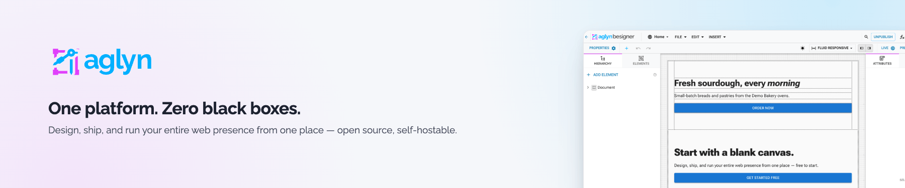
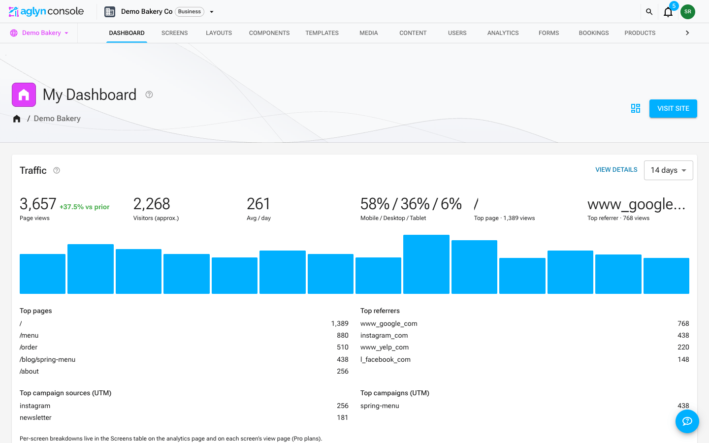
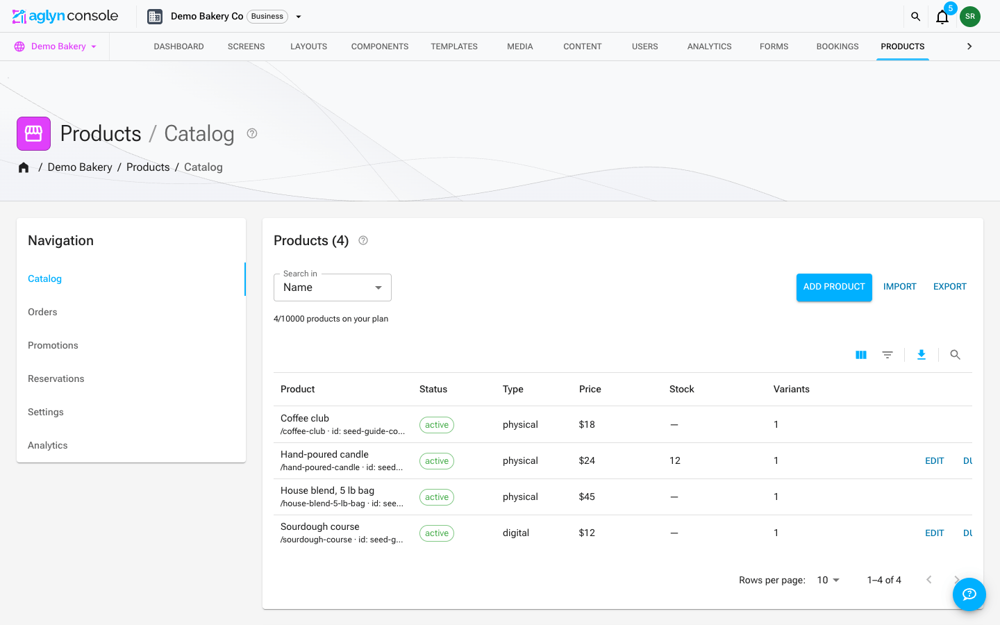

<!--
  ~ Shields.io Config
  ~ ~~~~~~~~~~~~~~~~~~~~~~~~~~~~~~~~~~~~~
  ~ Default params:
  ~   style=for-the-badge
  ~   labelColor=404C5C
  ~   cacheSeconds=maxAge
  ~
  ~ Brand palette:
  ~   Success 4CAF50 · Error E53935 · Warning FFAB40
  ~   Purple 9C27B0 · Blue-grey 404C5C · Light-blue 039BE5 · Pink E040FB
  -->

<p align="center">
  <a href="https://aglyn.com" title="Go to aglyn.com">
    
  </a>
</p>

<h3 align="center">The clickable screen to create online.</h3>

<p align="center">
  <i>Aglyn is a multi-tenant website-builder platform that turns a live, clickable canvas<br>
  into a real business website — no code, no ceremony, no expensive rebuilds.</i>
</p>

<p align="center">
  <a href="https://aglyn.com"><strong>aglyn.com</strong></a> &nbsp;·&nbsp;
  <a href="https://app.aglyn.com">Console</a> &nbsp;·&nbsp;
  <a href="https://docs.aglyn.com">Docs</a> &nbsp;·&nbsp;
  <a href="CONTRIBUTING.md">Contributing</a> &nbsp;·&nbsp;
  <a href="https://github.com/aglyn/aglyn/issues">Report a bug</a>
</p>

<p align="center">
  
  
  
</p>

<p align="center">
  
  
  
  
  
  
  
  
</p>

<hr/>

## ✨ What is Aglyn?

Aglyn takes the pain out of getting a professional website off the ground. Instead of hiring
engineers or wrestling with templates, you build on a **live, clickable canvas** — the _Besigner_ —
where what you click is what you ship. Every element, page, and interaction is editable in place, and
publishing is instant across a globally-served, multi-tenant runtime.

It's a full platform, not just an editor: organizations, billing, a plugin marketplace, a digital
asset manager, e-commerce, bookings, email, workflows, and a documented REST API all live under one
roof.

> **Three surfaces, one platform**
> · [`aglyn.com`](https://aglyn.com) — the marketing site
> · [`app.aglyn.com`](https://app.aglyn.com) — where you build, manage orgs & billing
> · `aglyn.app` + your own custom domain — where your published site is served to the world

## 📸 Take a look

<p align="center"><i>The Besigner — a clickable, in-place canvas where design and content live on the same surface.</i></p>

<table>
  <tr>
    <td width="50%" align="center" valign="top">
      
      <br /><sub><b>Console dashboard</b> — traffic, users, campaigns & activity at a glance</sub>
    </td>
    <td width="50%" align="center" valign="top">
      
      <br /><sub><b>Built-in commerce</b> — products, pricing, orders & POS</sub>
    </td>
  </tr>
</table>

## 🚀 Highlights

| | |
|---|---|
| 🖱️ **Besigner canvas** | A clickable, in-place visual editor — design and content on the same surface. |
| 🌐 **True multi-tenancy** | One runtime serves every customer site, on `aglyn.app` or a custom domain, with ISR. |
| 🧩 **Plugin platform** | Commerce, Bookings, Contacts, Email, Events, Workflows, Redirects & more — installable per org, with a review-queued marketplace. |
| 🎨 **Theme & layout builder** | Design tokens, themes, and layout templates that stay consistent across every page. |
| 🖼️ **Digital Asset Manager** | Drag-and-drop media, folders, custom metadata, and stable CDN URLs that survive replace & move. |
| 🛒 **Built-in commerce** | Products, pricing, POS, and digital goods powered by Stripe. |
| 🔐 **Security first** | Firebase Auth with email-verify gates, durable rate limiting, CSRF protection, and rules-tested Firestore. |
| ⚡ **Modern stack** | Next.js App Router, React 19, server components, and an Nx-orchestrated monorepo. |
| 🔌 **Customer REST API** | Scoped `aglyn_sk_` API keys for programmatic access on Business plans. |
| 📚 **Docs that ship with the code** | Four Docusaurus instances (docs, api, learn, help) kept in sync with features. |

## 🏗️ Inside the monorepo

An [Nx](https://nx.dev) workspace organized into deployable **apps** and shareable **libs**.

```
aglyn/
├─ apps/
│  ├─ 🌐 www        → marketing site               (aglyn.com)
│  ├─ 🛠️ console     → dashboard, editor, billing    (app.aglyn.com)
│  ├─ 🚀 tenant      → runtime for published sites   (aglyn.app + custom domains)
│  └─ 📖 docs        → Docusaurus documentation
│
├─ libs/
│  ├─ aglyn                 → core platform library
│  ├─ aglyn-node-renderer   → server-side screen renderer
│  ├─ besigner/             → the clickable visual editor (core + designer)
│  ├─ tenant/runtime        → shared tenant runtime (host events + composition)
│  ├─ plugins/              → bookings · commerce · contacts · data · email
│  │                          events-calendar · inbox · logic · marketing
│  │                          marketplace · mui · redirects · workflows
│  └─ shared/               → data · ui · util building blocks
│       ├─ data/  → enums · forms · mdi · regex · types
│       ├─ ui/    → jsx · jsx-forms · theme · color-picker · json-editor · next · …
│       └─ util/  → dom · email · errors · fbclient · fbserver · http · logger · …
│
└─ cloud/          → Firebase (functions, Firestore/Storage rules, Remote Config)
```

**Library conventions** — each lib is one of four types, so dependencies stay predictable:

- **Feature** — smart UI with data access, for a specific business use case.
- **UI** — presentational ("dumb") components only.
- **Data-access** — back-end interaction and state management.
- **Utility** — low-level helpers shared broadly.

## 🧰 Tech stack

| Area | Tools |
|---|---|
| **Framework** | Next.js 16 (App Router, RSC) · React 19 |
| **Language** | TypeScript (dual `typescript@6` bridge + `@typescript/native@7` for `tsc`) |
| **UI** | MUI 9 · MobX 6 · Data-Driven Forms 4 |
| **Backend** | Firebase (Auth, Firestore, Storage, Remote Config) · Cloud Functions · `firebase-admin` 14 |
| **Payments & email** | Stripe · Resend |
| **Monorepo** | Nx 23 |
| **Testing** | Jest 30 (unit) · Playwright + Firebase emulators (e2e) |
| **Runtime** | Node ≥ 24 |

## ⚡ Quick start

> **Prerequisites:** Node ≥ 24, npm, and the [Firebase CLI](https://firebase.google.com/docs/cli)
> for local emulation.

```bash
# 1. Install dependencies
npm install

# 2. Copy the example environment and fill in the blanks
cp .env.example .env

# 3. Serve an app (console, tenant, www, or docs)
npx nx serve console
```

The dev server hot-reloads on http://localhost:4200. Use `--prod` for a production build.

### Run against the Firebase emulators

```bash
# Start the emulators (imports/exports local data)
firebase emulators:start --import=./.firebase --export-on-exit

# Serve the console wired to the emulators
npm run serve:console:emulated
```

Default emulator hosts: Firestore `localhost:8082`, Auth `localhost:9099`. See
[`docs/E2E_LOCAL.md`](docs/E2E_LOCAL.md) for the full local end-to-end recipe.

## 🐳 Self-hosting

Run the whole platform on your own infrastructure with Docker — any cloud, a
VPS, or bare metal — pointed at **your own Firebase project** and your own
Stripe/Resend keys:

```bash
cp .env.selfhost.example .env.selfhost   # fill it in
docker compose up --build
```

Console on `:4200`, published sites on `:4500`, your reverse proxy in front.
The full runbook — Firebase project setup, security-rules deploy, DNS, and the
honest limits (Firebase is required; the in-console custom-domain flow is
Vercel-only) — lives in [`docs/SELF_HOSTING.md`](docs/SELF_HOSTING.md).

## 🛠️ Common commands

| Task | Command |
|---|---|
| Serve an app | `nx serve <app>` (`--prod` for production) |
| Build an app | `nx build <app>` → output in `dist/` |
| Unit tests | `nx test <app>` · affected only: `nx affected:test` |
| E2E tests | `nx e2e <app-e2e>` · affected only: `nx affected:e2e` |
| Lint | `nx lint` · workspace: `npm run lint` |
| Type-check | `npm run typecheck` |
| Format | `npm run format` |
| Dependency graph | `nx graph` |

Scaffolding new projects:

```bash
nx g @nx/next:app <app-name>     # new Next.js app
nx g @nx/react:lib <lib-name>    # new React library
nx g @nx/react:component <name> --project=<app>
```

Libraries are shareable and imported as `@aglyn/<name>` (e.g. `@aglyn/shared-ui-jsx`).

## 📖 Documentation

📚 **Full product & developer docs live at [docs.aglyn.com](https://docs.aglyn.com).**

Repo-local deep-dives live in [`docs/`](docs), including:

- [Self-hosting](docs/SELF_HOSTING.md) · [Multi-tenant Firestore](docs/MULTI_TENANT_FIRESTORE.md) · [Platform provisioning](docs/PLATFORM_PROVISIONING.md)
- [Plugin loading](docs/PLUGIN_LOADING.md) · [Plugin platform gaps](docs/PLUGIN_PLATFORM_GAPS.md)
- [Rate limiting](docs/RATE_LIMITING.md) · [Security content review](docs/SECURITY_CONTENT_REVIEW.md)
- [Email setup](docs/EMAIL_SETUP.md) · [Stripe go-live](docs/STRIPE_GO_LIVE.md) · [Commerce token signing](docs/COMMERCE_TOKEN_SIGNING.md)
- [Vercel deployments](docs/VERCEL_DEPLOYMENTS.md) · [Build performance](docs/BUILD_PERFORMANCE.md) · [TypeScript 7](docs/TYPESCRIPT7.md)

## 🤝 Contributing

We follow [Conventional Commits](https://www.conventionalcommits.org) — commit messages are linted.

```
<type>[(optional-scope)]: <description>

[optional body]

[optional footer(s)]
```

Common types: `feat` (new feature → minor), `fix` (bug patch → patch), plus `build`, `chore`, `ci`,
`docs`, `style`, `refactor`, `perf`, `test`, and `revert`. A `!` after the type/scope or a
`BREAKING CHANGE:` footer signals a major change.

See [CONTRIBUTING.md](CONTRIBUTING.md), the [Code of Conduct](CODE_OF_CONDUCT.md), and
[SECURITY.md](SECURITY.md) before opening a PR.

## 🌍 Terminology

- **Organization** — the entity that owns sites, members, and billing.
- **Workspace** — the UX word for an organization's working area.
- **Tenant** — a site at runtime (the served, published surface only).
- **Besigner** — Aglyn's clickable visual editor.
- **Plugin / Add-on** — pluggable, first- or third-party modules that extend an org or app while
  respecting its architecture.
- **Extension** — deeper, non-standard integrations that modify default behavior; typically
  third-party authored.

<hr/>

<h3 align="center">Connect with us</h3>

<p align="center">
  <a href="https://www.linkedin.com/company/aglyn/" title="LinkedIn">
    
  </a>&nbsp;
  <a href="https://twitter.com/AglynOfficial" title="Twitter / X">
    
  </a>&nbsp;
  <a href="https://github.com/aglyn" title="GitHub org">
    
  </a>
</p>

<h2 align="center">About Aglyn</h2>

<p align="center">
  Aglyn LLC is a distributed technology company building the clickable way to create online.
  We're improving the no-code web-development market by shrinking the distance between an idea and a
  live, professional website — easing maintenance and minimizing the expensive engineering work a
  business site usually demands.
</p>

<hr/>

<p align="center">
  <a href="LICENSE"><strong>Apache License 2.0</strong></a> · © Aglyn LLC
</p>
