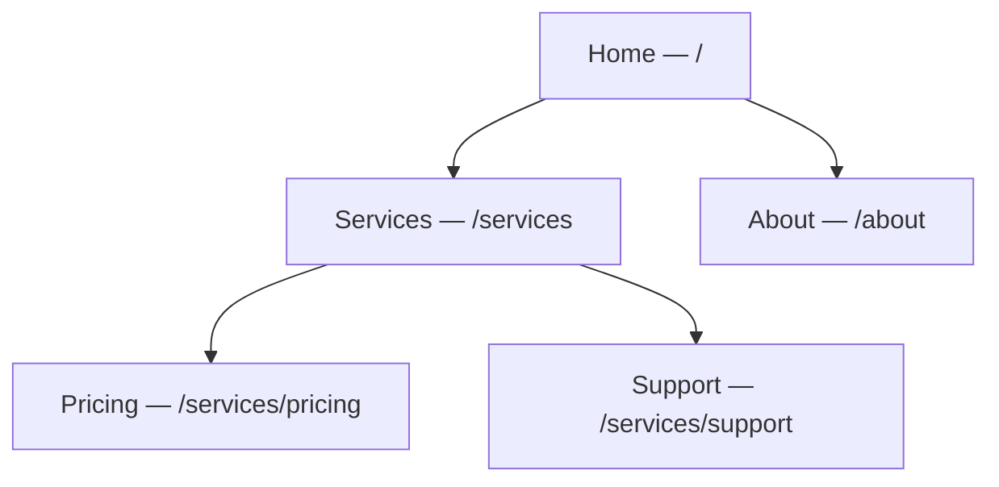

# Screens & Layouts

Screens are your pages; layouts are the shared frames they render inside. Together they
define your site's structure, URLs, and reusable chrome.

The screen hierarchy maps directly to your URL paths:

:::info Plan availability
**Free** for core screens and layouts. Higher tiers raise caps on screens, versions, and
reusable components.
:::

## What counts against your screen allowance

Your plan's screen limit counts the screens that are **pages of your site** — the ones a
visitor can reach at an address of their own. Some screens you design are not pages, and
those don't count:

| Screen | Counts? | Why |
| --- | --- | --- |
| A page you publish at a slug | **Yes** | It has a URL of its own. |
| A collection's **list** template | **Yes** | `/{collection}` renders that exact screen. |
| A collection's **entry** template | No | One screen composes every entry; it has no address of its own. |
| An [error screen](../site-protection/error-screens.md) you've assigned | No | It renders on addresses that matched nothing. |
| An [email](../../marketing-and-automation/email-campaigns/overview.md) you design | No | It's sent, never served at a URL. |
| A screen you've deleted | No | Deleting frees the slot straight away. |

The rule behind the table is one question: **does the screen occupy a URL of its own?**
So an error screen that is *also* still published at its own address — say a 404 screen
you published at `/404` while designing it — is a page, and it counts until you remove
that address. The **Error pages** card tells you when that's the case and offers the
one-click **Remove address**; the screen carries on rendering for its status code
afterwards.

## Screens & routing

- Each screen has a **title** and a URL **slug**. Aglyn normalizes slugs and keeps a
  site **routing map**.
- Screens form a **hierarchy**: pick a parent and the child inherits a nested path
  (`/services/pricing`). Changing a slug or parent cascades safe rewrites across the map,
  with cycle guards so you can't create a loop.
- Reorder the hierarchy with **drag-and-drop** in the screens list.
- The screens list shows each screen's **Published** date, and the screen's detail page
  shows **Date published**. Both stay empty until the screen goes live, and clear again if
  you unpublish it (including a scheduled unpublish) — so the column tells you what's
  live, not what exists.

## Layouts

A **layout** is a shared frame (header, nav, footer) with a **slot** where screen content
renders. Bind a screen to a layout in the Besigner and the layout chrome wraps the screen
both in the editor and on the published site. Layouts have their own versions and admin
converters, just like screens.

### Nested layouts

A layout can render inside **another layout**. Set **Renders inside** on a layout's detail
page and its chrome is wrapped by the outer layout's, exactly as a screen is wrapped by
its own — so site-wide furniture can live in one place while a section keeps a more
specific frame around it.

A screen inherits the whole chain: bind it to the inner layout and it renders inside that,
which renders inside the outer one, up to five layouts deep.

A layout can never sit inside itself, or inside a layout already nested within it — that
would be a loop with no outermost frame to render. The picker only offers layouts that
are legal choices, so you cannot select one by mistake.

### Used by

A layout's detail page has a **Used by** card listing everything that renders inside it,
so you can see what a change or a deletion would reach:

- **screens** bound to it, published or not, and
- **layouts nested inside it** — deleting the outer one unwraps every screen underneath
  those too.

A layout used by neither is genuinely unused.

## Reusable components

Promote a subtree into a **reusable component** and insert instances anywhere. Instances
graft the source at render time, so one edit updates them all. Manage (rename / demote /
delete) reusable components from the site dashboard.

## Versions & scheduled publishing

Screens, layouts, and reusable components all keep **versions** — open the version
name in the besigner's app bar to see the **Versions** dialog, with each version's
created/updated times and a **Published** chip on the live one.

- **New version** saves a named snapshot of the current saved document (prefilled
  "Copy of …" — rename it to something meaningful).
- **Open** switches the besigner to that version. Viewing an old version never
  publishes it.
- **Publish** on any row makes that version the live one — which is also how you
  **roll back**: publishing an older version moves the live pointer, destroys
  nothing, and is symmetrical, so rolling forward again is the same click.
- **Schedule** publishes a version automatically at a chosen future time; the row
  then shows a *"Publishes …"* chip you can clear to cancel.
- Delete versions you no longer need — the published version can't be deleted, and
  the one you have open must be closed first.

<!-- screenshot: besigner/versions-dialog.png per SCREENSHOT_PLAN.md -->

Plan gating, enforced where you click:

- **Creating versions** requires **Pro or above** — on a lower tier the editor answers
  *"Versioning requires a Pro plan — see Billing to upgrade"* instead of opening the
  name dialog.
- **Scheduled publishing** requires **Business or above**.
- A version is snapshotted from the **saved** document, so the editor asks you to save
  the canvas first rather than silently capturing (or losing) unsaved edits.
- If a scheduled publish comes due on a plan that no longer includes scheduling — after
  a downgrade, say — it is **skipped and shown as skipped** on the screen's page, never
  silently dropped, so you can dismiss it or upgrade and reschedule.

## Error & maintenance screens

You can design custom **404 / 401 / 403 / 503** screens and turn on **maintenance mode**.
See [Site protection & error pages](../site-protection/overview.md).

## Related

- [The Besigner](../besigner/overview.md)
- [Bindings & variables](../bindings/overview.md)
- [SEO toolkit](../seo/overview.md)
