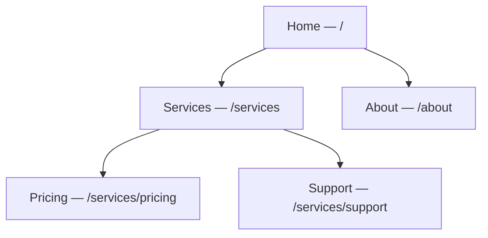

# Screens

A **screen** is a page of your site. It has a title, a URL slug, and a place in a
hierarchy that decides the address visitors reach it at.

The screen hierarchy maps directly to your URL paths:

:::info Plan availability
**Free** for core screens. Higher tiers raise the cap on how many screens a site can
publish.
:::

## Screens & routing

- Each screen has a **title** and a URL **slug**. Aglyn normalizes slugs and keeps a
  site **routing map**.
- Screens form a **hierarchy**: pick a parent and the child inherits a nested path
  (`/services/pricing`). Changing a slug or parent cascades safe rewrites across the map,
  with cycle guards so you can't create a loop.
- Reorder the hierarchy with **drag-and-drop** in the screens list.
- The screens list shows each screen's **Published** date, and the screen's detail page
  shows **Date published**. Both stay empty until the screen goes live, and clear again if
  you unpublish it (including a scheduled unpublish) — so the column tells you what's
  live, not what exists. A screen you've just created is a **draft**: it holds its slug
  but nothing resolves there until you publish it.
- **Unpublish** takes a live screen off your site. It's in the row's **⋮** menu on the
  screens list (on published screens), on the screen's detail page under **Publishing**,
  and on the Besigner toolbar. The screen, its versions and its slug are all kept, so
  publishing again puts it back at the same address.

## What counts against your screen allowance

Your plan's screen limit counts the screens that are **pages of your site** — the ones a
visitor can reach at an address of their own. Some screens you design are not pages, and
those don't count:

| Screen | Counts? | Why |
| --- | --- | --- |
| A page you publish at a slug | **Yes** | It has a URL of its own. |
| A collection's **list** template | **Yes** | `/{collection}` renders that exact screen. |
| A collection's **entry** template | No | One screen composes every entry; it has no address of its own. |
| An [error screen](../site-protection/error-screens.md) you've assigned | No | It renders on addresses that matched nothing. |
| An [email](../../marketing-and-automation/email-campaigns/overview.md) you design | No | It's sent, never served at a URL. |
| A screen you've deleted | No | Deleting frees the slot straight away. |

The rule behind the table is one question: **does the screen occupy a URL of its own?**
So an error screen that is *also* still published at its own address — say a 404 screen
you published at `/404` while designing it — is a page, and it counts until you remove
that address. The **Error pages** card tells you when that's the case and offers the
one-click **Remove address**; the screen carries on rendering for its status code
afterwards.

## Duplicate a screen

Every row on the Screens list has **Duplicate…** in its menu. The copy takes
the latest saved version whole — the element tree, layout values, description
and SEO fields — under the name you give it (`Copy of Home` by default; a name
another screen already has gets a number). Its slug becomes `home-copy`, then
`home-copy-2`, so it never claims the original's address.

The copy is a **draft**: it has no address on the live site until you publish
it, exactly like a screen you created from scratch. Components and layouts
placed on the original are shared, not copied — the duplicate points at the
same ones. A duplicate of a page counts against your screen allowance the
moment it is made, and is refused with the same message a new screen would be
when the allowance is spent.

A collection's **entry template** can be duplicated too, which is how a second
collection starts from the first one's design. The copy is still an entry
template, with every `{{entry.*}}` binding kept: it isn't published, and no
collection uses it until you pick it as a collection's **Entry screen** in
Content. Like the original, it doesn't count against your screen allowance. An
error screen can't be duplicated.

## Error & maintenance screens

You can design custom **404 / 401 / 403 / 503** screens and turn on **maintenance mode**.
See [Site protection & error pages](../site-protection/overview.md).

## Related

- [Layouts](layouts.md) — the shared frame a screen renders inside
- [Versions & scheduled publishing](versions-and-publishing.md)
- [The Besigner](../besigner/overview.md)
- [Bindings & variables](../bindings/overview.md)
- [SEO toolkit](../seo/overview.md)
