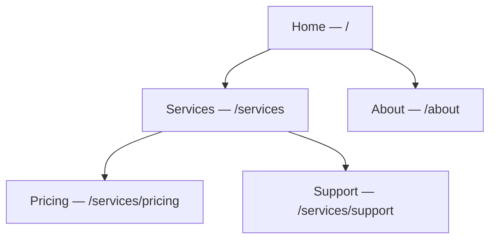

# Pages

Each **page** of your site has a title, a URL slug, and a place in a hierarchy
that decides the address visitors reach it at.

The page hierarchy maps directly to your URL paths:

```mermaid
flowchart TD
  Home["Home — /"] --> Services["Services — /services"]
  Home --> About["About — /about"]
  Services --> Pricing["Pricing — /services/pricing"]
  Services --> Support["Support — /services/support"]
```

:::info Plan availability
**Free** for core pages. Higher tiers raise the cap on how many pages a site can
publish.
:::

## Pages & routing {#screens--routing}

- Each page has a **title** and a URL **slug**. Aglyn normalizes slugs and keeps a
  site **routing map**.
- Pages form a **hierarchy**: pick a parent and the child inherits a nested path
  (`/services/pricing`). Changing a slug or parent cascades safe rewrites across the map,
  with cycle guards so you can't create a loop.
- Reorder the hierarchy with **drag-and-drop** in the pages list.
- The pages list shows each page's **Published** date, and the page's detail view
  shows **Date published**. Both stay empty until the page goes live, and clear again if
  you unpublish it (including a scheduled unpublish) — so the column tells you what's
  live, not what exists. A page you've just created is a **draft**: it holds its slug
  but nothing resolves there until you publish it.
- **Unpublish** takes a live page off your site. It's in the row's **⋮** menu on the
  pages list (on published pages), on the page's detail view under **Publishing**,
  and on the Besigner toolbar. The page, its versions and its slug are all kept, so
  publishing again puts it back at the same address.

## What counts against your page allowance {#what-counts-against-your-screen-allowance}

Your plan's page limit counts the pages that have **an address of their own** — the
ones a visitor can reach at a URL. Some pages you design never get an address, and
those don't count:

| Page | Counts? | Why |
| --- | --- | --- |
| A page you publish at a slug | **Yes** | It has a URL of its own. |
| A collection's **list** template | **Yes** | `/{collection}` renders that exact page. |
| A collection's **entry** template | No | One page composes every entry; it has no address of its own. |
| An [error page](../site-protection/error-screens.md) you've assigned | No | It renders on addresses that matched nothing. |
| An [email](../../marketing-and-automation/email-campaigns/overview.md) you design | No | It's sent, never served at a URL. |
| A page you've deleted | No | Deleting frees the slot straight away. |

The rule behind the table is one question: **does the page occupy a URL of its own?**
So an error page that is *also* still published at its own address — say a 404 page
you published at `/404` while designing it — has an address, and it counts until you
remove that address. The **Error pages** card tells you when that's the case and offers
the one-click **Remove address**; the page carries on rendering for its status code
afterwards.

## Duplicate a page {#duplicate-a-screen}

Every row on the Pages list has **Duplicate…** in its menu. The copy takes
the latest saved version whole — the element tree, layout values, description
and SEO fields — under the name you give it (`Copy of Home` by default; a name
another page already has gets a number). Its slug becomes `home-copy`, then
`home-copy-2`, so it never claims the original's address.

The copy is a **draft**: it has no address on the live site until you publish
it, exactly like a page you created from scratch. Components and layouts
placed on the original are shared, not copied — the duplicate points at the
same ones. A duplicate counts against your page allowance the moment it is
made, and is refused with the same message a new page would be when the
allowance is spent.

A collection's **entry template** can be duplicated too, which is how a second
collection starts from the first one's design. The copy is still an entry
template, with every `{{entry.*}}` binding kept: it isn't published, and no
collection uses it until you pick it as a collection's **Entry page** in
Content. Like the original, it doesn't count against your page allowance. An
error page can't be duplicated.

## Error & maintenance pages {#error--maintenance-screens}

You can design custom **404 / 401 / 403 / 503** pages and turn on **maintenance mode**.
See [Site protection & error pages](../site-protection/overview.md).

## Related

- [Layouts](layouts.md) — the shared frame a page renders inside
- [Versions & scheduled publishing](versions-and-publishing.md)
- [The Besigner](../besigner/overview.md)
- [Bindings & variables](../bindings/overview.md)
- [SEO toolkit](../seo/overview.md)
