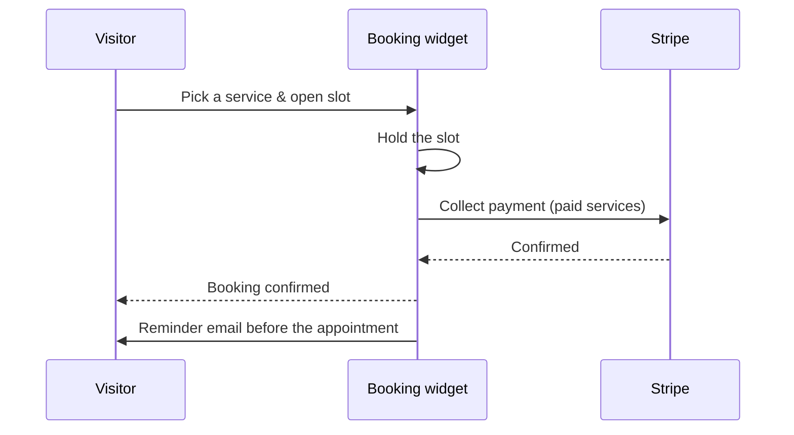

# Bookings & Scheduling

**Bookings** turn your site into a scheduling tool: define services, publish your
availability, and let visitors book time — with optional payment and automatic reminders.

:::info Plan availability
**Paid**. Paid bookings use Stripe; reminder emails are included.
:::

:::warning Paid services need Stripe connected first
A paid booking is a **destination charge into your own Stripe account**, so the
booking widget cannot take money until Stripe Connect onboarding is finished and
Stripe reports charges enabled. Until then a visitor who picks a paid service is
told **"Payments are not set up yet"** and the slot is not held. Free services are
unaffected — they never touch Stripe. Connect your account from the **Payments**
card on the Products hub; see [Commerce](../commerce/overview.md).
:::

## Set up bookings

1. Define **services** (what can be booked, duration, price).
2. Configure **availability** — the windows when slots are offered.
3. Add the **booking widget** to a screen as a canvas element.

## Taking bookings

- Visitors pick a slot through the booking widget; the **booking API** records it.
- For paid services, Stripe collects payment and a **slot hold** prevents double-booking
  during checkout.
- **Reminder emails** go out automatically ahead of the appointment — see below.

### 24-hour reminders {#reminders}

Every confirmed booking gets one reminder email roughly a day before it starts. A
background pass runs each hour and mails the bookings that are then 23–25 hours out,
so a reminder lands about 24 hours ahead rather than at an exact minute.

A booking is reminded once. The pass records that it has sent, so a booking is never
mailed twice, and these do not go out for canceled bookings or for bookings taken
without an email address.

The reminder uses your designed **booking reminder** email template if you have one,
and your own brand if your plan includes white-labeling; otherwise it sends a plain
text reminder naming the service and the time.

**Where to see it.** The **Upcoming bookings** card shows `24-hour reminders · N due in
the next pass · N already sent`, counted with the same rule the sender uses — so it is
the queue that will actually be drained, not an estimate.

## Payments and fees {#payments-and-fees}

Money for a paid booking goes **to you, not to Aglyn**. The charge is created on
your connected Stripe account, and Aglyn takes its platform fee out of it as the
Stripe Connect application fee — the same way a storefront sale works.

- A booking is priced as a **service**, which bills at your plan's **digital**
  transaction rate: 5% on Starter, 3% on Pro, 2% on Business, 1% on Scale, and
  **0% from Advanced up**. It is the same rate and the same ladder as digital
  products — bookings are not charged separately or additionally.
- The fee is taken on the **service price only**. Stripe's own processing fee is
  separate and comes out of your account as usual.
- Your current rate is shown on the **Payments** card of the Products hub, and
  the full ladder is on the [plans page](../../workspace-and-billing/billing-and-plans/overview.md#platform-fees).

### Service tax

Paid bookings charge **no tax by default**, and that stays true for every site
that does not change it.

A service is not goods: the sales-tax rate configured for your store is a goods
rate, and whether a service is taxable is a different question with frequently
the opposite answer. So Aglyn does not apply your store's sales rate to an
appointment. Instead, **Commerce → Settings → Taxes → Service tax** is where
you set your own rate for it.

When you set one, Aglyn adds it to the booking charge as its own receipt line
using the label you choose, and records the amount and the regime on the
booking. It is always your own rate — Stripe Tax is never asked to compute it,
because it has no service tax code for this and would apply a goods rate to an
appointment.

The platform fee is charged on the **service price**, never on the tax.

:::warning Aglyn does not provide tax advice
Aglyn applies the rate you enter and records what was charged. It does **not**
determine whether service tax applies to you, at what rate, or where it should
be paid. Confirm your obligations with a qualified tax professional.
:::

## Manage

Use the console **bookings** page to see and manage upcoming appointments.

### Canceling and refunding {#canceling-and-refunding}

Canceling a booking reopens the slot. For a **paid** booking, canceling also
**refunds the visitor through Stripe** — the button reads **Cancel and refund**
and tells you the amount before you confirm.

- The refund pulls the money back out of your account and returns Aglyn's
  platform fee on it, so a refunded appointment costs you nothing in fees.
- If the refund fails, **the booking is not canceled**. The appointment stays on
  the list and the message says what went wrong, so you never end up with a
  canceled slot the visitor was never paid back for.
- Refunding is **site-admin only**, because it moves money.
- Bookings paid before this was supported have to be refunded from the Stripe
  dashboard instead — the console will say so, and will remind you to tick
  **Reverse transfer** so the amount comes back from your account rather than
  Aglyn's.

## Related

- [Commerce](../commerce/overview.md)
- [Events calendar](../../content-and-data/events/overview.md)
- [Email campaigns](../../marketing-and-automation/email-campaigns/overview.md)
