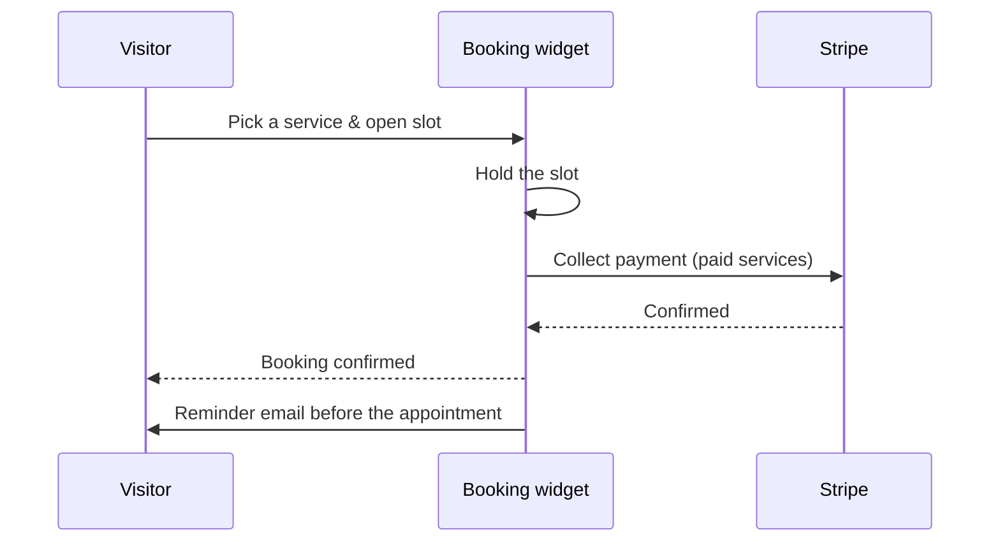

# Bookings & Scheduling

**Bookings** turn your site into a scheduling tool: define services, publish your
availability, and let visitors book time — with optional payment and automatic reminders.

```mermaid
sequenceDiagram
  participant V as Visitor
  participant W as Booking widget
  participant St as Stripe
  V->>W: Pick a service & open slot
  W->>W: Hold the slot
  W->>St: Collect payment (paid services)
  St-->>W: Confirmed
  W-->>V: Booking confirmed
  W->>V: Reminder email before the appointment
```

:::info Plan availability
**Paid**. Paid bookings use Stripe; reminder emails are included.
:::

:::warning Paid services need Stripe connected first
A paid booking is a **destination charge into your own Stripe account**, so the
booking widget cannot take money until Stripe Connect onboarding is finished and
Stripe reports charges enabled. Until then a visitor who picks a paid service is
told **"Payments are not set up yet"** and the slot is not held. Free services are
unaffected — they never touch Stripe. Connect your account from the **Payments**
card on the Products hub; see [Commerce](../commerce/overview.md).
:::

## Set up bookings

1. Define **services** (what can be booked, duration, price).
2. Configure **availability** — the windows when slots are offered.
3. Add the **booking widget** to a page as a canvas element.

### Draft services {#draft-services}

A service is either **active** — it takes bookings — or a **draft**: set up, and
offered nowhere. A draft is left out of the booking widget's list, shows no open
times, and a booking for it is refused, even through a link that names it.

- A service you add with **Add service** is active as soon as you save it.
- A service set up for you elsewhere in Aglyn, rather than added on this page,
  starts as a draft, so nothing goes live before you have looked at it. If no
  price was given, it is set to **Contact for price**.
- On the Bookings page a draft carries a **Draft** label and an **Activate**
  button. **Activate** puts it on your site straight away.
- **Deactivate** turns an active service back into a draft: it stops taking
  bookings without being deleted, and the bookings it already has stay.

A draft counts toward your plan's service allowance, like an active service.

### Price varies, free estimate, or contact for price {#price-labels}

A service that is quoted at the job doesn't need a price. In the service's
dialog, **Show the price as** picks how the widget states it:

- **The price** (the default): the widget shows the price, and a priced
  service is paid through Stripe when it's booked.
- **Price varies**, **Free estimate** or **Contact for price**: the widget
  shows that label instead, and the service **books with no charge**, like an
  estimate appointment. Any price typed in the dialog is neither shown nor
  charged, and you quote the visitor afterwards.

A labeled service needs no connected Stripe account, because nothing is
charged.

### Asking for a phone number and an address {#phone-and-address}

The booking widget always asks for a name and an email. A service can also ask
for a **phone number** and an **address** — the place the job is, for a service
done on site. Set each one in the service's dialog under **Booking form**:

- **Don't ask** (the default) — the field does not appear.
- **Optional** — the field appears and the visitor may leave it empty.
- **Required** — the visitor cannot confirm the booking without it.

The booking is checked again when it arrives, so a required field cannot be
skipped. A phone number has to look like one: a US or Canadian number is
stored in international form (`+15125550107`), and a number written another
country's way is kept as typed.

What the visitor gives shows:

- on the booking in **Upcoming bookings**;
- in the **New booking** notification the site's managers get, by email too if
  they have email notifications on — for paid bookings as well, once the
  payment clears;
- on the **meeting** the booking files in the CRM, under the slot.

The phone number is also added to the person in the CRM — the lead or the
contact the booking lands on — **only when that person has no phone yet**, so
it never replaces a number you already have. The address stays on the booking
and the meeting, not on the person: it is where this job is, which is often not
where they live.

## Taking bookings

- Visitors pick a slot through the booking widget; the **booking API** records it.
  The widget shows two weeks of open days at a time, with every open time of the
  day the visitor picks, grouped into morning, afternoon and evening. **Later dates**
  pages on through your whole booking horizon (60 days unless you change it in the
  plugin's settings).
- For paid services, Stripe collects payment and a **slot hold** prevents double-booking
  during checkout.
- **Reminder emails** go out automatically ahead of the appointment — see below.

### 24-hour reminders {#reminders}

Every confirmed booking gets one reminder email roughly a day before it starts. A
background pass runs each hour and mails the bookings that are then 23–25 hours out,
so a reminder lands about 24 hours ahead rather than at an exact minute.

A booking is reminded once. The pass records that it has sent, so a booking is never
mailed twice, and these do not go out for canceled bookings or for bookings taken
without an email address.

The reminder uses your designed **booking reminder** email template if you have one,
and your own brand if your plan includes white-labeling; otherwise it sends a plain
text reminder naming the service and the time.

**Where to see it.** The **Upcoming bookings** card shows `24-hour reminders · N due in
the next pass · N already sent`, counted with the same rule the sender uses — so it is
the queue that will actually be drained, not an estimate.

## Payments and fees {#payments-and-fees}

Money for a paid booking goes **to you, not to Aglyn**. The charge is created on
your connected Stripe account, and Aglyn takes its platform fee out of it as the
Stripe Connect application fee — the same way a storefront sale works.

- A booking is priced as a **service**, which bills at your plan's **digital**
  transaction rate: 5% on Starter, 3% on Pro, 2% on Business, 1% on Scale, and
  **0% from Advanced up**. It is the same rate and the same ladder as digital
  products — bookings are not charged separately or additionally.
- The fee is taken on the **service price only**. Stripe's own processing fee is
  separate and comes out of your account as usual.
- Your current rate is shown on the **Payments** card of the Products hub, and
  the full ladder is on the [plans page](../../workspace-and-billing/billing-and-plans/overview.md#platform-fees).

### Service tax

Paid bookings charge **no tax by default**, and that stays true for every site
that does not change it.

A service is not goods: the sales-tax rate configured for your store is a goods
rate, and whether a service is taxable is a different question with frequently
the opposite answer. So Aglyn does not apply your store's sales rate to an
appointment. Instead, **Commerce → Settings → Taxes → Service tax** is where
you set your own rate for it.

When you set one, Aglyn adds it to the booking charge as its own receipt line
using the label you choose, and records the amount and the regime on the
booking. It is always your own rate — Stripe Tax is never asked to compute it,
because it has no service tax code for this and would apply a goods rate to an
appointment.

The platform fee is charged on the **service price**, never on the tax.

:::warning Aglyn does not provide tax advice
Aglyn applies the rate you enter and records what was charged. It does **not**
determine whether service tax applies to you, at what rate, or where it should
be paid. Confirm your obligations with a qualified tax professional.
:::

## Manage

Use the console **bookings** page to see and manage upcoming appointments.

Each upcoming booking carries **View in CRM**, which opens the booker's contact — the
[CRM's](../../content-and-data/crm/overview.md) Contacts list asked for their
address, moving straight on to the record when exactly one person matches. A booking
taken without an address has no link. A contact's timeline links back to this page
from the booking that captured them.

### Booking from the CRM {#booking-from-the-crm}

A contact, a lead or a deal in the [CRM](../../content-and-data/crm/overview.md)
carries **Book a meeting** whenever this site runs Bookings and your plan includes
it. It lists the site's services, each with the public link a visitor books it at —
the page the booking widget sits on, with that service preselected — and a copy
button. From **Send email** on a record, **Insert booking link** drops the chosen
link into the message where the caret is.

Every link dropped from a record carries that record with it, so the booking lands
on the right timeline **even when the person books with a different address**. A
booking taken without a record reference is matched to a contact by the booker's
address instead. Links are per service, not per person: a service has one calendar,
so there is nothing narrower to link to.

Each service has two switches in its dialog:

- **Log a meeting on the CRM record when this service is booked** (on by default) — a confirmed booking is filed as
  a **meeting** on the record's timeline, titled with the service and the slot.
- **Create a follow-up task on the CRM record when this service is booked** (off by default) — a **Follow up after &lt;service&gt;**
  task is filed on the record, due one business day after the slot, on whoever holds
  the relationship.

Neither files anything on a site where the CRM plugin is switched off, and a
booking is filed once however many times its payment confirmation is redelivered.
A contact's page links back here through **Bookings on this site**, which is this
page narrowed to every booking taken with their address, upcoming and past.

### Canceling and refunding {#canceling-and-refunding}

Canceling a booking reopens the slot. For a **paid** booking, canceling also
**refunds the visitor through Stripe** — the button reads **Cancel and refund**
and tells you the amount before you confirm.

- The refund pulls the money back out of your account and returns Aglyn's
  platform fee on it, so a refunded appointment costs you nothing in fees.
- If the refund fails, **the booking is not canceled**. The appointment stays on
  the list and the message says what went wrong, so you never end up with a
  canceled slot the visitor was never paid back for.
- Refunding is **site-admin only**, because it moves money.
- Bookings paid before this was supported have to be refunded from the Stripe
  dashboard instead — the console will say so, and will remind you to tick
  **Reverse transfer** so the amount comes back from your account rather than
  Aglyn's.

### Export bookings {#export-bookings}

**Export** in the header of the bookings card downloads the site's bookings as
a file.

- **Which bookings.** The list you're looking at — **Upcoming bookings**, or
  one person's bookings when the page is narrowed to them — or every booking
  the site has taken.
- **Which columns.** Pick and order them yourself, or start from a preset.
  The columns are grouped as **Booking** (the service, the start and end in
  UTC and as a local time in the booking's time zone, the duration and the
  status), **Customer** (name, email, phone, address and the CRM record the
  booking link came from), **Payment** (the amount paid, tax, the platform
  fee and any refund, in US dollars, with the Stripe payment IDs) and
  **System** (when it was booked, confirmed and reminded). Your last choice
  is remembered for next time.
- **Formats.** CSV, JSON or NDJSON.

Exporting needs the **Manage data** permission on the site, and every export
is recorded in the workspace's audit log — who exported, when and how many
bookings, never the bookings themselves. A customer whose details were
erased exports with those columns blank.

Bookings can't be imported. A booking is made on the booking page, which
holds the slot, takes any payment and sends the confirmation and the
reminder; a booking written from a file would skip all of that.

## Related

- [Commerce](../commerce/overview.md)
- [CRM activities & the timeline](../../content-and-data/crm/activities.md)
- [Events calendar](../../content-and-data/events/overview.md)
- [Email campaigns](../../marketing-and-automation/email-campaigns/overview.md)
