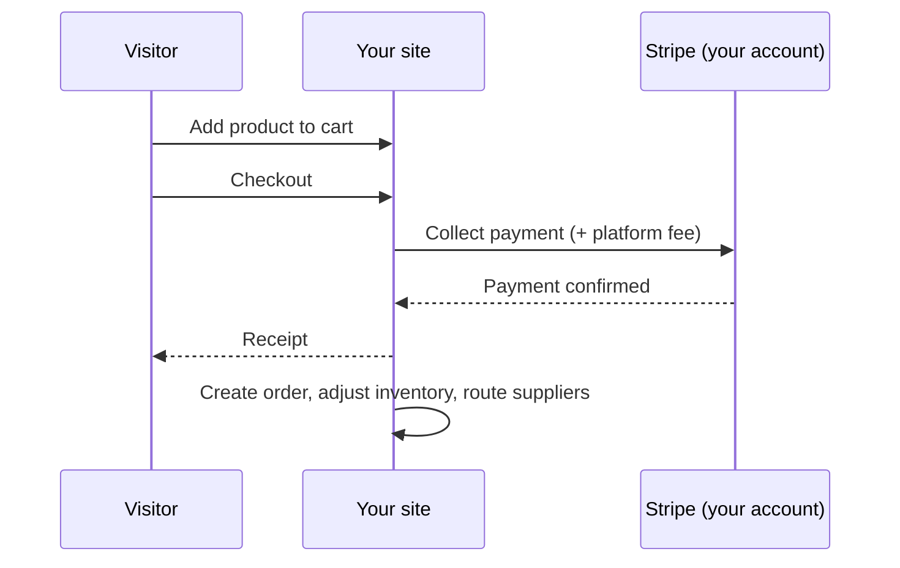

# Commerce

Aglyn commerce sells from **your own Stripe account**: buyers pay you
directly, and Aglyn collects a per-sale platform fee set by your plan (see
[Billing & plans](../../workspace-and-billing/billing-and-plans/overview.md) — higher plans reduce
fees to 0%).

:::info Plan availability
**Paid**. Starter sells up to 100 products (2% physical / 7% digital fee);
Pro and Business raise limits and remove fees.
:::

## Products hub

The **Products** page is the catalog manager:

- **Products** with up to 3 options and 100 variants each — per-variant SKU,
  barcode, price, compare-at (sale badge), weight, and stock. See
  [Product catalog](catalog.md).
- **Categories & collections** — a category tree plus manual and smart
  (rule-based) collections with a live match preview.
- **CSV import/export** in the Shopify column dialect, with a dry-run
  report — switching from Shopify is a file upload.
- **Payments** — Stripe Connect onboarding status and your plan's fee
  ladder.

## Inventory

- Per-variant stock; blank = untracked, 0 = sold out.
- **Oversell policy** per product: stop selling or allow backorders.
- **Low-stock alerts** notify managers once per threshold crossing.
- **Adjustment history** with reason codes (sale, restock, correction…).
- **Locations** split stock across warehouses/storefronts (plan-capped);
  adjustments and POS sales bucket per location.

## Orders

Every paid checkout becomes an order with a sequential number, line-item
snapshots, totals, and a timeline:

- **Statuses**: pending → paid → fulfilled (or partially) → delivered, with
  cancel/refund exits guarded by a status machine.
- **Fulfill with tracking**, print **packing slips**, add internal notes.
- **Refunds** (full or partial) go through Stripe and reverse the platform
  fee; site-admin only.
- **Draft orders**: build an order in the console and send the buyer a
  payment link (Shopify parity).

## Shipping & taxes

- **Shipping zones** own countries ('*' = rest of world); rates are flat,
  free-over-subtotal, or subtotal/weight tiers; optional local pickup.
- **Taxes**: manual per-region rates (state beats country, VAT-style
  inclusive pricing supported) or **Stripe Tax** automatic calculation;
  products can be tax-exempt.

### Destination coverage

Checkout collects a shipping address for six countries — **United States,
Canada, United Kingdom, Australia, Germany and France** — and charges the
rate that destination resolves to. It will not charge a rate belonging to
another zone, so the zones you save decide what checkout can do:

- **A destination no rate reaches is refused.** The shopper is told the store
  does not ship there, rather than being posted a parcel you priced nothing
  for. The **Coverage** line under Shipping settings names those countries as
  you edit, and offers to add a rest-of-world zone.
- **Rates that differ by destination make checkout ask.** The cart and
  product page reveal a "Ship to" selector before they can price one. A
  single zone, or a single rest-of-world zone, asks the shopper nothing.
- **No rates at all is a valid setup**, not a gap: the store charges no
  shipping and refuses nobody.
- **Payment links price a parcel too.** A draft order you invoice a customer
  for charges the same rates, collects the same address, and asks you the same
  "Ships to" question in the draft dialog when your rates differ by
  destination.
- **In-person sales charge no shipping.** A register has no destination to
  price against — cash, card and room-folio sales all settle at the counter —
  so a POS sale is items and tax. Raise a draft order for anything you post.

A zone that names a country **hides the rest-of-world zone for it** — so a
"Europe" zone with no rates on it refuses Europe even when a `*` zone exists.
Cover a destination by pricing a rate on the zone that claims it.

## Dropshipping

Assign a **supplier** to a product and paid orders route automatically —
by email and/or HMAC-signed webhook — with a token link the supplier uses
to post tracking back, which fulfills the order. Pro plan and above.

## Related

- [Product catalog](catalog.md)
- [Billing & plans](../../workspace-and-billing/billing-and-plans/overview.md)
- [Bookings & scheduling](../bookings/overview.md)
