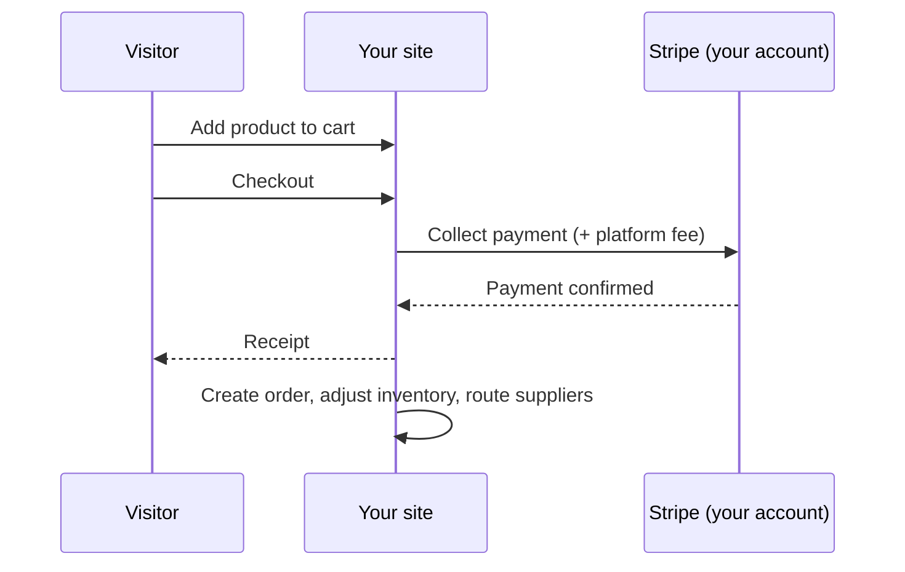

# Commerce

Aglyn commerce sells from **your own Stripe account**: buyers pay you
directly, and Aglyn collects a per-sale platform fee set by your plan (see
[Billing & plans](../../workspace-and-billing/billing-and-plans/overview.md) — higher plans reduce
fees to 0%).

:::info Plan availability
**Paid**. Starter sells up to 100 products (2% physical / 5% digital fee);
Pro and Business raise limits and remove fees.
:::

## Products hub

The **Products** page is the catalog manager:

- **Products** with up to 3 options and 100 variants each — per-variant SKU,
  barcode, price, compare-at (sale badge), weight, and stock. See
  [Product catalog](catalog.md).
- **Categories & collections** — a category tree plus manual and smart
  (rule-based) collections with a live match preview.
- **CSV import/export** in the Shopify column dialect, with a dry-run
  report — switching from Shopify is a file upload.
- **Payments** — Stripe Connect onboarding status and your plan's fee
  ladder.

## Inventory

- Per-variant stock; blank = untracked, 0 = sold out.
- **Oversell policy** per product: stop selling or allow backorders.
- **Low-stock alerts** notify managers once per threshold crossing.
- **Adjustment history** with reason codes (sale, restock, correction…).
- **Locations** split stock across warehouses/storefronts (plan-capped);
  adjustments and POS sales bucket per location.
- **Reserved in checkout** holds units for a shopper who has reached the
  payment page, so the last one cannot be sold twice.

### Reserved stock {#reserved-stock}

When a shopper reaches the payment page, the units in their basket are
**reserved** — the next shopper is offered what is left, not the same unit. It
is what stops two people paying for the last one.

Your stock count does **not** move when a unit is reserved. A reservation is a
promise, not a sale, and the count means what is on the shelf. The products
list names the difference instead: `3 (1 reserved)` is three units on the shelf
with one of them spoken for, so two are available to buy right now.

A reservation is released when the shopper pays (the count moves then), when
they abandon the checkout, or **after 31 minutes**, whichever comes first. A
checkout page left open expires on its own, so nothing stays reserved by
someone who walked away.

Two cases reserve nothing, deliberately: a variant with no stock tracking has
no number to reserve against, and a product set to **allow backorders** is one
you have told us to keep selling past zero.

Sales at the register are not affected — the till never refuses a sale, because
the shelf in front of the cashier is the truth.

### Stock movements {#stock-movements}

**Inventory → Stock movements** is the history behind every tracked count —
the answer to "the shelf says four and the console says six, what happened?"

Five things write to it and they all appear in one list, newest first: a paid
sale, a refunded return, a cancelled order putting stock back, a point-of-sale
sale at the register, and any hand adjustment you make from the products hub.
Each row carries **when**, **which product** (and variant, when the product has
options), **how much the count changed**, the **reason** — Sale, Refund return,
Restock, Correction, Damaged, Order cancelled — and the **source** that wrote
it. Filter by product or by reason to narrow it.

The list holds the most recent 100 movements. Filtering happens inside that
window, so a product with no recent movement will not appear in the product
filter at all — that is the absence of a movement, not a missing row.

:::note A change and an applied change can differ
A row shows two numbers when they disagree. The first is the change that was
asked for; the second is what the count could actually give up. They differ
when a product with backorders allowed sells past zero — three sold against a
count of zero moves the count by nothing, and both numbers are shown so the
discrepancy is legible rather than silently rounded away.
:::

## Gift cards & store credit {#gift-cards}

**Gift cards** lists every card your store has issued, what is left on each
one, and what that adds up to. Business plan and above.

Cards arrive two ways:

- **A shopper buys one.** A gift-card purchase mints a card with a code at the
  moment the payment settles.
- **You issue one by hand.** Enter an amount and, optionally, an email address
  and the code is created and mailed to that person. This is the goodwill
  gesture and the service-recovery path — a refund you would rather keep as
  store credit.

Balances apply automatically at checkout; a shopper enters the code and the
card is drawn down by what the order uses. Search the list by code or by
recipient email to find one.

:::caution Outstanding balance is a liability, not revenue
The **outstanding** total at the top is money customers have already paid you
and have not yet spent. It is store credit you owe against future orders, and
it belongs on the liability side of your books — not in a sales figure. Cards
are counted at zero or above, so a card that has somehow gone negative cannot
flatter that total downward.
:::

**Voiding** a card zeroes whatever is left on it. The holder can no longer
redeem it and the action cannot be undone, so you are asked to confirm the
remaining amount first.

## Recovery & alerts {#recovery-and-alerts}

Two queues the storefront fills and Aglyn drains for you, both visible so you
can see they are moving.

**Abandoned checkouts** — a shopper who reached checkout, entered their email
and left. Aglyn emails them once, with a link back to the cart they had built,
about fifteen minutes after that checkout has been idle for an hour. A checkout
that gets completed stops reminding itself, and one that is never completed is
given up on after seven days. The card shows how many are due a reminder, how
many are still inside the first hour, and how many have already been reminded,
with the most recent few named. Pro plan and above.

**Back-in-stock alerts** — anyone who used *"Notify me when it's back"* on a
sold-out product is emailed once its stock goes above zero. The count of
shoppers waiting is a demand signal worth restocking against. Available on
every plan that includes commerce.

Both are read-only here on purpose. Sending is the scheduled job's to do, and a
"send now" button would race it for a reminder you cannot un-send.

## Orders

Every paid checkout becomes an order with a sequential number, line-item
snapshots, totals, and a timeline:

- **Statuses**: pending → paid → fulfilled (or partially) → delivered, with
  cancel/refund exits guarded by a status machine. The seven of them, and the
  labels the console shows, are in [Statuses and channels](#order-statuses).
- **Fulfill with tracking**, print **packing slips**, add internal notes.
- **Refunds** (full or partial) go through Stripe and reverse the platform
  fee. Refunding needs the **admin** role *and* organization-wide membership —
  a workspace owner or admin, or a member given access to every site. A
  collaborator invited to this one site is an admin **of the site**, which is
  enough to run the till and fulfill orders but not to send money back out of
  the business.
- **Chargebacks** are shown apart from refunds. When a shopper disputes a
  charge with their bank, the order gets a **Chargeback open** badge and the
  list warns you with the date Stripe needs your evidence by — answer it in
  the Stripe dashboard, because an unanswered dispute is decided for the
  shopper. If the dispute is lost the money is reversed, the order reads
  **Charged back** rather than Refunded, and the buyer loses the downloads,
  membership and verified-purchase review a refund would have withdrawn. A
  dispute you win reverses nothing. Filter the list by **Disputes** to find
  either.
- **Draft orders**: build an order in the console and send the buyer a
  payment link (Shopify parity). Requires an active plan with commerce — see
  the note below.

### The Orders screen {#orders-screen}

Open your site's **Products** hub and choose the **Orders** tab. Before your first
sale the tab is an invitation rather than a table: it explains where orders come from
and offers **Draft order**, so you can invoice a customer you already have. The
filters and **Export CSV** appear once there are rows to filter.

Above the table sit five filters and two buttons:

| Control | Choices |
| --- | --- |
| **Product** | **All products**, or one product — matched against the order's line items, so carts, POS and draft orders are found too. |
| **Period** | **All time**, **Last 7 days**, **Last 30 days**. |
| **Status** | **All statuses**, or one of the seven below. |
| **Channel** | **All channels**, or one of the four below. |
| **Disputes** | **All orders**, **Open dispute**, **Charged back**. |
| **Export CSV** | Writes the rows currently shown — the filters apply. |
| **Draft order** | Builds an order by hand and sends the buyer a payment link. |

**Disputes is its own filter, not a status.** An open dispute sits on an order that is
still **Paid**, and a lost one sits on **Refunded** beside every ordinary refund, so
folding either into Status would make that control select the wrong rows.

The table has six columns:

| Column | What the cell holds |
| --- | --- |
| **Order** | The order number, with the first line item underneath — `Blue Mug +2 more` when there is more than one. |
| **Customer** | The buyer's email, or `—` when there isn't one. |
| **Channel** | Online, POS, Draft or Subscription. |
| **Total** | The **net** amount — what you charged, **less anything refunded**. |
| **Status** | The status pill, plus a dispute chip and its evidence deadline when there is one. |
| **Date** | The order date, with the time underneath. |

**Total is net, and this is the column to read carefully.** A $100 order with a $30
refund shows **$70**, and a second line appears under it reading **$100.00 less
refunds** — the gross figure, so you can see both without opening the order. An order
with no refund shows one figure and no caption. Reconciling against a Stripe payout
means reading the caption, not assuming the big number is what was charged.

### Statuses and channels {#order-statuses}

Statuses render as coloured pills, and the colour is part of the message:

| Status | Pill | Colour |
| --- | --- | --- |
| `pending` | **Pending** | Neutral grey — an unpaid order is not a problem, it is not money yet. |
| `paid` | **Paid** | Green. |
| `partially_fulfilled` | **Partly fulfilled** | Amber — something is still owed to the buyer. |
| `fulfilled` | **Fulfilled** | Blue. |
| `delivered` | **Delivered** | Blue. |
| `cancelled` | **Cancelled** | Neutral grey. |
| `refunded` | **Refunded** | Red. |

The left column is the value in the API and the CSV; the middle one is what the
console shows. They differ in one place — `partially_fulfilled` displays as **Partly
fulfilled** — so a filter or a script written against the label will miss it.

Red and grey are reserved deliberately. Cancelled and refunded are the states worth
spotting in a scan of fifty rows, and colouring pending as a warning would spend that
attention on orders that are merely young.

Four channels say where the sale came through:

| Channel | Label |
| --- | --- |
| `online` | **Online** — the storefront. |
| `pos` | **POS** — the in-person register. |
| `draft` | **Draft** — an order you built and invoiced. |
| `subscription` | **Subscription** — one order per paid cycle of a *physical* subscription product. |

### The money tiles {#order-money-tiles}

Three figures sit above the table: **Revenue · 30d**, **Orders · 30d** and **Avg order
value**. Each carries a percentage change measured **against the previous 30 days** —
hover it for that caption.

:::info Plan availability
The tiles need the commerce analytics entitlement — **Pro and above**. **The table
itself is not gated**: a list of your own orders is not a paid feature, and every
filter, the CSV export and draft orders work on any plan that can sell at all.
:::

Two behaviours here look like bugs and are not:

- **Pending and cancelled orders are left out of the tiles.** Neither is money: one
  has not been paid and the other never will be. So the tile count can be lower than
  the number of rows you are looking at. Refunds are handled differently — they are
  **subtracted** rather than dropped, so a refund inside the window pulls revenue and
  the delta down, which is the point of showing them.
- **A tile with no prior period shows no percentage at all** — not `+100%`, not `+0%`,
  not a dash. A first sale has no growth rate, and every way of drawing one is a claim
  that isn't true. The same rule governs the
  [traffic delta in analytics](../../marketing-and-automation/analytics/overview.md#traffic-delta).

:::caution The tiles summarise the loaded window, not your books
The screen loads a bounded page of recent orders — 200 — and the tiles summarise what
is loaded. A store past that many orders in 60 days is reading a slice, at the same
bound the commerce analytics card has always had. Use **Export CSV** and your Stripe
payouts to reconcile; use the tiles to see which way the last month went.
:::

### If a dispute is lost, the money comes back out of your payout {#a-lost-dispute}

Worth knowing before it happens, because it is money leaving an account you
already received it into:

The order keeps its **Refunded** status and gains a **Charged back** badge beside
it — the pair is deliberate. The money did leave, so the order is refunded; the
badge is what tells you the merchant did not choose it.

- **The sale was paid out to you at the time of the charge.** When a dispute is
  lost, that payout is reversed — the amount is pulled back from your connected
  Stripe account, not absorbed by Aglyn.
- **The full sale amount comes back, not the amount after our commission.** On
  a $100 sale you received $95 and Aglyn kept $5; a lost dispute pulls back the
  whole $100, because that is what the shopper's bank took. This is the same
  treatment Shopify, Etsy, eBay, PayPal and Square apply to a chargeback, and
  it is **different from a refund you issue yourself** — on a refund, Aglyn's
  commission is returned to you.
- **Aglyn pays the dispute fee.** Card networks charge a fee (around $15) on
  every lost dispute on top of the sale amount. That one is ours, not yours,
  and it never appears on your order or your payout.
- **You are notified** when the reversal happens, so the first you hear of it is
  not a shortfall in a payout you were expecting.
- **The reversal can push your Stripe balance negative** if you have already
  been paid out and nothing new has come in. Stripe recovers a negative balance
  from your next payouts; it does not ask you for money. It does mean your next
  payout can be smaller than the sales behind it, which is normal and not an
  error.
- **Answer disputes promptly.** An unanswered dispute is decided for the shopper
  by default, so the deadline on the order row is the whole game. Evidence is
  submitted in the Stripe dashboard.

:::info Selling needs a plan with commerce
Storefront checkout, POS, **draft orders**, and **reservation deposits** all
check your plan at the moment of the sale, not just when the feature was
switched on. If your plan lapses or you move to one without commerce, these
answer "Selling is not enabled" and stop creating payment links — even though
the commerce plugin is still enabled on the site. Turning the plugin on is your
switch; including commerce is your plan's. See
[downgrading](/workspace-and-billing/billing-and-plans/downgrading-and-canceling#what-changes-on-a-downgrade).
:::

## Shipping & taxes

- **Shipping zones** own countries ('*' = rest of world); rates are flat,
  free-over-subtotal, or subtotal/weight tiers; optional local pickup.
- **Taxes**: manual per-region rates (state beats country, VAT-style
  inclusive pricing supported) or **Stripe Tax** automatic calculation;
  products can be tax-exempt.

### Lodging tax on reservations

A stay is not goods. The sales-tax settings above configure a **goods** rate
resolved against an address; occupancy (lodging/hotel) tax is a separate
regime with its own rates, its own registration and its own return, so
reservations do not use them.

**Commerce → Settings → Taxes → Lodging tax** is where you set your own rate
for it. It is **off by default** — leave it blank and reservations charge no
lodging tax, exactly as before.

When you set a rate, Aglyn adds it to the reservation charge as its own
receipt line using the label you choose, and records the amount and the rate
on the reservation. It is always **your own rate**: Stripe Tax cannot compute
occupancy tax from a reservation session, so a store using Stripe Tax for
goods still sets this one by hand.

:::warning Aglyn does not provide tax advice
Aglyn applies the rate you enter and records what was charged. It does **not**
determine whether lodging tax applies to you, at what rate, or where it should
be paid. Confirm your obligations with a qualified tax professional.
:::

**Deposits.** A reservation usually charges a deposit rather than the whole
stay, and the rate is applied to **the amount actually charged** — the
deposit. Aglyn does not decide whether your jurisdiction wants occupancy tax
on the full stay at booking, on the deposit, or at check-out. If tax is due on
more than the deposit, collect the difference the way you collect the rest of
the balance.

### Storefront sales tax

**Analytics → Storefront sales tax** shows what your storefront collected in a
period. Until this existed, the number was recorded on every taxed sale and
shown to you nowhere — you could open one order at a time and read its Tax
line, and that was all.

The report **groups the figures by how each was calculated**, and never adds
them together:

- **Tax Stripe calculated against Aglyn's registrations** — automatic tax was
  on, Stripe computed the rate against registrations on Aglyn's platform
  account, and Aglyn holds what was collected.
- **Tax your store calculated at your own rate** — automatic tax was off, and
  the rate came from the tax settings you configured, applied to your own
  declared origin.
- **Tax Stripe calculated against your connected account** — automatic tax was
  on and Stripe named your connected account as the liable party.

Each group breaks down by jurisdiction, with the sales, the taxable base
Stripe stated, and the tax.

:::warning Aglyn does not provide tax advice
For storefront sales Aglyn acts as a **marketplace facilitator**, and where
applicable law gives Aglyn a collection obligation it calculates, collects and
remits that tax itself — added on top at checkout, held by Aglyn, and never
transferred to your connected payment account. That is the first group above.
Tax your store calculated at your own rate, and tax Stripe named your connected
account liable for, stay yours.

Aglyn still does not print a per-jurisdiction verdict for your business:
Terms of Service §10.7 binds Aglyn only where it actually has an obligation for
the transaction in question, which is a per-sale test rather than a fact about
a merchant. Confirm your obligations with a qualified tax professional.
:::

Two things the figures do not yet include, both stated on the card itself:

- **Refunds are not reflected.** A refunded sale keeps its full tax, so the
  figures over-state whenever you have refunded in the period.
- **A sale whose taxable base Stripe did not state** is counted in the tax
  total but not in the taxable base, and the card says how many.

### Destination coverage

Checkout collects a shipping address for six countries — **United States,
Canada, United Kingdom, Australia, Germany and France** — and charges the
rate that destination resolves to. It will not charge a rate belonging to
another zone, so the zones you save decide what checkout can do:

- **A destination no rate reaches is refused.** The shopper is told the store
  does not ship there, rather than being posted a parcel you priced nothing
  for. The **Coverage** line under Shipping settings names those countries as
  you edit, and offers to add a rest-of-world zone.
- **Rates that differ by destination make checkout ask.** The cart and
  product page reveal a "Ship to" selector before they can price one. A
  single zone, or a single rest-of-world zone, asks the shopper nothing.
- **No rates at all is a valid setup**, not a gap: the store charges no
  shipping and refuses nobody.
- **Payment links price a parcel too.** A draft order you invoice a customer
  for charges the same rates, collects the same address, and asks you the same
  "Ships to" question in the draft dialog when your rates differ by
  destination.
- **In-person sales charge no shipping.** A register has no destination to
  price against — cash, card and room-folio sales all settle at the counter —
  so a POS sale is items and tax. Raise a draft order for anything you post.

A zone that names a country **hides the rest-of-world zone for it** — so a
"Europe" zone with no rates on it refuses Europe even when a `*` zone exists.
Cover a destination by pricing a rate on the zone that claims it.

## Dropshipping

Assign a **supplier** to a product and paid orders route automatically —
by email and/or HMAC-signed webhook — with a token link the supplier uses
to post tracking back, which fulfills the order. Pro plan and above.

## Related

- [Product catalog](catalog.md)
- [Billing & plans](../../workspace-and-billing/billing-and-plans/overview.md)
- [Bookings & scheduling](../bookings/overview.md)
