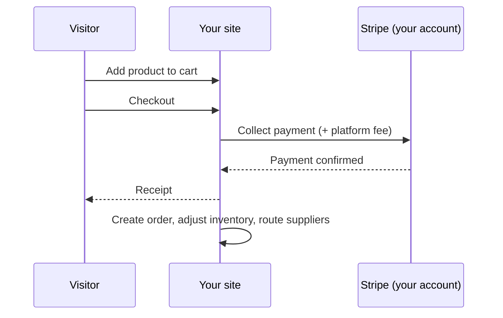

# Commerce

Aglyn commerce sells from **your own Stripe account**: buyers pay you
directly, and Aglyn collects a per-sale platform fee set by your plan (see
[Billing & plans](../../workspace-and-billing/billing-and-plans/overview.md) — higher plans reduce
fees to 0%).

:::info Plan availability
**Paid**. Starter sells up to 100 products (2% physical / 7% digital fee);
Pro and Business raise limits and remove fees.
:::

## Products hub

The **Products** page is the catalog manager:

- **Products** with up to 3 options and 100 variants each — per-variant SKU,
  barcode, price, compare-at (sale badge), weight, and stock. See
  [Product catalog](catalog.md).
- **Categories & collections** — a category tree plus manual and smart
  (rule-based) collections with a live match preview.
- **CSV import/export** in the Shopify column dialect, with a dry-run
  report — switching from Shopify is a file upload.
- **Payments** — Stripe Connect onboarding status and your plan's fee
  ladder.

## Inventory

- Per-variant stock; blank = untracked, 0 = sold out.
- **Oversell policy** per product: stop selling or allow backorders.
- **Low-stock alerts** notify managers once per threshold crossing.
- **Adjustment history** with reason codes (sale, restock, correction…).
- **Locations** split stock across warehouses/storefronts (plan-capped);
  adjustments and POS sales bucket per location.

## Orders

Every paid checkout becomes an order with a sequential number, line-item
snapshots, totals, and a timeline:

- **Statuses**: pending → paid → fulfilled (or partially) → delivered, with
  cancel/refund exits guarded by a status machine. The seven of them, and the
  labels the console shows, are in [Statuses and channels](#order-statuses).
- **Fulfill with tracking**, print **packing slips**, add internal notes.
- **Refunds** (full or partial) go through Stripe and reverse the platform
  fee; site-admin only.
- **Chargebacks** are shown apart from refunds. When a shopper disputes a
  charge with their bank, the order gets a **Chargeback open** badge and the
  list warns you with the date Stripe needs your evidence by — answer it in
  the Stripe dashboard, because an unanswered dispute is decided for the
  shopper. If the dispute is lost the money is reversed, the order reads
  **Charged back** rather than Refunded, and the buyer loses the downloads,
  membership and verified-purchase review a refund would have withdrawn. A
  dispute you win reverses nothing. Filter the list by **Disputes** to find
  either.
- **Draft orders**: build an order in the console and send the buyer a
  payment link (Shopify parity). Requires an active plan with commerce — see
  the note below.

### The Orders screen {#orders-screen}

Open your site's **Products** hub and choose the **Orders** tab. Before your first
sale the tab is an invitation rather than a table: it explains where orders come from
and offers **Draft order**, so you can invoice a customer you already have. The
filters and **Export CSV** appear once there are rows to filter.

Above the table sit five filters and two buttons:

| Control | Choices |
| --- | --- |
| **Product** | **All products**, or one product — matched against the order's line items, so carts, POS and draft orders are found too. |
| **Period** | **All time**, **Last 7 days**, **Last 30 days**. |
| **Status** | **All statuses**, or one of the seven below. |
| **Channel** | **All channels**, or one of the four below. |
| **Disputes** | **All orders**, **Open dispute**, **Charged back**. |
| **Export CSV** | Writes the rows currently shown — the filters apply. |
| **Draft order** | Builds an order by hand and sends the buyer a payment link. |

**Disputes is its own filter, not a status.** An open dispute sits on an order that is
still **Paid**, and a lost one sits on **Refunded** beside every ordinary refund, so
folding either into Status would make that control select the wrong rows.

The table has six columns:

| Column | What the cell holds |
| --- | --- |
| **Order** | The order number, with the first line item underneath — `Blue Mug +2 more` when there is more than one. |
| **Customer** | The buyer's email, or `—` when there isn't one. |
| **Channel** | Online, POS, Draft or Subscription. |
| **Total** | The **net** amount — what you charged, **less anything refunded**. |
| **Status** | The status pill, plus a dispute chip and its evidence deadline when there is one. |
| **Date** | The order date, with the time underneath. |

**Total is net, and this is the column to read carefully.** A $100 order with a $30
refund shows **$70**, and a second line appears under it reading **$100.00 less
refunds** — the gross figure, so you can see both without opening the order. An order
with no refund shows one figure and no caption. Reconciling against a Stripe payout
means reading the caption, not assuming the big number is what was charged.

### Statuses and channels {#order-statuses}

Statuses render as coloured pills, and the colour is part of the message:

| Status | Pill | Colour |
| --- | --- | --- |
| `pending` | **Pending** | Neutral grey — an unpaid order is not a problem, it is not money yet. |
| `paid` | **Paid** | Green. |
| `partially_fulfilled` | **Partly fulfilled** | Amber — something is still owed to the buyer. |
| `fulfilled` | **Fulfilled** | Blue. |
| `delivered` | **Delivered** | Blue. |
| `cancelled` | **Cancelled** | Neutral grey. |
| `refunded` | **Refunded** | Red. |

The left column is the value in the API and the CSV; the middle one is what the
console shows. They differ in one place — `partially_fulfilled` displays as **Partly
fulfilled** — so a filter or a script written against the label will miss it.

Red and grey are reserved deliberately. Cancelled and refunded are the states worth
spotting in a scan of fifty rows, and colouring pending as a warning would spend that
attention on orders that are merely young.

Four channels say where the sale came through:

| Channel | Label |
| --- | --- |
| `online` | **Online** — the storefront. |
| `pos` | **POS** — the in-person register. |
| `draft` | **Draft** — an order you built and invoiced. |
| `subscription` | **Subscription** — one order per paid cycle of a *physical* subscription product. |

### The money tiles {#order-money-tiles}

Three figures sit above the table: **Revenue · 30d**, **Orders · 30d** and **Avg order
value**. Each carries a percentage change measured **against the previous 30 days** —
hover it for that caption.

:::info Plan availability
The tiles need the commerce analytics entitlement — **Pro and above**. **The table
itself is not gated**: a list of your own orders is not a paid feature, and every
filter, the CSV export and draft orders work on any plan that can sell at all.
:::

Two behaviours here look like bugs and are not:

- **Pending and cancelled orders are left out of the tiles.** Neither is money: one
  has not been paid and the other never will be. So the tile count can be lower than
  the number of rows you are looking at. Refunds are handled differently — they are
  **subtracted** rather than dropped, so a refund inside the window pulls revenue and
  the delta down, which is the point of showing them.
- **A tile with no prior period shows no percentage at all** — not `+100%`, not `+0%`,
  not a dash. A first sale has no growth rate, and every way of drawing one is a claim
  that isn't true. The same rule governs the
  [traffic delta in analytics](../../marketing-and-automation/analytics/overview.md#traffic-delta).

:::caution The tiles summarise the loaded window, not your books
The screen loads a bounded page of recent orders — 200 — and the tiles summarise what
is loaded. A store past that many orders in 60 days is reading a slice, at the same
bound the commerce analytics card has always had. Use **Export CSV** and your Stripe
payouts to reconcile; use the tiles to see which way the last month went.
:::

### If a dispute is lost, the money comes back out of your payout {#a-lost-dispute}

Worth knowing before it happens, because it is money leaving an account you
already received it into:

- **The sale was paid out to you at the time of the charge.** When a dispute is
  lost, that payout is reversed — the amount is pulled back from your connected
  Stripe account, not absorbed by Aglyn.
- **The full sale amount comes back, not the amount after our commission.** On
  a $100 sale you received $95 and Aglyn kept $5; a lost dispute pulls back the
  whole $100, because that is what the shopper's bank took. This is the same
  treatment Shopify, Etsy, eBay, PayPal and Square apply to a chargeback, and
  it is **different from a refund you issue yourself** — on a refund, Aglyn's
  commission is returned to you.
- **Aglyn pays the dispute fee.** Card networks charge a fee (around $15) on
  every lost dispute on top of the sale amount. That one is ours, not yours,
  and it never appears on your order or your payout.
- **You are notified** when the reversal happens, so the first you hear of it is
  not a shortfall in a payout you were expecting.
- **The reversal can push your Stripe balance negative** if you have already
  been paid out and nothing new has come in. Stripe recovers a negative balance
  from your next payouts; it does not ask you for money. It does mean your next
  payout can be smaller than the sales behind it, which is normal and not an
  error.
- **Answer disputes promptly.** An unanswered dispute is decided for the shopper
  by default, so the deadline on the order row is the whole game. Evidence is
  submitted in the Stripe dashboard.

:::info Selling needs a plan with commerce
Storefront checkout, POS, **draft orders**, and **reservation deposits** all
check your plan at the moment of the sale, not just when the feature was
switched on. If your plan lapses or you move to one without commerce, these
answer "Selling is not enabled" and stop creating payment links — even though
the commerce plugin is still enabled on the site. Turning the plugin on is your
switch; including commerce is your plan's. See
[downgrading](/workspace-and-billing/billing-and-plans/downgrading-and-canceling#what-changes-on-a-downgrade).
:::

## Shipping & taxes

- **Shipping zones** own countries ('*' = rest of world); rates are flat,
  free-over-subtotal, or subtotal/weight tiers; optional local pickup.
- **Taxes**: manual per-region rates (state beats country, VAT-style
  inclusive pricing supported) or **Stripe Tax** automatic calculation;
  products can be tax-exempt.

### Destination coverage

Checkout collects a shipping address for six countries — **United States,
Canada, United Kingdom, Australia, Germany and France** — and charges the
rate that destination resolves to. It will not charge a rate belonging to
another zone, so the zones you save decide what checkout can do:

- **A destination no rate reaches is refused.** The shopper is told the store
  does not ship there, rather than being posted a parcel you priced nothing
  for. The **Coverage** line under Shipping settings names those countries as
  you edit, and offers to add a rest-of-world zone.
- **Rates that differ by destination make checkout ask.** The cart and
  product page reveal a "Ship to" selector before they can price one. A
  single zone, or a single rest-of-world zone, asks the shopper nothing.
- **No rates at all is a valid setup**, not a gap: the store charges no
  shipping and refuses nobody.
- **Payment links price a parcel too.** A draft order you invoice a customer
  for charges the same rates, collects the same address, and asks you the same
  "Ships to" question in the draft dialog when your rates differ by
  destination.
- **In-person sales charge no shipping.** A register has no destination to
  price against — cash, card and room-folio sales all settle at the counter —
  so a POS sale is items and tax. Raise a draft order for anything you post.

A zone that names a country **hides the rest-of-world zone for it** — so a
"Europe" zone with no rates on it refuses Europe even when a `*` zone exists.
Cover a destination by pricing a rate on the zone that claims it.

## Dropshipping

Assign a **supplier** to a product and paid orders route automatically —
by email and/or HMAC-signed webhook — with a token link the supplier uses
to post tracking back, which fulfills the order. Pro plan and above.

## Related

- [Product catalog](catalog.md)
- [Billing & plans](../../workspace-and-billing/billing-and-plans/overview.md)
- [Bookings & scheduling](../bookings/overview.md)
