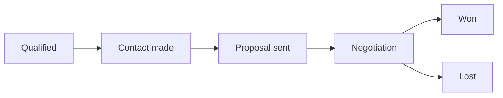

# Deals pipeline

**Deals** is the sales pipeline inside the [CRM](./overview.md): one card per
opportunity, moving through the stages your business sells in. Open it at
`…/hosts/{site}/crm/deals`; a single deal has its own page at
`…/crm/deals/{id}`.

:::info Plan availability
Deals are part of the **CRM suite**, included from **Starter**; on Free the section
is shown locked. A deal is a **CRM record**, counted with contacts and companies
against your plan's records band — see
[CRM records](../../workspace-and-billing/billing-and-plans/overview.md#crm-records).
:::

## Pipelines

Every workspace starts with one pipeline, **Sales**, and a default set of
stages: *Qualified*, *Contact made*, *Proposal sent*, *Negotiation*, then
*Won* and *Lost*. The pipeline is created the first time somebody opens the
Deals section, so there is nothing to set up before the first deal.

A business that sells more than one way — new accounts and renewals, retail
and wholesale — can run more than one pipeline, each with its own stages and
its own board. Open **Pipelines** on the Deals section to:

- **Create** a pipeline. Give it a name; it starts with the default stages,
  which you can then edit. Names are unique among the active pipelines.
- **Rename** a pipeline.
- **Set as default**. New deals land in the default pipeline unless the New
  deal drawer picks another; there is always exactly one default.
- **Archive** a pipeline that holds no open deal. The default pipeline and the
  last active one cannot be archived; close or move the open deals first. An
  archived pipeline is never deleted — the deals it closed still show their
  stages — and can be **restored** later.
- **Edit stages** of a pipeline (below).

When there is more than one active pipeline, a **pipeline switcher** appears
in the section header. The board, the table, the three figures above them
and the New deal drawer all follow it.

### Stages

Each stage carries a **probability** — the chance a deal in that stage closes —
which is what the weighted forecast multiplies by. Won is always 100%, Lost is
always 0%, and the stages in between are yours to set.

**Edit stages** on a pipeline lets you:

- **Rename** a stage or change its probability.
- **Reorder** the open stages with the up and down arrows.
- **Add** a stage. New stages are open stages; every pipeline keeps exactly one
  Won and one Lost.
- **Remove** a stage that no deal is in. A stage with deals in it cannot be
  removed — move the deals first, so nothing is left pointing at a stage that no
  longer exists.

## The board and the table

The section opens as a **board** of the chosen pipeline: one column per open
stage, with Won and Lost folded away at the end until you expand them. Each card shows the deal's title,
amount, the contact and company it is with, its owner, and how many days it has
sat in its current stage. **Drag a card** between columns to move it, or use the
card's menu to move it, mark it won, or mark it lost from the keyboard.

Above the board, three figures summarize what is open: the **open count**, the
**pipeline value** (every open deal's amount, per currency) and the **weighted
value** (each amount multiplied by its stage's probability).

Switch to the **table** for a paged list with the title, stage, amount, owner,
expected close date and status of every deal in the pipeline, including the
closed ones.

## Creating a deal

**New deal** opens a drawer. A deal needs only a title; everything else is
optional:

| Field | What it is |
| --- | --- |
| **Pipeline and stage** | Where the deal starts. The pipeline list holds every active pipeline and opens on the one the board is showing; the stage defaults to its first open stage. |
| **Amount and currency** | What the deal is worth. Currency defaults to US dollars; the amount is stored in minor units, so `1,250.00` is exact. On a deal with [line items](#line-items) the amount is their sum and is read-only here. |
| **Expected close** | The date you expect to close it — what a forecast by month reads. |
| **Owner** | The teammate responsible. Picked from your workspace's members. |
| **Contact** | The person the deal is with, searched by name or email from your contacts. |
| **Company** | The organization, searched by name from your [companies](./companies.md). |
| **Notes** | Anything the card cannot carry. |

A deal is visible to the same sites as a contact captured on this site would
be, so a site that cannot see the person cannot see the deal.

## Line items

A deal's amount can be a number you type, or the sum of the **products**
behind it. The **Products** card on a deal's page lists its line items — each
a name, a quantity and a unit amount in the deal's currency — and **Add line**
opens a dialog with two doors:

- **From the catalog** searches this site's active products by name and offers
  each variant at its catalog price. Catalog prices are in US dollars; on a
  deal in another currency the dialog says so, and the unit amount can be
  edited before the line is added.
- **By hand** takes a name and a price with no product behind them. A plan
  without commerce has no catalog to search, so this is the only door it
  shows.

Once a deal has a line item, its **amount is the lines' sum**: the Amount field
in the Edit drawer turns read-only with a caption saying so, and every change
to the lines — a quantity edited in place, a line removed — writes the new sum
with it. Remove the last line and the amount is yours to type again, starting
from the last sum. A deal carries at most fifty lines, all in the deal's
currency.

Line items travel over the [REST API](/api/resources/deals) as `lineItems`,
with the same rules.

## Moving, winning and losing

Stage changes go through the server rather than being written directly, so
that automations can hear them. Three events fire, and each can trigger a
[workflow or action](../../marketing-and-automation/workflows-and-actions/overview.md)
— see [Automations for the CRM](./automations.md):

| Event | When |
| --- | --- |
| `dealStageChanged` | A deal moves between open stages, or is reopened. |
| `dealWon` | A deal is marked won. |
| `dealLost` | A deal is marked lost. Marking a deal lost asks for a reason, which is kept on the deal. |

Every event carries the deal's id, title, amount and currency, its new and
previous stage, and the owner, contact and company ids, so a workflow can
notify the owner, update the contact's lifecycle stage, or file a task.

## A deal's page

Opening a deal shows:

- **The header** — the deal's title in the page heading and the trail, the
  pipeline and stage under its kind, its status, amount and owner as chips,
  **Back to deals**, **Edit**, and a menu (⋮) carrying **Delete deal**.
- **Stage** — a stepper across the open stages, with **Won** and **Lost**
  buttons and, on a closed deal, the way to reopen it.
- **Properties** — the amount and its weighted value, the expected close, the
  owner, links to the contact and the company, and the notes.
- **Products** — the [line items](#line-items) behind the amount, with the
  door to add one from the catalog or by hand.
- **Tasks** and **Activity** — what is owed on this deal and what has happened
  on it.

A deal also appears on the pages of the contact and the company it names, each
with a **New deal** shortcut that starts a deal already linked to them.

## Related

- [CRM overview](./overview.md)
- [Companies](./companies.md) and [the contact record](./contact-record.md) — the two records a deal is with
- [Tasks & follow-ups](./tasks.md) and [Activities & the timeline](./activities.md) — what is owed on a deal and what has happened on it
- [Reports](./reports.md) — the open pipeline, its weighted forecast, and won against lost
- [Automations for the CRM](./automations.md) — the three deal events
- [Workflows & actions](../../marketing-and-automation/workflows-and-actions/overview.md)
- [REST API — deals](/api/resources/deals) and [pipelines](/api/resources/pipelines)
