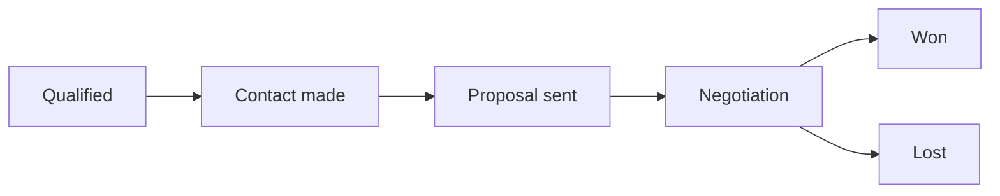

# Deals pipeline

**Deals** is the sales pipeline inside the [CRM](./overview.md): one card per
opportunity, moving through the stages your business sells in. Open it at
`…/hosts/{site}/crm/deals`; a single deal has its own page at
`…/crm/deals/{id}`.

## The pipeline and its stages

Every workspace starts with one pipeline, **Sales**, and a default set of
stages: *Qualified*, *Contact made*, *Proposal sent*, *Negotiation*, then
*Won* and *Lost*. The pipeline is created the first time somebody opens the
Deals section, so there is nothing to set up before the first deal.

Each stage carries a **probability** — the chance a deal in that stage closes —
which is what the weighted forecast multiplies by. Won is always 100%, Lost is
always 0%, and the stages in between are yours to set.

Open **Stages** on the Deals section to:

- **Rename** a stage or change its probability.
- **Reorder** the open stages with the up and down arrows.
- **Add** a stage. New stages are open stages; every pipeline keeps exactly one
  Won and one Lost.
- **Remove** a stage that no deal is in. A stage with deals in it cannot be
  removed — move the deals first, so nothing is left pointing at a stage that no
  longer exists.

## The board and the table

The section opens as a **board**: one column per open stage, with Won and Lost
folded away at the end until you expand them. Each card shows the deal's title,
amount, the contact and company it is with, its owner, and how many days it has
sat in its current stage. **Drag a card** between columns to move it, or use the
card's menu to move it, mark it won, or mark it lost from the keyboard.

Above the board, three figures summarize what is open: the **open count**, the
**pipeline value** (every open deal's amount, per currency) and the **weighted
value** (each amount multiplied by its stage's probability).

Switch to the **table** for a paged list with the title, stage, amount, owner,
expected close date and status of every deal, including the closed ones.

## Creating a deal

**New deal** opens a drawer. A deal needs only a title; everything else is
optional:

| Field | What it is |
| --- | --- |
| **Pipeline and stage** | Where the deal starts. Defaults to the first open stage of the default pipeline. |
| **Amount and currency** | What the deal is worth. Currency defaults to US dollars; the amount is stored in minor units, so `1,250.00` is exact. |
| **Expected close** | The date you expect to close it — what a forecast by month reads. |
| **Owner** | The teammate responsible. Picked from your workspace's members. |
| **Contact** | The person the deal is with, searched by name or email from your contacts. |
| **Company** | The organization, searched by name from your [companies](./companies.md). |
| **Notes** | Anything the card cannot carry. |

A deal is visible to the same sites as a contact captured on this site would
be, so a site that cannot see the person cannot see the deal.

## Moving, winning and losing

Stage changes go through the server rather than being written directly, so
that automations can hear them. Three events fire, and each can trigger a
[workflow or action](../../marketing-and-automation/workflows-and-actions/overview.md)
— see [Automations for the CRM](./automations.md):

| Event | When |
| --- | --- |
| `dealStageChanged` | A deal moves between open stages, or is reopened. |
| `dealWon` | A deal is marked won. |
| `dealLost` | A deal is marked lost. Marking a deal lost asks for a reason, which is kept on the deal. |

Every event carries the deal's id, title, amount and currency, its new and
previous stage, and the owner, contact and company ids, so a workflow can
notify the owner, update the contact's lifecycle stage, or file a task.

## A deal's page

Opening a deal shows:

- **The header** — the deal's title in the page heading and the trail, the
  pipeline and stage under its kind, its status, amount and owner as chips,
  **Back to deals**, **Edit**, and a menu (⋮) carrying **Delete deal**.
- **Stage** — a stepper across the open stages, with **Won** and **Lost**
  buttons and, on a closed deal, the way to reopen it.
- **Properties** — the amount and its weighted value, the expected close, the
  owner, links to the contact and the company, and the notes.
- **Tasks** and **Activity** — what is owed on this deal and what has happened
  on it.

A deal also appears on the pages of the contact and the company it names, each
with a **New deal** shortcut that starts a deal already linked to them.

## Related

- [CRM overview](./overview.md)
- [Companies](./companies.md) and [the contact record](./contact-record.md) — the two records a deal is with
- [Tasks & follow-ups](./tasks.md) and [Activities & the timeline](./activities.md) — what is owed on a deal and what has happened on it
- [Reports](./reports.md) — the open pipeline, its weighted forecast, and won against lost
- [Automations for the CRM](./automations.md) — the three deal events
- [Workflows & actions](../../marketing-and-automation/workflows-and-actions/overview.md)
- [REST API — deals](/api/resources/deals) and [pipelines](/api/resources/pipelines)
