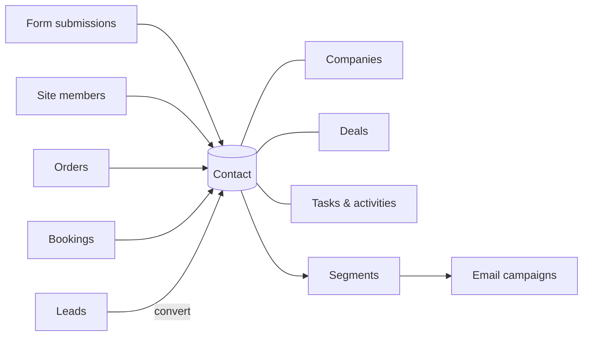

# CRM

The **CRM** is where your team works the people who interact with your sites.
Aglyn builds the contact list on its own from everything a visitor does — a
form submitted, an account created, an order placed, a booking made — and the
CRM puts the rest of a sales team's records around that list: leads to qualify,
the companies people work for, a deals pipeline, tasks, a timeline of calls and
meetings, reports, and the custom fields your business describes people by.

In the console the plugin is called **CRM**. It is one tab, and a hub of eight
sections, each with its own address under your site at
`…/hosts/{site}/crm/<section>`; a bare `…/crm` lands on the first. The surface
was called **Contacts** while it was a single list, and a link kept from then —
the older `…/contacts` address — still opens the hub.

:::caution Rolling out
The **CRM** tab in the console isn't available yet — it's a release-flagged
feature, so there's no CRM tab in your workspace and nothing to switch on under
**Organization → Plugins**.

Capture is already running, though. Contacts are ingested from forms, member
sign-ups, orders and bookings **today**, and you can read them over the
[REST API](/api/resources/contacts) in the meantime — nothing is lost while you
wait. Records-band overage is **not billed** while the page is unavailable.
:::

## What's in the CRM area

| Section | Address | What lives there |
| --- | --- | --- |
| **[Contacts](./contact-record.md)** | `/crm/contacts` | Every person your site may see, as a list with Owner and Stage columns, filters and search; a person's own page is `/crm/contacts/{id}`. [CSV import](./import.md), [bulk actions](./bulk-actions.md), [saved views](./views.md) and the [timeline](./activities.md) live here too. |
| **[Leads](./leads.md)** | `/crm/leads` | People a site has captured but not yet qualified — a status, an owner and notes on each, and a conversion into a contact, a company and a deal. |
| **[Companies](./companies.md)** | `/crm/companies` | The organizations your contacts belong to, keyed by domain — a captured contact is linked to the company at their email domain on its own; a company's page is `/crm/companies/{id}`. [CSV import and export](./companies.md#import-from-csv) and [bulk actions](./bulk-actions.md#companies) too. |
| **[Deals](./deals.md)** | `/crm/deals` | The sales pipeline — open deals by stage, with an amount, an owner and an expected close, as a board or a table with [export and bulk actions](./bulk-actions.md#deals); a deal's page is `/crm/deals/{id}`. |
| **[Tasks](./tasks.md)** | `/crm/tasks` | Calls, emails, meetings and to-dos by due date, each linked to the contact, company or deal it is for, with [export and bulk actions](./bulk-actions.md#tasks). |
| **[Reports](./reports.md)** | `/crm/reports` | New contacts over time, sources and the lifecycle funnel, the open pipeline and its forecast, won and lost, and the task load. |
| **[Fields](./custom-fields.md)** | `/crm/fields` | The custom fields on a contact — text, number, date, choice, checkbox or link — which a form field can save into. |
| **[Settings](./settings.md)** | `/crm/settings` | What the CRM does on its own for every site in the workspace — whether a company is created from a captured contact's work email domain. |

Three things cut across the sections rather than having one of their own.
**Saved views** keep a list's filters, columns and sort under a name on every
section that has a list, shareable and linkable; see
[Saved views](./views.md). **Activities** — the calls, emails, meetings and
notes your team logs — are filed from the page of the record they are about
and read in that record's timeline; see
[Activities & the timeline](./activities.md). **Automations** can start on
what happens in the CRM and act on it; see
[Automations for the CRM](./automations.md).

Every record here is also on the [REST API](/api/): contacts under
`/v1/contacts`, and companies, pipelines, deals, tasks and activities under one
pair of scopes, `crm:read` and `crm:write`.

## Unified ingestion

Contacts are ingested from across your site:

- [Form](../forms/overview.md) submissions
- Site **members** (sign-ups)
- **Orders** from [commerce](../../commerce-and-bookings/commerce/overview.md)
- **Bookings** from [scheduling](../../commerce-and-bookings/bookings/overview.md)

Duplicate signals from the same person are unified into one contact. A person
your site has met but not yet qualified is also a [lead](./leads.md); converting
the lead joins the same contact rather than making a second one.

Every tier includes a **CRM records band** — one number for contacts, companies and
deals together. Only the Free tier's band is a hard limit; paid tiers never drop a
record, and growth past the band meters as overage. That overage is **not billed while
the CRM is unavailable**. See
[CRM records](../../workspace-and-billing/billing-and-plans/overview.md#crm-records)
under Billing & plans.

## What each plan includes {#what-each-plan-includes}

| | Free | Starter and above |
| --- | --- | --- |
| **Contacts** — the list, tags, notes, segments, CSV import and export, bulk actions | Yes, banded at 100 records | Yes, banded by tier and metered past the band |
| **The CRM suite** — Leads, Companies, Deals, Tasks, Reports and Fields; the two CRM dashboard cards; the CRM automation steps; the `crm:*` REST resources | Shown in the rail with a lock; opening a section names the plan that includes it | Yes |
| **One-to-one email** from a record | None | A daily cap by tier — see [One-to-one email](../../workspace-and-billing/billing-and-plans/overview.md#one-to-one-email) |

The contacts list is on every plan because it is the audience your email campaigns
read; the suite is what a sales team builds on that list. A record's **activity log**
is bounded on every plan at **5,000 logged activities per record** — a call a day for
fourteen years — after which the log dialog, the automation step and the API refuse
another entry on that record with a message saying so.

## The contacts page

The **Contacts** section is the list the rest of the CRM is built on. It lets
you:

- Browse the **list**, with Owner and Stage columns, a stage filter, an
  **Assigned to me** toggle, and one optional column per custom field.
- Add a contact **by hand** with **New contact** — see
  [The contact record](./contact-record.md).
- Open a contact's **own page** to edit their profile, see where they came
  from, and read their history.
- Add **tags** and **notes**.
- Log **calls, emails, meetings and notes** against a person, and read them in
  one timeline with everything the platform captured — see
  [Activities & the timeline](./activities.md).
- Tick rows and act on all of them at once — tag them, set their owner or
  stage, add them to an email audience, export them, or remove them from this
  site; see [Bulk actions](./bulk-actions.md).
- **Export to CSV**, and **Import CSV** — see below.

Under the list, a **Recent activity** feed shows the newest calls, emails,
meetings and notes anyone on the team has logged against any record.

## Import from CSV

**Import CSV** on the Contacts section brings a spreadsheet of people in — map its
columns to contact fields, preview the first rows, and import in batches with a report
of what was added, updated and skipped. See [Import contacts from CSV](./import.md).

## Segments

Group contacts into **segments** — saved filters over tags and sources, kept
from the Contacts list's filter bar through **Save as segment…** in the views
menu — and target them directly in
[email campaigns](../../marketing-and-automation/email-campaigns/overview.md).
A [saved view](./views.md) keeps more than a segment — every filter, the
columns and the sort — and a contacts view can be an audience in its own
right, picked beside a segment when an audience is built from a rule. An
audience built from a rule can also read a contact's owner, lifecycle stage,
company and custom fields; see
[email audiences](../../marketing-and-automation/email-campaigns/overview.md#email-lists).

## Everywhere the CRM shows up

The CRM is wired into the rest of the console rather than standing beside it.
Every place a person's record is met links into the CRM, and the CRM links
back out to the record that put the person there.

| Where | Into the CRM | Out of the CRM |
| --- | --- | --- |
| **Search** (the top bar) | Contacts by name, email, phone or company; **leads** by name or email; **companies** by name or domain; **deals** by title. Each result opens the record. The CRM groups appear only for members who may open the CRM. | — |
| **Inbox** | A submission row's **⋮ → Open contact in CRM**; a member or lead row's **Open in CRM**. | A contact's timeline opens the submission that captured them, in the Inbox reader. |
| **Forms** | A form's page: **See the contacts this form captured in the CRM**, and the **CRM routing** card. | — |
| **Products → Orders** | An order's dialog: **View customer in CRM**. | The contact header's order count opens the orders list narrowed to the person's address; a timeline entry opens the order itself. |
| **Bookings** | Each upcoming booking: **View in CRM**. | A timeline entry for a booking opens the Bookings page. |
| **Users** | A site user's row menu: **Open in CRM**. | A timeline entry for a sign-up opens the Users page. |
| **Dashboard** | The **Inbox** card counts the site's open leads and links to **Leads**; the **CRM at a glance** card's figures open Contacts, Deals and Tasks. | — |
| **Marketing** | — | The Relationship card's campaign attribution opens the campaign's page. |
| **Setup → Activity** | — | Adding, deleting or converting a contact, company, deal or lead is logged, and each entry opens the record. |

A link that arrives by a person's *address* — from an order, a booking or a
site user — opens the Contacts list asked for that address, and the list moves
straight on to the record when exactly one person matches. No match leaves the
filtered list on screen, which is the honest answer for a capture the audience
band dropped.

## Who can open the CRM

Opening the CRM takes the workspace's **manage data** permission — owners,
admins and editors by default, or a custom role granting it. What a reader then
sees follows the site they have open: a record captured on one site is visible
to that site, to every site declared to be one sender with it, or to the whole
organization when the organization has chosen to share its data. A collaborator
scoped to one site sees that site's people, deals and tasks and no others. The
rule is the same in every section, so no section can show a record the reader
could not open as a contact.

## Related

- [The contact record](./contact-record.md) · [Leads](./leads.md) · [Companies](./companies.md) · [Deals pipeline](./deals.md) · [Tasks & follow-ups](./tasks.md) · [Reports](./reports.md) · [Custom fields](./custom-fields.md)
- [Forms & lead capture](../forms/overview.md)
- [Email campaigns](../../marketing-and-automation/email-campaigns/overview.md)
- [Automations for the CRM](./automations.md)
- [REST API — contacts](/api/resources/contacts), [companies](/api/resources/companies), [pipelines](/api/resources/pipelines), [deals](/api/resources/deals), [tasks](/api/resources/tasks) and [activities](/api/resources/activities)
