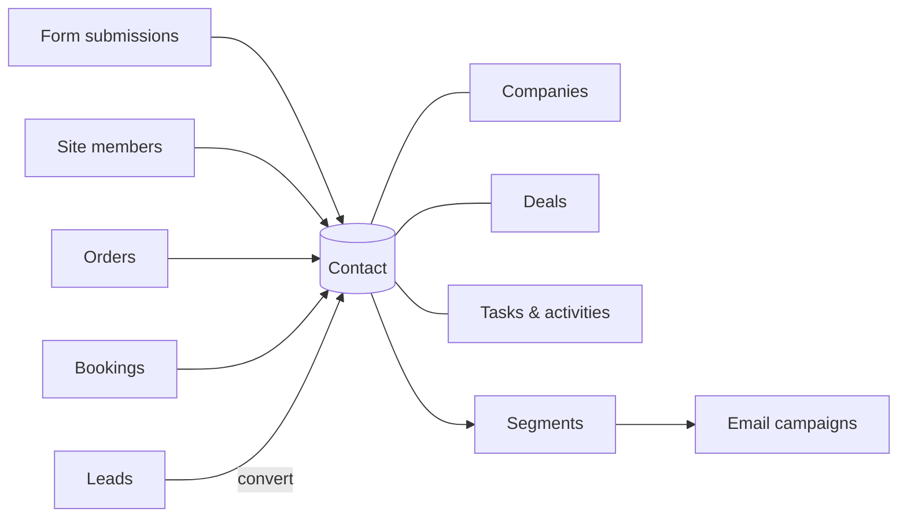

# CRM

The **CRM** is where your team works the people who interact with your sites.
Aglyn builds the contact list on its own from everything a visitor does — a
form submitted, an account created, an order placed, a booking made — and the
CRM puts the rest of a sales team's records around that list: leads to qualify,
the companies people work for, a deals pipeline, tasks, a timeline of calls and
meetings, reports, and the custom fields your business describes people by.

In the console the plugin is called **CRM**. It is one tab, and a hub of seven
sections, each with its own address under your site at
`…/hosts/{site}/crm/<section>`; a bare `…/crm` lands on the first. The surface
was called **Contacts** while it was a single list, and a link kept from then —
the older `…/contacts` address — still opens the hub.

:::caution Rolling out
The **CRM** tab in the console isn't available yet — it's a release-flagged
feature, so there's no CRM tab in your workspace and nothing to switch on under
**Organization → Plugins**.

Capture is already running, though. Contacts are ingested from forms, member
sign-ups, orders and bookings **today**, and you can read them over the
[REST API](/api/resources/contacts) in the meantime — nothing is lost while you
wait. Audience-band overage is **not billed** while the page is unavailable.
:::

## What's in the CRM area

| Section | Address | What lives there |
| --- | --- | --- |
| **[Contacts](./contact-record.md)** | `/crm/contacts` | Every person your site may see, as a list with Owner and Stage columns, filters and search; a person's own page is `/crm/contacts/{id}`. [CSV import](./import.md), [bulk actions](./bulk-actions.md) and the [timeline](./activities.md) live here too. |
| **[Leads](./leads.md)** | `/crm/leads` | People a site has captured but not yet qualified — a status, an owner and notes on each, and a conversion into a contact, a company and a deal. |
| **[Companies](./companies.md)** | `/crm/companies` | The organizations your contacts belong to, keyed by domain; a company's page is `/crm/companies/{id}`. |
| **[Deals](./deals.md)** | `/crm/deals` | The sales pipeline — open deals by stage, with an amount, an owner and an expected close, as a board or a table; a deal's page is `/crm/deals/{id}`. |
| **[Tasks](./tasks.md)** | `/crm/tasks` | Calls, emails, meetings and to-dos by due date, each linked to the contact, company or deal it is for. |
| **[Reports](./reports.md)** | `/crm/reports` | New contacts over time, sources and the lifecycle funnel, the open pipeline and its forecast, won and lost, and the task load. |
| **[Fields](./custom-fields.md)** | `/crm/fields` | The custom fields on a contact — text, number, date, choice, checkbox or link — which a form field can save into. |

Two things cut across the sections rather than having one of their own.
**Activities** — the calls, emails, meetings and notes your team logs — are
filed from the page of the record they are about and read in that record's
timeline; see [Activities & the timeline](./activities.md). **Automations**
can start on what happens in the CRM and act on it; see
[Automations for the CRM](./automations.md).

Every record here is also on the [REST API](/api/): contacts under
`/v1/contacts`, and companies, pipelines, deals, tasks and activities under one
pair of scopes, `crm:read` and `crm:write`.

## Unified ingestion

Contacts are ingested from across your site:

- [Form](../forms/overview.md) submissions
- Site **members** (sign-ups)
- **Orders** from [commerce](../../commerce-and-bookings/commerce/overview.md)
- **Bookings** from [scheduling](../../commerce-and-bookings/bookings/overview.md)

Duplicate signals from the same person are unified into one contact. A person
your site has met but not yet qualified is also a [lead](./leads.md); converting
the lead joins the same contact rather than making a second one.

Every tier includes an **audience band** — a number of contacts. Only the Free tier's
band is a hard limit; paid tiers never drop a record, and growth past the band meters
as overage. That overage is **not billed while the Contacts page is unavailable**. See
[Billing & plans](../../workspace-and-billing/billing-and-plans/overview.md).

## The contacts page

The **Contacts** section is the list the rest of the CRM is built on. It lets
you:

- Browse the **list**, with Owner and Stage columns, a stage filter, an
  **Assigned to me** toggle, and one optional column per custom field.
- Add a contact **by hand** with **New contact** — see
  [The contact record](./contact-record.md).
- Open a contact's **own page** to edit their profile, see where they came
  from, and read their history.
- Add **tags** and **notes**.
- Log **calls, emails, meetings and notes** against a person, and read them in
  one timeline with everything the platform captured — see
  [Activities & the timeline](./activities.md).
- Tick rows and act on all of them at once — tag them, set their owner or
  stage, add them to an email audience, export them, or remove them from this
  site; see [Bulk actions](./bulk-actions.md).
- **Export to CSV**, and **Import CSV** — see below.

Under the list, a **Recent activity** feed shows the newest calls, emails,
meetings and notes anyone on the team has logged against any record.

## Import from CSV

**Import CSV** on the Contacts section brings a spreadsheet of people in — map its
columns to contact fields, preview the first rows, and import in batches with a report
of what was added, updated and skipped. See [Import contacts from CSV](./import.md).

## Segments

Group contacts into **segments** — saved filters over tags and sources, kept
from the Contacts list's own filter controls — and target them directly in
[email campaigns](../../marketing-and-automation/email-campaigns/overview.md).
An audience built from a rule can also read a contact's owner, lifecycle stage,
company and custom fields; see
[email audiences](../../marketing-and-automation/email-campaigns/overview.md#email-lists).

## Who can open the CRM

Opening the CRM takes the workspace's **manage data** permission — owners,
admins and editors by default, or a custom role granting it. What a reader then
sees follows the site they have open: a record captured on one site is visible
to that site, to every site declared to be one sender with it, or to the whole
organization when the organization has chosen to share its data. A collaborator
scoped to one site sees that site's people, deals and tasks and no others. The
rule is the same in every section, so no section can show a record the reader
could not open as a contact.

## Related

- [The contact record](./contact-record.md) · [Leads](./leads.md) · [Companies](./companies.md) · [Deals pipeline](./deals.md) · [Tasks & follow-ups](./tasks.md) · [Reports](./reports.md) · [Custom fields](./custom-fields.md)
- [Forms & lead capture](../forms/overview.md)
- [Email campaigns](../../marketing-and-automation/email-campaigns/overview.md)
- [Automations for the CRM](./automations.md)
- [REST API — contacts](/api/resources/contacts), [companies](/api/resources/companies), [pipelines](/api/resources/pipelines), [deals](/api/resources/deals), [tasks](/api/resources/tasks) and [activities](/api/resources/activities)
