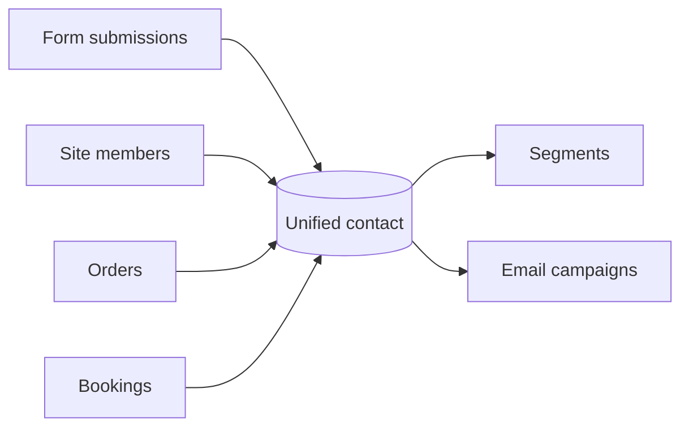

# Contacts CRM

The **Contacts CRM** is a single list of the people who interact with your site. Aglyn
builds it automatically from everything they do, so you always have an up-to-date view of
your audience.

:::caution Rolling out
The **Contacts page** in the console isn't available yet — it's a release-flagged
feature being finished for Contacts CRM v1, so there's no Contacts tab in your
workspace and nothing to switch on.

Capture is already running, though. Contacts are ingested from forms, member
sign-ups, orders and bookings **today**, and you can read them over the
[REST API](/api/resources/contacts) in the meantime — nothing is lost while you
wait. Audience-band overage is **not billed** while the page is unavailable.
:::

## Unified ingestion

Contacts are ingested from across your site:

- [Form](../forms/overview.md) submissions
- Site **members** (sign-ups)
- **Orders** from [commerce](../../commerce-and-bookings/commerce/overview.md)
- **Bookings** from [scheduling](../../commerce-and-bookings/bookings/overview.md)

Duplicate signals from the same person are unified into one contact.

Every tier includes an **audience band** — a number of contacts. Only the Free tier's
band is a hard limit; paid tiers never drop a record, and growth past the band meters
as overage. That overage is **not billed while the Contacts page is unavailable**. See
[Billing & plans](../../workspace-and-billing/billing-and-plans/overview.md).

## The contacts page

Once the page is switched on, it will let you:

- Browse the **list** of contacts.
- Open a **profile drawer** to see a contact's details and history.
- Add **tags** and **notes**.
- **Export to CSV**.

## Segments

Group contacts into **segments** — reusable audiences you can target directly in
[email campaigns](../../marketing-and-automation/email-campaigns/overview.md).

## Related

- [Email campaigns](../../marketing-and-automation/email-campaigns/overview.md)
- [Forms & lead capture](../forms/overview.md)
