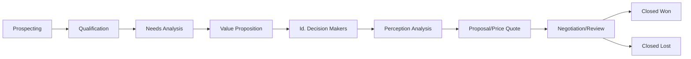

# Deals pipeline

**Deals** is the sales pipeline inside the [CRM](./overview.md): one card per
opportunity, moving through the stages your business sells in. Open it at
`…/hosts/{site}/crm/deals`; a single deal has its own page at
`…/crm/deals/{id}`.

:::info Plan availability
Deals are part of the **CRM**, included from **Starter**. On Free the section is shown
locked, with the rest of the CRM. A deal is a **CRM record**, counted with contacts and
companies against your plan's records band — see
[CRM records](../../workspace-and-billing/billing-and-plans/overview.md#crm-records).
:::

## Pipelines

Every workspace on a plan with the CRM starts with one pipeline, **Sales**. A
new pipeline starts with Salesforce's standard Opportunity stages:

| Stage | Probability | Forecast category |
| --- | --- | --- |
| Prospecting | 10% | Pipeline |
| Qualification | 10% | Pipeline |
| Needs Analysis | 20% | Pipeline |
| Value Proposition | 50% | Pipeline |
| Id. Decision Makers | 60% | Pipeline |
| Perception Analysis | 70% | Pipeline |
| Proposal/Price Quote | 75% | Best Case |
| Negotiation/Review | 90% | Commit |
| Closed Won | 100% | Closed |
| Closed Lost | 0% | Omitted |

The pipeline is created the first time somebody opens the Deals section, so
there is nothing to set up before the first deal. A pipeline created before
these stages became the default keeps the stages it has; nothing is changed
for you.

A business that sells more than one way — new accounts and renewals, retail
and wholesale — can run more than one pipeline, each with its own stages and
its own board. Open **Pipelines** on the Deals section to:

- **Create** a pipeline. Give it a name; it starts with the default stages,
  which you can then edit. Names are unique among the active pipelines.
- **Rename** a pipeline.
- **Set as default**. New deals land in the default pipeline unless the New
  deal drawer picks another; there is always exactly one default.
- **Archive** a pipeline that holds no open deal. The default pipeline and the
  last active one cannot be archived; close or move the open deals first. An
  archived pipeline is never deleted — the deals it closed still show their
  stages — and can be **restored** later.
- **Edit stages** of a pipeline (below).

When there is more than one active pipeline, a **pipeline switcher** appears
in the section header. The board, the table, the three figures above them
and the New deal drawer all follow it.

### Stages

Each stage carries a **probability** — the chance a deal in that stage closes —
which is what the weighted forecast multiplies by — and a **forecast
category**: where a deal that lands in the stage is forecast. The categories
are Salesforce's fixed set — **Omitted**, **Pipeline**, **Best Case**,
**Commit** and **Closed** — and cannot be renamed or added to, because a
forecast rolls up by them. Won is always 100% and Closed, Lost is always 0% and
Omitted, and the stages in between are yours to set; a stage that never had a
category reads as **Pipeline**.

**Edit stages** on a pipeline lets you:

- **Rename** a stage or change its probability or its forecast category. A
  new category applies to the deals that move into the stage from then on.
- **Reorder** the open stages with the up and down arrows.
- **Add** a stage. New stages are open stages; every pipeline keeps exactly one
  Won and one Lost.
- **Remove** a stage that no deal is in. A stage with deals in it cannot be
  removed — move the deals first, so nothing is left pointing at a stage that no
  longer exists.

## The board and the table

The section opens as a **board** of the chosen pipeline: one column per open
stage, with Won and Lost folded away at the end until you expand them. Each card shows the deal's title,
amount, the contact and company it is with, its owner, and how many days it has
sat in its current stage. **Drag a card** between columns to move it, or use the
card's menu to move it, mark it won, or mark it lost from the keyboard.

Above the board, three figures summarize what is open: the **open count**, the
**pipeline value** (every open deal's amount, per currency) and the **weighted
value** (each amount multiplied by its probability — the deal's own when it
has one, otherwise its stage's).

Switch to the **table** for a paged list with the title, stage, amount, owner,
expected close date, status and [**next activity**](./tasks.md#next-activity)
of every deal in the chosen pipeline, including the closed ones, most recently
changed first. **Type** and **Lead source** are optional columns: turn them on
from the column menu. The table's **Filters** panel narrows it by **Status**
(open, won or lost — one, or any of them), by **Type** and by **Lead source**
(one value, any of several, or *No type* / *No lead source*), and
**Next activity** › **is empty** keeps only the deals with no open task
scheduled against them — the ones the reports page counts as
[stuck](./reports.md#pipeline). **Search** finds a deal by any word of its
title.

Every filter and the search are answered by the table's query, so they reach
every deal in the pipeline, a page at a time, not only the page on screen, and
filters on different columns add up. The search matches whole words from
their start — "cof" finds *Coffee*, a fragment from the middle of a word does
not — one word at a time: type several and it searches the first, and says
so. Under a site, a member whose access is limited to particular sites
searches by the start of a deal's title, and a notice says so. When a
combination cannot be answered by one query, the table does not
apply that filter, and a notice above it names the filter and says why; see
[Filter and search a list](../../getting-started/console-tour.md#filter-and-search).
A column header sorts only the rows of the page on screen; the pages keep
the table's own order. The board has no filters.

The table's rows have checkboxes: tick some and a [bulk bar](./bulk-actions.md#deals)
appears above it to set their stage, set their owner, mark them lost with one
reason, export them or delete them. **Export CSV** in the card's header, shown
with the table, downloads the deals on screen as `deals.csv` — title, pipeline and stage by
name, the amount in major units beside its currency, the owner by email
address, the expected close date, status, the contact and the company, when
it closed, the lost reason and notes, then the type, lead source, next step,
the deal's own probability (blank when it uses its stage's), the forecast
category and the campaign by name; the bar's **Export CSV** writes the same
file over the selection.

## Import from CSV

**Import CSV** in the card's header takes a spreadsheet of deals —
an export from another CRM, a forecast sheet — and files each row as a new
deal. A deal has no key the way a contact has an address, so nothing is
merged: importing a file twice files it twice. Importing needs the same
**Manage data** permission as creating a deal.

The three steps are the ones the [contacts import](./import.md) walks: choose
the file (up to 5,000 rows), match its columns — Aglyn proposes a match from
the header names and shows the first row's value beside each — check the
ten-row preview, then import in batches of 200 with a progress bar and a
result that says how many were **added** and **skipped**, with the skipped
rows downloadable as a CSV that says why. **Download template** hands you the
export's own header over no rows, so a sheet filled in against it maps itself.

| Field | What is read |
| --- | --- |
| **Title** | Required. A row without one is skipped. |
| **Pipeline** | By **name**, as it appears in [Pipelines](#pipelines), spelled either way. Left empty, the row lands in the default pipeline. A name your workspace has no pipeline for skips the row as *No pipeline by that name*. |
| **Stage** | By name within that pipeline. Left empty, the pipeline's first open stage. A name the pipeline has no stage for skips the row as *No stage by that name in that pipeline*. A row filed into **Won** or **Lost** is closed on arrival; no `dealWon` or `dealLost` event fires for it. |
| **Amount** | In major units (`1250.00`, `$1,250`); the currency symbol and separators are ignored. A cell that is not a number is dropped and reported. |
| **Currency** | A three-letter code (`USD`, `EUR`); `USD` when empty. Anything else is dropped and reported. |
| **Owner** | The email address of a member of your organization. An address that matches nobody leaves the deal without an owner, and the result names those addresses. |
| **Expected close** | A calendar day (`2026-12-01`) or a timestamp. Anything else is dropped and reported. |
| **Notes** | Free text. |
| **Type** | One of your [deal types](#type-and-lead-source), in any case. A row with none takes the list's default, when it has one. A value your list does not hold skips the row as *Type is not one of your deal types*. |
| **Lead source** | One of your lead sources, in any case. A value your list does not hold skips the row as *Lead source is not one of your lead sources*. |
| **Next step** | Free text, up to 255 characters. |
| **Probability** | A whole percent from 0 to 100 (`35` or `35%`) — the deal's own, over its stage's. Anything else is dropped and reported. |
| **Forecast category** | *Omitted*, *Pipeline*, *Best Case*, *Commit* or *Closed*. Left empty, the stage's. Anything else is dropped and reported. |

The export's **Status**, **Contact**, **Company**, **Closed**, **Lost
reason** and **Campaign** columns are proposed as **Do not import**: the stage
decides the status, and a deal is linked to its contact, company and campaign
on its own page. A
new deal counts against your plan's [records band](../../workspace-and-billing/billing-and-plans/overview.md#crm-records);
on a plan whose band is a hard limit, rows past it are skipped as **CRM
records limit reached**.

At the [organization level](./overview.md#at-the-organization-level) the
drawer first asks which site the deals are filed under, because a deal is
some site's record and the site decides which of your sites may see it.

## Creating a deal

**New deal** opens a drawer. A deal needs only a title; everything else is
optional:

| Field | What it is |
| --- | --- |
| **Pipeline and stage** | Where the deal starts. The pipeline list holds every active pipeline and opens on the one the board is showing; the stage defaults to its first open stage. |
| **Amount and currency** | What the deal is worth. Currency defaults to US dollars; the amount is stored in minor units, so `1,250.00` is exact. On a deal with [line items](#line-items) the amount is their sum and is read-only here. |
| **Expected close** | The date you expect to close it — what a forecast by month reads. |
| **Owner** | The teammate responsible. Picked from your workspace's members. |
| **Contact** | The person the deal is with, searched by name or email from your contacts — the deal's Primary [contact role](#contact-roles). Picking another makes them Primary. |
| **Company** | The organization, searched by name from your [companies](./companies.md). |
| **Type** | Salesforce's Type: *New Business*, *Existing Business*, or one of your own — see [Type and lead source](#type-and-lead-source). A new deal with none takes the list's default, when it has one. |
| **Lead source** | Where the deal came from — the same list a [lead's](./leads.md) lead source is picked from. |
| **Next step** | What happens next, up to 255 characters. |
| **Probability** | This deal's own chance of closing, a whole percent. Leave it blank to use the stage's, which the field shows as *From stage: N%*. |
| **Forecast category** | Where the deal is forecast. *From the stage* uses the stage's category. |
| **Campaign** | The campaign the deal is attributed to — Salesforce's Primary Campaign Source — one of the campaigns your leads are filed under. |
| **Notes** | Anything the card cannot carry. |

A deal is visible to the same sites as a contact captured on this site would
be, so a site that cannot see the person cannot see the deal.

### Type and lead source {#type-and-lead-source}

A deal's **Type** and **Lead source** are picklists, as in Salesforce. Type
ships with Salesforce's standard values, *Existing Business* and *New
Business*; add your own, rename, reorder, deactivate them or set a default on
the **Deals** tab of [Custom fields](./custom-fields.md#picklist-values). Lead
source is the list a lead's own lead source comes from, managed on the
**Leads** tab; renaming or deleting a value there moves every lead, contact
and deal that holds it. A deal keeps a value it already holds after the value
is deactivated.

When a lead is [converted](./leads.md#converting-a-lead) with a deal, the
deal takes the lead's lead source, and the Type the convert dialog shows —
the list's default until you pick another.

## Contact roles {#contact-roles}

A deal can name more than one person: Salesforce's Opportunity Contact Roles.
The **Contact roles** card on a deal's page lists every contact on the deal,
the part each plays, and which one is **Primary**:

- **Add contact** (in the card's header) opens a dialog: pick a contact, a
  role, and whether they are the Primary. The first contact on a deal is
  always its Primary.
- Each row's **Role** select changes the part they play; **Make primary**
  moves the Primary to them; the remove button takes them off the deal.

A deal names up to **50** contacts, each once, and at most one is Primary.

**The Primary is the deal's contact.** The **Contact** field of the deal
drawer, the email button on the deal's page, the CSV's **Contact** column, the
[won-deal customer floor](#a-won-deal-makes-its-contact-a-customer) and the
REST `contactId` all read the Primary. Picking a contact in the drawer makes
them Primary — adding them with no role when the deal did not name them — and
clearing it leaves the deal with no Primary. A deal created before contact
roles reads as its one contact, Primary, with no role.

The roles are a picklist with Salesforce's standard values: *Business User*,
*Decision Maker*, *Economic Buyer*, *Economic Decision Maker*, *Evaluator*,
*Executive Sponsor*, *Influencer*, *Technical Buyer* and *Other*. Add your own,
rename, reorder or deactivate them on the **Deals** tab of
[Custom fields](./custom-fields.md#picklist-values); a rename moves every deal
that holds the role, and a contact keeps a role after it is deactivated.

Where else contact roles appear:

- **A contact's page** lists the deals the person is on in any role, with the
  role beside each. A teammate whose access is limited to some sites sees the
  deals that name the person as Primary.
- **[Converting a lead](./leads.md#converting-a-lead)** with a deal makes the
  converted contact the deal's Primary, with no role yet.
- **Merging two contacts** moves the merged person's roles to the survivor; on
  a deal that named both, the survivor keeps one row, taking the merged
  record's role where it had none and its Primary where it was.
- **Deleting or erasing a contact** takes them off every deal; a deal whose
  Primary they were is left with none.
- The deals **CSV** has a **Contact roles** column —
  `Jane Doe (Decision Maker, Primary); Sam Lee (Evaluator)` — which an import
  reads past: a contact is put on a deal from its page.
- The [REST API](/api/resources/deals) reads and writes the list as
  `contactRoles`, and [CRM by AI](../../ai/crm-by-ai.md) reads them as part of
  the deal.

## Line items

A deal's amount can be a number you type, or the sum of the **products**
behind it. The **Products** card on a deal's page lists its line items — each
a name, a quantity and a unit amount in the deal's currency — and **Add line**
opens a dialog with two doors:

- **From the catalog** searches this site's active products by name and offers
  each variant at its catalog price. Catalog prices are in US dollars; on a
  deal in another currency the dialog says so, and the unit amount can be
  edited before the line is added.
- **By hand** takes a name and a price with no product behind them. A plan
  without commerce has no catalog to search, so this is the only door it
  shows.

Once a deal has a line item, its **amount is the lines' sum**: the Amount field
in the Edit drawer turns read-only with a caption saying so, and every change
to the lines — a quantity edited in place, a line removed — writes the new sum
with it. Remove the last line and the amount is yours to type again, starting
from the last sum. A deal carries at most fifty lines, all in the deal's
currency.

Line items travel over the [REST API](/api/resources/deals) as `lineItems`,
with the same rules.

## Moving, winning and losing

Stage changes go through the server rather than being written directly, so
that automations can hear them. Three events fire, and each can trigger a
[workflow or action](../../marketing-and-automation/workflows-and-actions/overview.md)
— see [Automations for the CRM](./automations.md):

| Event | When |
| --- | --- |
| `dealStageChanged` | A deal moves between open stages, or is reopened. |
| `dealWon` | A deal is marked won. |
| `dealLost` | A deal is marked lost. Marking a deal lost asks for a reason, which is kept on the deal. |

Every move also gives the deal the new stage's **forecast category** and clears
its own **probability**, so it forecasts at the new stage's odds — as
Salesforce re-defaults a probability when the stage changes. Edit the deal
afterwards to set either again.

Every event carries the deal's id, title, amount and currency, its new and
previous stage, and the owner, contact and company ids, so a workflow can
notify the owner, file a task, or act on the person.

### A won deal makes its contact a customer {#a-won-deal-makes-its-contact-a-customer}

Marking a deal **won** sets the linked contact's
[lifecycle stage](./contact-record.md#lifecycle-stages) to **Customer** — the
same rule an order applies: a person with no stage or an earlier one becomes a
customer, and nobody is ever moved back, so an **Evangelist** who closes
another deal stays an evangelist and a stage of **Other** is never overwritten.
It happens on the move into the won stage itself, whichever way the deal got
there — the board, a card's menu, the deal's page, the bulk bar, the
organization-level board, or the [REST API](/api/resources/deals#moving) — and
there is nothing to switch on: a won deal is a customer by definition. The
stage is written for the site the deal was made on, so a sibling site that
also knows the person keeps its own reading of them.

When the stage did move, a **Contact changed stage** event follows the **Deal
won** event, so an automation that starts when somebody becomes a customer
hears it; the organization's activity feed line for the win says *contact now
a customer*. An automation on **Deal won** is for what happens next — the
[Follow up a won deal](./automations.md#recipes) recipe books a check-in call
and sets no stage, because the win already did.

## A deal's page

Opening a deal shows:

- **The header** — the deal's title in the page heading and the trail, the
  pipeline and stage under its kind, its status, amount and owner as chips,
  **Back to deals**, **Edit**, and a menu (⋮) carrying **Delete deal**.
- **Stage** — a stepper across the open stages, with **Won** and **Lost**
  buttons and, on a closed deal, the way to reopen it. The line under it says
  how long the deal has sat in its stage, its probability and its forecast
  category.
- **Properties** — the amount and its weighted value, the probability (the
  deal's own beside its stage's, *40% · from stage: 75%*), the forecast
  category, the expected close, the type, lead source and next step, the
  owner, links to the contact and the company, the campaign, the notes, and one row per
  [custom field](./custom-fields.md) defined on the **Deals** tab of the Fields
  section; **Edit** carries a control for each.
- **Contact roles** — every person on the deal, the part each plays, and the
  Primary; see [Contact roles](#contact-roles).
- **Products** — the [line items](#line-items) behind the amount, with the
  door to add one from the catalog or by hand.
- **Tasks** and **Activity** — what is owed on this deal and what has happened
  on it.

A deal also appears on the pages of the contact and the company it names — on
a contact's page, for every [role](#contact-roles) the person holds on it —
each with a **New deal** shortcut that starts a deal already linked to them.

## Files

The **Files** card attaches assets from the [media library](../media/overview.md)
to this record: contracts, quotes, a signed proposal, a photo of the site.

- **Attach…** opens the media browser. At a site you can pick from the site's
  own library and the workspace's shared one; at the
  [organization hub](./overview.md#at-the-organization-level) only the shared
  library is offered, because a record there belongs to the workspace rather
  than to one site.
- A record holds up to **20 files**.
- The **✕** beside a file removes the attachment. The file itself is untouched
  and stays in the library.

Files are stored **by id**, not by address. A file moved between folders keeps
its attachment, and a private file is still served through the signed link that
checks who is asking rather than through a public URL. A file deleted from the
library is still listed, marked as no longer there, so an attachment never
disappears without saying so.

Attachments are readable and writable through the
[REST API](/api/resources/deals) as `mediaIds`.

## Related

- [CRM overview](./overview.md)
- [Companies](./companies.md) and [the contact record](./contact-record.md) — the two records a deal is with
- [Tasks & follow-ups](./tasks.md) and [Activities & the timeline](./activities.md) — what is owed on a deal and what has happened on it
- [Bulk actions](./bulk-actions.md#deals) — stage, owner, loss, export and delete over a selection
- [Import contacts and companies](./import.md)
- [Reports](./reports.md) — the open pipeline, its weighted forecast, and won against lost
- [Automations for the CRM](./automations.md) — the three deal events, and what a won deal does on its own
- [Workflows & actions](../../marketing-and-automation/workflows-and-actions/overview.md)
- [REST API — deals](/api/resources/deals) and [pipelines](/api/resources/pipelines)
