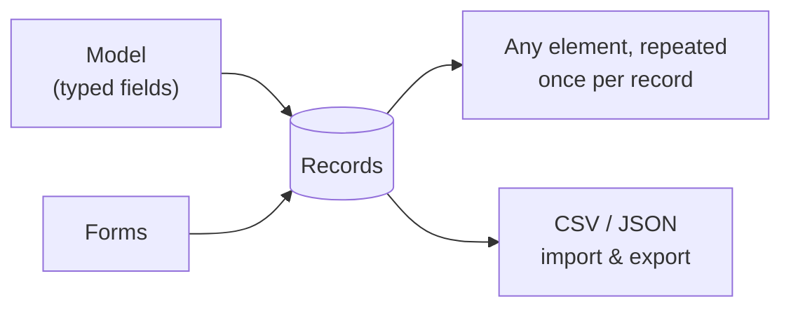

# Datasets & Dynamic Content

**Datasets** are your structured content: a typed **model** plus the **records** that fill
it. Screens read from datasets to render dynamic, repeatable content, and
[forms](../forms/overview.md) write new records back in.

Datasets belong to your **organization**, not to a single site — every site in the
organization shares the same collections. Manage them from the organization **Data**
page (next to Media in the organization tabs), or from any site's Data page; both edit
the same data. Dataset limits, storage, and add-ons are billed at the organization
level.




:::info Plan availability
**Starter** and above. Free plans have no data store; higher tiers raise the dataset
and record caps, and extra-dataset add-ons are available.
:::

## Model builder

Define a model in the schema dialog with **typed fields** (text, number, date, reference,
and more). The model is stored on the dataset itself. Records added or imported in the
console, or written through the REST API, are validated against it; form submissions and
automation steps store their values as text without validating them.

## Typed documents

Edit records in the **typed document editor** — each field renders the right input for its
type, so data stays clean.

## Filter and search the records {#filter-records}

The records table filters through its own toolbar: **Filters** opens the filter panel,
where every field of the dataset's model is a column, and **Search** finds records by the
words in their text. A field with a fixed list of options, and a true/false field, are
picked from a list; numbers and dates take a value; reference, map, bytes, coordinates
and null fields are not filterable. Each filter shows as a chip above the table, and
removing the chip removes the filter.

**One condition reaches every record.** A single filter or a single search word is
answered across the whole dataset and paged like the unfiltered table, when it is:

- a field **equals** a value — for a text field, ignoring case;
- a text field **contains** a word, which matches words that **start with** what you
  typed (`kett` finds *Kettle*, `ttle` does not);
- a list field **contains** one of its entries;
- one **search** word, which likewise matches the start of any word in the record's text
  fields, option fields and lists.

Its chip is highlighted. **Anything more is matched over the first 1,000 records** that
the first condition finds (or the first 1,000 records of the dataset, when none of the
conditions can be answered that way): a second filter or search word, a filter that
contains several words, **number and date ranges**, *is empty*, *is not*, and *is any
of*. When there were more than 1,000 to look through, the table says so. A word is matched
on its first 12 characters, and a text value's first 40 words are searchable.

This needs no database index — nothing to deploy on a self-hosted project. Records keep
their filter terms in a `filterKeys` field that every write keeps current. **Records
written before the field existed** are found only once it is stamped onto them, which the
operator does once per project:

```bash
# Dry run: counts what would change and writes nothing.
GOOGLE_CLOUD_PROJECT=<project-id> node tools/scripts/backfill-dataset-filter-keys.mjs

# Write.
GOOGLE_CLOUD_PROJECT=<project-id> node tools/scripts/backfill-dataset-filter-keys.mjs --apply
```

It uses Application Default Credentials (`gcloud auth application-default login`), is
safe to re-run, and `--org=<orgId>` limits it to one organization. Run it again after
changing a field's type or options in the schema dialog: a schema change does not rewrite
records, so until a record is edited or re-stamped its filter terms follow the old model.

## Relations

Fields can **reference** other records, including **many-to-many** relations, letting you
model real structures (posts ↔ authors, products ↔ categories).

## Query layer

A **dataset query layer** powers both the editor and screen bindings, so the same data is
available to design-time previews and the live site.

## Repeatable components

Point **any** element at a dataset and it renders once per record — a list, a grid or a
gallery driven by your data. A card, an image, a row, a whole placed component: each one
is copied per record, and an element that holds a list can repeat its contents instead,
so the element stays the frame the items fill.

The Besigner draws the real copies on the canvas, from your real records and in the order
the published page will render them, and a **repeat badge** names what an element repeats
over and how many records it found. The copy you edit is the design; changing it changes
all of them.

A filter, a sort and a limit narrow what renders, and a repeat renders at most 100
records however high the limit is set.

See [Repeat over data](../../building-sites/besigner/repeat.md) for the full walkthrough.

## Who a dataset is shared with

Datasets belong to the **workspace**, not to a single site, so one dataset can drive pages
on every site you run. When that isn't what you want, the **Sharing** control on each
dataset decides which sites can see it:

- **All sites** — everyone in the workspace, on every site.
- **Selected sites…** — pick the sites that share it, up to 30.

Where a new dataset starts depends on where you create it and on your workspace's
**Default sharing for new data and media**, the setting at the top of the workspace
[**Media** page](../media/overview.md#who-an-asset-is-shared-with):

- **Created on a site's Data page** — it follows that setting. Set to **All sites**, the
  dataset starts on **All sites**. Set to **Only the site they were created in**, it
  starts shared with that site alone, and its control reads **Selected sites…** with
  just that site picked.
- **Created on the organization Data page** — it starts on **All sites** whatever the
  setting says, because there is no site to limit it to.
- **Installed from the Marketplace, or created through the REST API** — it starts on
  **All sites** too. Both act for the whole organization, not for one site.

The setting only decides where a new dataset starts. It changes nothing that already
exists, and you can widen or narrow any dataset afterwards.

A dataset with no sharing stored is visible to **no** site; its control reads **Not
shared with any site** until you choose one of the two.

This matters most for agencies. If you run three internal sites alongside twelve client
sites, your rate card can be shared with the internal three and stay invisible to the
clients — including to the client collaborators you have invited, who will not see it in
the Data page, the pickers, or anywhere else.

Sharing is enforced on the **server**, not just in the console. A site cannot render a
dataset it hasn't been shared with even if a page explicitly asks for it by name.

A few consequences worth knowing:

- **Narrowing sharing can empty a live page.** If a published page repeats over a dataset
  and you remove that site, the page renders with no rows. The console warns before saving
  a change that takes a site's access away.
- **Reference fields need both sides.** A reference from one dataset to another only
  resolves on sites that can see both, so the target's sharing has to cover the source's.
- **Limits are workspace-wide.** Your dataset and record allowances count everything the
  workspace owns, whether or not you can see it all. Sharing decides visibility, not
  billing.
- **Deleting is a workspace action.** A dataset shared with more than one site can't be
  deleted from a single site's Data page — narrow its sharing instead, or delete it from
  the workspace Data page.

## Import & export

Datasets round-trip via **CSV and JSON**: export your records, edit them elsewhere, and
re-import with validation on the way in.

A whole-site export includes the datasets and media **that site can see**, and nothing
else — an agency exporting a client site gets that client's data only. It carries up to
50 datasets and 1,000 records from each, so export a larger dataset on its own. On restore,
everything comes back shared with **the site you restored into**, not with whatever it was
shared with before. Widen it afterwards if you meant to share it. That direction is
deliberate: a bundle can be restored into a different site or a different workspace
entirely, and quietly re-publishing one client's data across another's sites would be far
worse than an extra click.

## Related

- [Forms & lead capture](../forms/overview.md)
- [Bindings, variables & functions](../../building-sites/bindings/overview.md)
- [Content collections & blog](../../building-sites/site-templates/overview.md)
