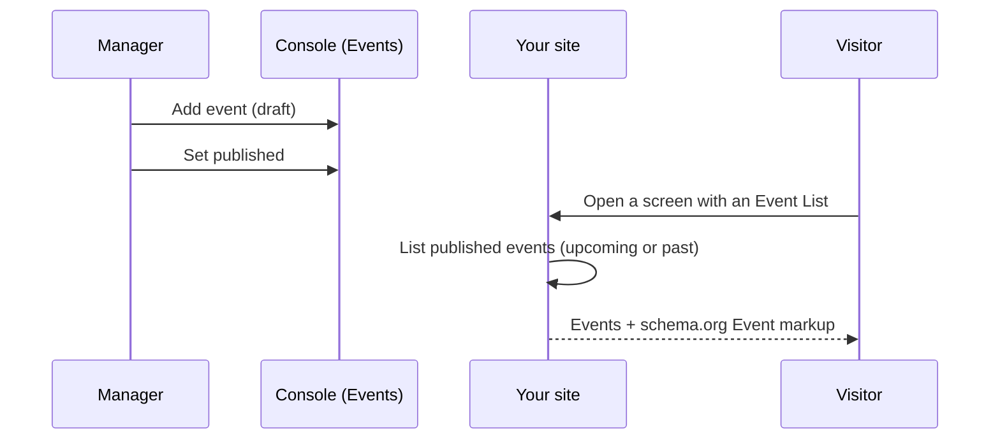

# Events Calendar

The **Events Calendar** is a schedule your workspace edits in the console and your
visitors read on the site. Each event carries a time, a place, an organizer, a
description and a cover image, and stays invisible until you publish it.

:::info Plan availability
**Add-on**. The Event Calendar is a $9/mo add-on that covers the whole workspace on
any paid plan — buy it on **Billing → Add-ons** (see [Add-ons](../../workspace-and-billing/billing-and-plans/add-ons.md)).
Until it's enabled the Events page explains the add-on, and the Event List element
renders nothing on your site.
:::

## Manage events

The console **Events** page lists your site's events, newest start first. **Add event**
opens the editor; each event has:

- **Title** — required.
- **Starts** and **Ends** — a start time is required; leaving the end blank (or setting
  it before the start) gives the event one hour.
- **Location** and **Organizer** — both optional, and both shown next to the date.
- **Cover image URL** — optional thumbnail, shown beside the event.
- **Description** — optional detail paragraph.

**Set published** / **Set to draft** flips an event's status, shown as a chip in the
list. **Delete** removes an event from your site.

:::note Drafts never leave the console
The public listing filters to published events on the server, so a draft is never sent
to a visitor's browser — it's a safe place to stage next month's schedule.
:::

## Show events on a screen

Events reach visitors through the **Event List** canvas element (Data display
category) — drop it on any screen in the Besigner and set:

- **Heading** — a title above the list; empty hides it.
- **Show** — *Upcoming* (default) or *Past events*.
- **Max items** — how many to render (default 10).

Upcoming lists the next events by start time; past lists the most recent first. The
list is served through the public events API and cached briefly at the CDN, so a newly
published event can take about a minute to appear.

## Search engines

Every rendered event emits **schema.org `Event` JSON-LD** — name, start and end,
place, organizer, description and image — so search engines can show your events as
rich results. Nothing to configure; see [SEO](../../building-sites/seo/overview.md) for
the rest of your site's structured data.

## Related

- [Add-ons](../../workspace-and-billing/billing-and-plans/add-ons.md)
- [Bookings & scheduling](../../commerce-and-bookings/bookings/overview.md)
- [SEO & structured data](../../building-sites/seo/overview.md)
