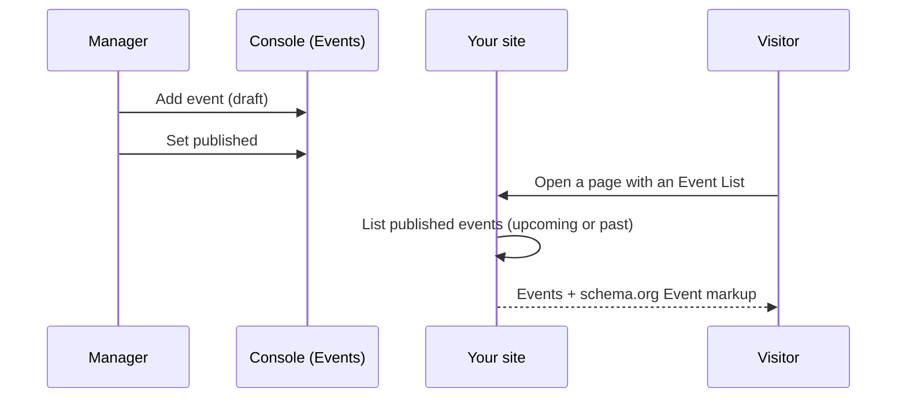

# Events Calendar

The **Events Calendar** is a schedule your workspace edits in the console and your
visitors read on the site. Each event carries a time, a place, an organizer, a
description and a cover image, and stays invisible until you publish it.

```mermaid
sequenceDiagram
  participant M as Manager
  participant C as Console (Events)
  participant S as Your site
  participant V as Visitor
  M->>C: Add event (draft)
  M->>C: Set published
  V->>S: Open a page with an Event List
  S->>S: List published events (upcoming or past)
  S-->>V: Events + schema.org Event markup
```

:::info Plan availability
**Add-on**. The Event Calendar is a flat monthly add-on that covers the whole workspace on
any paid plan — buy it on **Billing → Add-ons** (see [Add-ons](../../workspace-and-billing/billing-and-plans/add-ons.md)).
Until it's enabled the Events page explains the add-on, and the Event List element
renders nothing on your site.
:::

## Manage events

The console **Events** page lists your site's events, newest start first. It has no
filters or search, and it reads the newest 200 events: a site with more says so above
**Add event**, and the older ones are not reachable from the list. **Add event**
opens the editor; each event has:

- **Title** — required.
- **Starts** and **Ends** — a start time is required; leaving the end blank (or setting
  it before the start) gives the event one hour.
- **Location** and **Organizer** — both optional, and both shown next to the date.
- **Cover image URL** — optional thumbnail, shown beside the event.
- **Description** — optional detail paragraph.

**Set published** / **Set to draft** flips an event's status, shown as a chip in the
list. **Delete** removes an event from your site.

:::note Drafts never leave the console
The public listing filters to published events on the server, so a draft is never sent
to a visitor's browser — it's a safe place to stage next month's schedule.
:::

## Import and export events {#import-and-export-events}

**Import** and **Export** sit at the top of the **Events** card. Both work on the site
you have open.

**Export** writes every event on the site — all of them, not only the 200 the list
shows — newest start first, as CSV, JSON or NDJSON. You pick the columns and their
order; the default (*Re-importable*) puts the Aglyn ID first so the file can come back
in and update the same events. Deleted events are never exported. Times are written in
UTC, for example `2026-11-05T18:00:00.000Z`.

**Import** takes a CSV, JSON or NDJSON file of up to 2,000 events and needs the Event
Calendar add-on, like the Events page itself.

### Columns

| Column | What it holds |
| -- | -- |
| **Aglyn ID** | The event's ID. Exported, and used on import to find the event; never changed by a file. |
| **Title** | Required for a new event. Up to 150 characters. |
| **Starts** | Required for a new event. A date and time; a time with no time zone is read as UTC and flagged for you to check. |
| **Ends** | Optional. Blank, or not after the start, gives the event one hour — the same rule as the editor. |
| **Location** | Up to 200 characters. |
| **Organizer** | Up to 100 characters. |
| **Description** | Up to 2,000 characters. |
| **Status** | `draft` or `published`, in any capitalization. A new event without one is a draft; any other value refuses the row. |
| **Cover image** | A web address, or a path on your site. |
| **Cover image alt text** | Up to 300 characters, and kept only beside a cover image. |
| **Created**, **Updated** | Exported only. |

Text longer than its column allows is cut to fit, and the review step flags every cut.

### How a row finds an existing event

1. By its **Aglyn ID**, when the file has that column (an exported file does).
2. Otherwise by its **title and start together**: the title ignoring capitalization,
   accents and punctuation, and the start to the minute. A weekly class has one title
   and many starts, so each start stays its own event.

A row that finds no event creates one. A deleted event is never found.

### Conflicts, the dry run and undo

When a row finds an event that already has a value, you choose per column what the
file does: fill only blank fields (the default), overwrite, or keep what is there — and
whether a blank cell clears the field. You can also skip matched rows instead of
updating them.

Before anything is written, the **Review** step is a dry run: how many events will be
created, updated, left unchanged, skipped or refused, with each change shown before and
after. Each kind of warning needs an "I understand" before **Import** is enabled — for
example an end before its start (the event will end one hour after it starts) or text
that was cut. A row is refused when its status is not `draft` or `published`, or when it
would leave an event without a title or a start.

An import can be **undone for seven days**. Undo removes the events the import created
and puts back the values it changed. An event someone edited after the import is shown
to you first, and you choose whether to keep the edit or undo it.

The list on the Events page updates on its own when an import finishes.

### Files from other calendars

Columns from these exports are recognized by name:

| Export | Their column → Aglyn |
| -- | -- |
| Google Calendar (CSV) | Subject → Title, Start Date → Starts, End Date → Ends, Location, Description |
| iCalendar fields | SUMMARY → Title, DTSTART → Starts, DTEND → Ends, LOCATION, DESCRIPTION |
| The Events Calendar for WordPress (CSV) | Event Name → Title, Event Start Date → Starts, Event End Date → Ends, Event Venue Name → Location, Event Organizer Name → Organizer, Event Description → Description, Event Featured Image → Cover image |

Some exports keep the date and the time in separate columns (Google Calendar's
**Start Time**, for example). The two cannot be joined during an import, so an event
read from the date alone starts at midnight. To keep the times, combine each pair into
one column first, with your time zone — `2026-11-05 18:00 -05:00` — and map that column
to **Starts**.

## Show events on a page {#show-events-on-a-screen}

Events reach visitors through the **Event List** canvas element (Data display
category) — drop it on any page in the Besigner and set:

- **Heading** — a title above the list; empty hides it.
- **Show** — *Upcoming* (default) or *Past events*.
- **Max items** — how many to render (default 10).

Upcoming lists the next events by start time; past lists the most recent first. The
list is served through the public events API and cached briefly at the CDN, so a newly
published event can take about a minute to appear.

## Search engines

Every rendered event emits **schema.org `Event` JSON-LD** — name, start and end,
place, organizer, description and image — so search engines can show your events as
rich results. Nothing to configure; see [SEO](../../building-sites/seo/overview.md) for
the rest of your site's structured data.

## Related

- [Add-ons](../../workspace-and-billing/billing-and-plans/add-ons.md)
- [Site backup and packages](../../building-sites/site-backup-and-packages.md)
- [Bookings & scheduling](../../commerce-and-bookings/bookings/overview.md)
- [SEO & structured data](../../building-sites/seo/overview.md)
