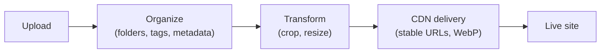

# Media Library & CDN

The **media library** stores your images, video, and files, keeps them organized, and
serves them quickly. Media plugs into components like **Image** and **Video** and into the
theme's favicon.

:::info Plan availability
**Free** with storage quotas. **CDN delivery** with WebP variants is on **every
plan**, free included; large video uploads and higher storage are gated by plan.
:::

## Organize

- Arrange media in a **folder hierarchy**. Folders appear as **cards in the grid
  (folders first, before files)** as well as in a side rail — open one to browse into it,
  and use the breadcrumb to step back out.
- **Drag and drop to reorganize**: drag a file (or a whole selection) onto a folder to
  move it in, drag a folder onto another to nest it, or drop onto a breadcrumb to move
  items up and out. Nesting depth and name-collision rules are enforced automatically.
- **Move to folder… shows the full path**, not just the folder name — `Blog / Covers`
  and `Press / Covers` are two different destinations and the menu says so. The same
  paths appear in the detail drawer's **Folder** field.
- **Big moves are safe to interrupt.** Moving a large selection relocates the stored
  objects one at a time, so the library keeps working through it and tells you how far
  it has got. If it cannot finish everything, it reports the real split — *Moved 7 of
  19 — 12 could not be moved* — and **leaves the files that did not move selected**, so
  clicking Move again picks up exactly where it stopped. Nothing is lost either way: a
  file is only ever in one folder, its URL keeps working, and a repeat move of a file
  that already arrived does nothing.
- Filter by **type, date, and size**, search, and sort the library.
- **Search covers everything you authored, not just file names** — alt text, description,
  tags, folder name and your own custom metadata values are all searchable. Results update
  as you type, and **✕** (or **Esc**) clears the box.
  - **Wildcards**: `mock-*-noshadow.png` matches a whole family of files. `*` is any run of
    characters, `?` is exactly one, and a wildcard pattern matches the *whole* value.
  - **Search one field**: `tag:hero`, `name:logo`, `alt:product`, `desc:landing`,
    `folder:brand`, or a custom field by key — `meta.campaign:spring`. Combine them with
    plain words; everything you type has to match.
  - **Phrases**: put quotes around anything with a space — `"landing page"`, `tag:"black friday"`.
  - **Typos still find things.** If nothing matches literally, Aglyn falls back to close
    matches and tells you it did.
  - The caption under the box always says **what was actually searched** — the whole library,
    or how much of it. Typing loads the rest of the library once so the search covers all of
    it; on very large libraries it searches as much as it can and says where it stopped, so
    narrowing by folder, type or date gets you the rest.
- Capture and edit **metadata** in a detail drawer — file name, alt text, description,
  [tags](#tags), and your own **custom key/value metadata** (mirrored onto the delivered
  object's storage metadata). Bulk-edit tags and folders across a selection.
- Each card has an **overflow menu** (the ⋮ button that appears on hover) so actions stay
  tidy. What it offers depends on the file:
  - **Copy URL** — public files only. **Copy temporary link** replaces it on a private
    file, because a private file has no permanent URL to copy.
  - **Make private** / **Publish file** — only in the organization library, and only for
    members with organization-wide access.
  - **Download file** — always, public or private. See
    [Download the original file](#download-file).
  - **Replace file** — images only.
  - **Details** and **Delete**.

  **Copy URL** gives you a full absolute URL on the site's own domain, ready to paste
  anywhere — including outside Aglyn. The whole menu is hidden when the library opens as
  a **picker** (choosing an image for a page, a logo or a favicon): a picker is for
  choosing, not for editing.
- See **per-asset usage**: delivery counters load automatically, and a **Used on**
  audit runs on demand — click **Find where this is used** to list everything that
  references the asset, each a link that opens it. The audit covers **pages, layouts,
  reusable components, emails, site settings** (logo, favicon, social image),
  **content entries**, and **plugin content** — products and their variants, product
  categories, events, bookable services, member posts and the rest. It reads every
  version of a page, not just the published one, so an image held only by a draft
  still shows up.

  Two things it deliberately does **not** check, and it says so under the result:
  **order history, form submissions and the activity log**. Those record a past use
  — an order keeps a copy of the product photo as it was when it sold — so deleting
  the file changes nothing about them.

  If the audit cannot finish, it tells you that instead of showing an empty list.
  **"We could not check everywhere"** is not the same answer as **"nothing uses
  this"**, and only the second one is safe to delete on.
- **Delete from the detail drawer too**, right under the usage audit — so you can run
  **Find where this is used**, read the answer, and act on it without leaving the file.
  The confirmation opens immediately and fills the usage warning in as the scan lands,
  and the message afterwards names the file (or counts and names them, for a selection).
- **Undo a delete.** The message that confirms a delete carries an **Undo** button, and
  pressing it puts the file back exactly as it was — same link, same folder, same tags,
  alt text and sharing, and any site that was using it starts rendering it again. It
  works for a whole selection too, so a bulk delete is one button to reverse.

  Undo lives on that message and nowhere else. Once it goes, the file is gone from the
  library for good, so read the message before dismissing it. Very occasionally Undo
  will decline — if putting the file back would push you past your plan's storage limit,
  it says so and leaves the button where it is, so you can free up space and press it
  again.
- **Select a range with ⇧-click**: click one card, then hold **⇧** and click another —
  every card between the two is selected, in the order they are on screen. Works on the
  card itself and on its checkbox, and un-selects a whole range the same way.
- **Deleting keeps your place.** However many times you clicked **Load more**, the files
  you deleted disappear and everything else stays exactly where it was — so a long
  clear-out is one pass, not one pass per file.

### Tags {#tags}

Open a file's **Details** drawer and look under **Tags**. Existing tags are **chips**:
click the ✕ on one to remove it. Below them is an **Add a tag** field, with the helper
text **Press Enter to add**. A file with no tags yet reads **No tags yet**.

The typed tag is folded in when you press **Enter** — and also when you **click away
from the field**, which is the case worth knowing: the commonest way to lose a tag is to
type it and press **Save** without pressing Enter first, and here that still saves the
tag. Nothing is stored until you press **Save** in the drawer, so a chip you removed by
mistake comes back if you press **Cancel** instead.

A tag is tidied **as you add it**, not quietly at save time:

- surrounding blanks are trimmed, and a blank entry is dropped;
- it is **lower-cased**, so `Hero` and `hero` are the same tag;
- a tag already on the file is not added twice — re-adding one looks like nothing
  happened, because it is nothing.

That matters for finding things again. The library's filter chips and the `tag:` search
prefix match the **stored** tag, so a tag that carried a trailing space used to become a
tag no chip could ever match — a file you tagged and then could not find by that tag.
Normalizing at entry is what makes the chip you see and the tag that gets stored the
same thing. The exact caps are in
[Tag limits](#tag-limits).

## Upload

- Upload **images**, **video** (MP4, WebM, QuickTime), **PDFs**, **ZIP archives** and
  **documents** (Word, Excel, PowerPoint, CSV, RTF, plain text, Markdown and JSON).
  Click **Upload media**, or **drag files straight from your desktop onto the library**
  — dropped files land in the folder you have open.
- Documents and archives are stored and served exactly as you uploaded them — nothing
  is opened, extracted or converted. Macro-enabled Office files (`.docm`, `.xlsm`,
  `.pptm`) are not accepted.
- Rename, **replace the file** behind an asset, and edit images in place. Replace is
  available from the asset's details drawer and straight from the card's overflow menu.

### Size and plan limits

| Upload | Cap | Plan |
| --- | --- | --- |
| Images | 15 MB per file | Every plan |
| PDFs | 25 MB per file | **Pro and above** |
| Documents (Word, Excel, CSV, RTF, text, Markdown, JSON) | 25 MB per file | **Pro and above** |
| Presentations (PowerPoint) | 50 MB per file | **Pro and above** |
| ZIP archives | 50 MB per file | **Pro and above** |
| Video | 200 MB per file | **Pro and above** |

Any file over 3 MB automatically uses **signed-URL uploads**, so big files go straight to
storage without tying up the console. Folders nest up to **5 levels** deep.

:::note Uploads are checked for what they are — but not scanned for malware

Every upload is checked **structurally** before it is stored:

- the bytes have to match the type the file claims to be, so a program renamed
  `invoice.pdf` is refused rather than stored and served from your domain;
- programs and installers are refused under **any** file type or name;
- a Word, Excel or PowerPoint file carrying **macros** is refused, including one
  renamed from `.docm` to `.docx`.

A refused upload names the reason in the message that appears in the library, and
nothing is stored or counted against your storage.

**This is not a virus scan.** These checks establish that a file is the *kind of thing*
it says it is; they do not examine what is inside it. A harmful document that is a
genuine document of its type will be accepted. Treat files you upload as content you
are responsible for, the same as anything else you publish.

:::

:::note SVG uploads are cleaned

An SVG is a document, not just a picture — it can carry scripts, event handlers and
references to other sites. Uploaded SVGs have all of that stripped, and the delivery URL
serves them under a policy that blocks scripting outright. Your marks and logos render
exactly as before; a decorative SVG that relied on embedded script or on pulling an image
from another domain will render without those parts.

:::

Storage is metered per site against your plan (Free 250 MB, Starter 2 GB, Pro 10 GB,
Business 50 GB, Scale 75 GB, Advanced 100 GB, Agency 200 GB, Enterprise unlimited) —
the library's toolbar shows the running total, and the
[billing page](../../workspace-and-billing/billing-and-plans/overview.md#usage-meters)
meters it alongside everything else.

### Edit images

**Edit image**, in an image's details, opens the editor: rotate left/right, flip
horizontally or vertically, drag a **crop** (pick a **Crop ratio** — 1:1, 4:3, 3:2,
16:9, or Free — first to lock the aspect), and set a **Max width** to downscale.
Finish with **Save as copy** to keep the original, or **Replace original** to update
every place the asset is used at once.

<!-- screenshot: media/image-editor-dialog.png per SCREENSHOT_PLAN.md -->

### Download the original file {#download-file}

**Download file** saves the file itself back to your computer, under the **file name the
library shows** — not the storage object's name. You'll find it in two places:

- in the file's **Details** drawer, beside **Copy URL**;
- in the card's **overflow menu**, without opening the drawer.

It works for **private** files as well as public ones, and that is the point:
**Copy URL** is the wrong tool for a private file (it is hidden there — see
[Private files](#private-files)), so downloading is how you get the bytes of a private
asset out of Aglyn. Behind the scenes the console mints the private file's temporary link
per click and never holds it, which is why there is no link to copy but there is always a
file to save.

Two things you may see:

- The menu item is **absent in the media picker**. Pick the file, then download it from
  the library.
- If your browser blocks the direct save, Aglyn opens the file in a new tab instead and
  says so. You still get the file; it arrives under the server's own name.

## Deliver over CDN

Every plan serves media via a **CDN** with automatic **WebP variants**, so images load fast
and cache well.

### URLs are stable

A media URL is keyed to the **asset**, not to its bytes or its location. That means the
link you copied stays correct when you:

- **Replace the file** — every screen, layout, and content entry that embeds it serves
  the new image immediately, with no re-linking.
- **Move it between folders** — organizing your library never breaks a live page.

So replacing a logo across a whole site is one upload, not a hunt for every reference.
Links copied before this behavior shipped keep working too.

### Page elements point at the asset, not at a link

When you place an image with **Browse media**, the element records **which asset** you
chose rather than a link to it. You never have to copy or paste a path, and the element
keeps working through folder moves, file replacements, and any future change to how we
deliver media. **Copy URL** is still there for pasting a link somewhere outside Aglyn.

You can also type any external image URL into the field by hand — useful for hotlinking an
image hosted elsewhere. Images placed before this shipped keep rendering exactly as they
did.

### What hotlinking means for your visitors {#hotlinking-and-your-visitors}

Hotlinking is a supported feature and we do not intend to remove it, but it has a
consequence worth knowing before you rely on it: **your visitor's browser fetches that file
from that host directly, and we do not proxy it.** Aglyn never sits in the middle of the
request, so the host you named receives the visitor's IP address, their browser
user-agent and the address of the page they are reading, and it can set its own cookies on
them.

That makes it your choice rather than ours, and it follows that:

- The host is **not** on Aglyn's
  [subprocessor list](https://aglyn.com/legal/subprocessors), and it never will be. That
  list names the parties Aglyn engages to process data. You engaged this one, and only you
  know which sites and pages it is on — so if you hotlink, name those hosts in **your own**
  privacy notice.
- **This field does not check what you type.** An `http://` address ships exactly as
  entered; browsers block it on an `https` page as mixed content, so the image simply fails
  to appear. Paste `https://` links. Some other surfaces do refuse `http://` outright —
  [Trust & security](/trust#hosts-our-customers-choose-which-are-not-on-that-list) lists
  which ones, per surface.
- Uploading the file to your media library instead avoids all of it, and gets you the CDN,
  WebP variants and stable URLs described above.

When a visitor saves a delivered file, it keeps the asset's **original filename and
extension**, even though the URL itself doesn't carry one — the CDN response declares the
name. [Download file](#download-file) in the console arrives under that same name by a
different route: the console names the saved file from the library's own **File name**
field, so renaming a file in the drawer changes what a download is called.

### What the drawer says about delivery {#delivery-line}

Open a file's **Details** drawer and read the line with the small dot next to it. It
describes **this file**, and it says one of exactly three things:

| Line | Dot | What it means |
| --- | --- | --- |
| **Served from storage · no CDN, no variants** | grey | This asset has no CDN path — a plan without the media CDN, or an asset stored before you had it. |
| **CDN · variants 320 / 640 / 1280** | green | On the CDN, with those WebP widths generated for it. The widths listed are the ones this file actually has. |
| **CDN · no responsive variants for this file** | green | On the CDN, serving the original bytes only. |

The third line is **not a fault report**. A file has no variants when there was nothing
to generate — an SVG, a PDF, a video, anything that isn't a raster image — and also when
generation has not run or did not succeed for it. From outside those look identical, so
the drawer says what is true either way: there are none right now. An image that stays
variant-less after a re-upload is worth a support ticket; a logo in SVG is working as
designed.

The line reads the asset, not your plan: a paid plan does not make a line say
`variants 320 / 640 / 1280` for a file that has none.

## Who an asset is shared with

Workspace media is shared across every site by default. The **Shared with** control
narrows that, with the same three choices as datasets — **All sites**, **This site only**,
or **Selected sites…**. You'll find it in three places:

- on a single asset, in its details drawer;
- on a **selection** — tick several files and use **Shared with…** in the toolbar;
- on a **folder**, from its ⋮ menu, which offers to apply the same sharing to the files
  inside it and its subfolders (it names the count, so you know what you're about to
  change).

A folder applies its sharing **when you save it** — files keep their own setting
afterwards, so moving a file into a "Client A" folder later does not re-share it. Narrowing
a file that sites are already using names those sites first and asks you to confirm.
Only workspace owners and admins can change sharing.

A new folder starts shared with **All sites**, so it appears everywhere the moment you
create it — or with the site you were working in, if your workspace has been set to make
new resources site-scoped by default. That default is **Default sharing for new data and
media**, at the top of the workspace's **Media** page; it applies to new datasets as well
as new files, and changes nothing that already exists. If the **Shared with** dialog ever opens on
"Not shared with any site", that folder or file has no sharing stored at all: it is hidden
from every site, and any file inside it turns up under **No folder** there. Pick a value
and save to fix it.

In the media picker's **Organization (shared)** tab, a site sees only the assets it may
use. An agency's internal artwork stays out of the client sites' pickers entirely.

:::warning Sharing controls discovery, not secrecy
Sharing decides which sites may **find and use** an asset, and stops the CDN serving a
restricted asset to a site it isn't shared with. It does **not** make the bytes secret:
anyone holding a delivered media URL can still fetch it, because that URL is public and
cacheable by design — that is what makes the CDN fast.

Treat an ordinary media URL as a shareable link. For files that must never be fetchable by
someone who simply has the URL, mark them **Private** — see below.
:::

## Private files

**Private** is a separate switch from sharing, and it answers a different question:

|  | Question it answers |
| -- | -- |
| **Shared with** | Which of your sites may *use* this file? |
| **Private** | May anyone *fetch* these bytes at all? |

A private file:

- has **no public URL** — the normal media link does not exist for it, and **Copy URL is
  hidden** on it in both the card menu and the drawer,
- **loses any public URL it already had.** Turning Private on revokes the file's public
  address at the moment you confirm it, so a link you copied and sent last month stops
  working too. That is the part people expect and the part that is easy to get wrong:
  a switch that only stopped *new* links would leave the one already in circulation
  serving the file forever,
- **cannot be placed on a page**; the picker refuses it and says why,
- is viewable and downloadable in the console by people who can already see it, through a
  **temporary link that stops working after about fifteen minutes**.

Two menu items do that last part, and they are not interchangeable:

- **Copy temporary link** (organization library, organization-wide members) puts a
  fifteen-minute link on your clipboard — for handing to one person, once, now. Nothing
  in Aglyn renews it, so it is a trap in a document or a page: what you paste stops
  working while the page still looks fine.
- **[Download file](#download-file)** saves the bytes. Aglyn mints a fresh link for that
  click, so the expiry never reaches you.

**Copy URL** being hidden rather than disabled is deliberate: there is no permanent
address to hand over, and a copied link that 404s is worse than no button.

That expiry is the point. A normal media URL, once shared, works forever and there's no way
to take it back. A private file's link dies on its own, so a link pasted somewhere it
shouldn't have been is a short problem instead of a permanent one.

Use Private for things that aren't website assets: a signed contract, unreleased artwork,
an embargoed announcement, anything with personal data in it. Don't use it to keep an image
off one particular site — that's what sharing is for, and marking it private will just stop
the image working everywhere.

To publish a private file later, turn Private off. It gets a normal URL from that moment
on — a **new** one. The address it had before you made it private stays dead, so anything
still pointing at the old link needs the new one.

One thing none of this reaches: **bytes somebody already downloaded.** Revoking an address
stops the file being fetched again; it cannot recall a copy that is already on someone's
disk, in a browser cache or in a web archive. Nothing anyone sells can, and a product that
implied otherwise would be the more dangerous thing to trust.

## Approved image hosts {#approved-image-hosts}

Most images on your site are ones you uploaded here, and those always work. But you can
also point a block at an image that lives somewhere else by pasting its URL — a photo on
your own CDN, say, or an image your supplier hosts.

Those are worth being deliberate about, for a reason that is easy to miss: when a visitor
opens a page with an external image on it, **their browser fetches that image directly
from the other site.** So that site sees your visitor's IP address and which page they
were on, whether or not you have any relationship with them. It is a real disclosure, and
it is one you are making on your visitors' behalf.

So your site keeps a list of the external hosts it is allowed to load images from, under
**Admin → Security → Approved image hosts**. Add a host and images from it load
normally. Leave it off the list and browsers refuse it.

You do not have to think about this for anything you upload — your own media is always
allowed, and so is your site's own address.

### Adding a host {#adding-an-approved-image-host}

Enter the host on its own, with no `https://` and no path:

- `cdn.example.com` allows exactly that host.
- `*.example.com` allows every subdomain of it, which is what most image CDNs need
  because they give each account its own.

If you paste a URL into an image block for a host you have not approved, the editor tells
you so while you are editing, rather than letting you publish a page whose image is blank
for everyone but you. The warning names the host, so approving it is a copy and paste.

### When an image does not appear {#approved-image-host-troubleshooting}

If an image shows in the editor but not on the published page, an unapproved host is the
first thing to check. Open the page, right-click the missing image, and the browser
console will name the host it refused.

## Reference {#reference}

The details behind the screens above, for anyone wiring media into their own code.

### Variant widths {#variant-widths}

Aglyn generates WebP variants at **320**, **640** and **1280** pixels wide when an image
is uploaded. Those three are the whole set — there is no arbitrary resizing service
behind the CDN URL.

Add `?w=` to a CDN URL to ask for one: `…/api/media/cdn/org:{orgId}/{mediaId}?w=640`. A
width the asset does not have generated is not an error and not a resize — the original
bytes are served instead, so a `?w=200` request answers with the full-size file. Check
the drawer's [delivery line](#delivery-line) to see which widths a given file has.

`?download=1` on the same URL makes the response save rather than open in a tab. Both
parameters are read after every access check, so neither widens what is served, and both
are part of the cache key, so they cannot bleed into each other.

### Tag limits {#tag-limits}

Tags are stored lower-cased and de-duplicated. A tag longer than **40 characters** is
dropped, and a file keeps at most **20 tags** — entries past the twentieth are dropped
rather than replacing an earlier one.

### Over the API

Media is **read-only** over the REST API: file names, sizes, dimensions, tags, folders,
and both URL forms. See [the Media API resource](/api/resources/media), including
[what it does not return](/api/resources/media#no-variants).

## Components

- **Image** — place and bind images from the library.
- **Video** — embed uploaded video.
- **Favicon picker** — choose the site favicon from your media.

Everywhere you pick media — the Image and Video components, the logo and favicon pickers,
and the organization logo field — the **same media picker** opens, with **This site** and
**Organization (shared)** tabs so you can pull from either library without leaving the
dialog.

## Related

- [Bindings](../../building-sites/bindings/overview.md)
- [SEO toolkit](../../building-sites/seo/overview.md) (Open Graph & Twitter images)
- [Media API resource](/api/resources/media) — reading the library from your own code
