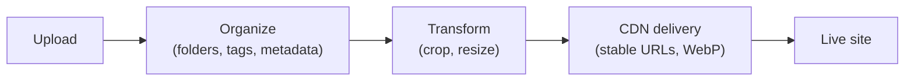

# Media Library & CDN

The **media library** stores your images, video, and files, keeps them organized, and
serves them quickly. Media plugs into components like **Image** and **Video** and into the
theme's favicon.

:::info Plan availability
**Free** with storage quotas. **CDN delivery** with WebP variants is a **paid-tier**
feature; large video uploads and higher storage are gated by plan.
:::

## Organize

- Arrange media in a **folder hierarchy**. Folders appear as **cards in the grid
  (folders first, before files)** as well as in a side rail — open one to browse into it,
  and use the breadcrumb to step back out.
- **Drag and drop to reorganize**: drag a file (or a whole selection) onto a folder to
  move it in, drag a folder onto another to nest it, or drop onto a breadcrumb to move
  items up and out. Nesting depth and name-collision rules are enforced automatically.
- Filter by **type, date, and size**, search, and sort the library.
- Capture and edit **metadata** in a detail drawer — file name, alt text, description,
  tags, and your own **custom key/value metadata** (mirrored onto the delivered object's
  storage metadata). Bulk-edit tags and folders across a selection.
- Each card has an **overflow menu** (Copy URL, Replace file, Details, Delete) so actions
  stay tidy. **Copy URL** gives you a full absolute URL on the site's own domain, ready to
  paste anywhere — including outside Aglyn.
- See **per-asset usage**: delivery counters load automatically, and a **Used on**
  audit runs on demand — click **Find where this is used** to list every screen,
  layout, and content entry that references the asset, each a link that opens it.

## Upload

- Upload **images**, **video**, and **PDFs**, with tiered size caps. Click **Upload**, or
  **drag files straight from your desktop onto the library** — dropped files land in the
  folder you have open.
- Large video (up to 200MB) uses **signed-URL uploads** so big files go straight to
  storage.
- Rename, **replace the file** behind an asset, and apply **image transforms**. Replace is
  available from the asset's details drawer and straight from the card's overflow menu.

## Deliver over CDN

Paid tiers serve media via a **CDN** with automatic **WebP variants**, so images load fast
and cache well.

### URLs are stable

A media URL is keyed to the **asset**, not to its bytes or its location. That means the
link you copied stays correct when you:

- **Replace the file** — every screen, layout, and content entry that embeds it serves
  the new image immediately, with no re-linking.
- **Move it between folders** — organizing your library never breaks a live page.

So replacing a logo across a whole site is one upload, not a hunt for every reference.
Links copied before this behavior shipped keep working too.

When a visitor saves a delivered file, it keeps the asset's **original filename and
extension**, even though the URL itself doesn't carry one.

## Who an asset is shared with

Workspace media is shared across every site by default. The **Sharing** control on each
asset and folder narrows that, with the same three choices as datasets — **All sites**,
**This site only**, or **Selected sites…**. A folder's sharing applies to what it holds,
so scoping a "Client A" folder scopes the assets inside it.

In the media picker's **Organization (shared)** tab, a site sees only the assets it may
use. An agency's internal artwork stays out of the client sites' pickers entirely.

:::warning Sharing controls discovery, not secrecy
Sharing decides which sites may **find and use** an asset, and stops the CDN serving a
restricted asset to a site it isn't shared with. It does **not** make the bytes secret:
anyone holding a delivered media URL can still fetch it, because that URL is public and
cacheable by design — that is what makes the CDN fast.

Treat a media URL as a shareable link. If an asset must never be fetchable by someone who
has its URL — signed contracts, unreleased artwork, anything with personal data — the
media library is the wrong place for it today.
:::

## Components

- **Image** — place and bind images from the library.
- **Video** — embed uploaded video.
- **Favicon picker** — choose the site favicon from your media.

Everywhere you pick media — the Image and Video components, the logo and favicon pickers,
and the organization logo field — the **same media picker** opens, with **This site** and
**Organization (shared)** tabs so you can pull from either library without leaving the
dialog.

## Related

- [Bindings](../../building-sites/bindings/overview.md)
- [SEO toolkit](../../building-sites/seo/overview.md) (Open Graph & Twitter images)
