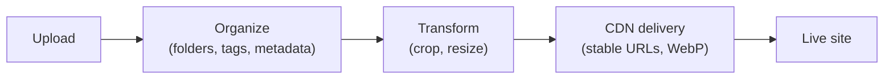

# Media Library & CDN

The **media library** stores your images, video, and files, keeps them organized, and
serves them quickly. Media plugs into components like **Image** and **Video** and into the
theme's favicon.

:::info Plan availability
**Free** with storage quotas. **CDN delivery** with WebP variants is a **paid-tier**
feature; large video uploads and higher storage are gated by plan.
:::

## Organize

- Arrange media in a **folder hierarchy**. Folders appear as **cards in the grid
  (folders first, before files)** as well as in a side rail — open one to browse into it,
  and use the breadcrumb to step back out.
- **Drag and drop to reorganize**: drag a file (or a whole selection) onto a folder to
  move it in, drag a folder onto another to nest it, or drop onto a breadcrumb to move
  items up and out. Nesting depth and name-collision rules are enforced automatically.
- Filter by **type, date, and size**, search, and sort the library.
- **Search covers everything you authored, not just file names** — alt text, description,
  tags, folder name and your own custom metadata values are all searchable. Results update
  as you type, and **✕** (or **Esc**) clears the box.
  - **Wildcards**: `mock-*-noshadow.png` matches a whole family of files. `*` is any run of
    characters, `?` is exactly one, and a wildcard pattern matches the *whole* value.
  - **Search one field**: `tag:hero`, `name:logo`, `alt:product`, `desc:landing`,
    `folder:brand`, or a custom field by key — `meta.campaign:spring`. Combine them with
    plain words; everything you type has to match.
  - **Phrases**: put quotes around anything with a space — `"landing page"`, `tag:"black friday"`.
  - **Typos still find things.** If nothing matches literally, Aglyn falls back to close
    matches and tells you it did.
  - The caption under the box always says **what was actually searched** — the whole library,
    or how much of it. Typing loads the rest of the library once so the search covers all of
    it; on very large libraries it searches as much as it can and says where it stopped, so
    narrowing by folder, type or date gets you the rest.
- Capture and edit **metadata** in a detail drawer — file name, alt text, description,
  tags, and your own **custom key/value metadata** (mirrored onto the delivered object's
  storage metadata). Bulk-edit tags and folders across a selection.
- Each card has an **overflow menu** (Copy URL, Replace file, Details, Delete) so actions
  stay tidy. **Copy URL** gives you a full absolute URL on the site's own domain, ready to
  paste anywhere — including outside Aglyn.
- See **per-asset usage**: delivery counters load automatically, and a **Used on**
  audit runs on demand — click **Find where this is used** to list every screen,
  layout, and content entry that references the asset, each a link that opens it.
- **Delete from the detail drawer too**, right under the usage audit — so you can run
  **Find where this is used**, read the answer, and act on it without leaving the file.
  The confirmation opens immediately and fills the usage warning in as the scan lands,
  and the message afterwards names the file (or counts and names them, for a selection).
- **Undo a delete.** The message that confirms a delete carries an **Undo** button, and
  pressing it puts the file back exactly as it was — same link, same folder, same tags,
  alt text and sharing, and any site that was using it starts rendering it again. It
  works for a whole selection too, so a bulk delete is one button to reverse.

  Undo lives on that message and nowhere else. Once it goes, the file is gone from the
  library for good, so read the message before dismissing it. Very occasionally Undo
  will decline — if putting the file back would push you past your plan's storage limit,
  it says so and leaves the button where it is, so you can free up space and press it
  again.
- **Select a range with ⇧-click**: click one card, then hold **⇧** and click another —
  every card between the two is selected, in the order they are on screen. Works on the
  card itself and on its checkbox, and un-selects a whole range the same way.
- **Deleting keeps your place.** However many times you clicked **Load more**, the files
  you deleted disappear and everything else stays exactly where it was — so a long
  clear-out is one pass, not one pass per file.

## Upload

- Upload **images**, **video** (MP4, WebM, QuickTime), **PDFs**, **ZIP archives** and
  **documents** (Word, Excel, PowerPoint, CSV, RTF, plain text, Markdown and JSON).
  Click **Upload media**, or **drag files straight from your desktop onto the library**
  — dropped files land in the folder you have open.
- Documents and archives are stored and served exactly as you uploaded them — nothing
  is opened, extracted or converted. Macro-enabled Office files (`.docm`, `.xlsm`,
  `.pptm`) are not accepted.
- Rename, **replace the file** behind an asset, and edit images in place. Replace is
  available from the asset's details drawer and straight from the card's overflow menu.

### Size and plan limits

| Upload | Cap | Plan |
| --- | --- | --- |
| Images | 15 MB per file | Every plan |
| PDFs | 25 MB per file | **Pro and above** |
| Documents (Word, Excel, CSV, RTF, text, Markdown, JSON) | 25 MB per file | **Pro and above** |
| Presentations (PowerPoint) | 50 MB per file | **Pro and above** |
| ZIP archives | 50 MB per file | **Pro and above** |
| Video | 200 MB per file | **Pro and above** |

Any file over 3 MB automatically uses **signed-URL uploads**, so big files go straight to
storage without tying up the console. Folders nest up to **5 levels** deep.

:::note SVG uploads are cleaned

An SVG is a document, not just a picture — it can carry scripts, event handlers and
references to other sites. Uploaded SVGs have all of that stripped, and the delivery URL
serves them under a policy that blocks scripting outright. Your marks and logos render
exactly as before; a decorative SVG that relied on embedded script or on pulling an image
from another domain will render without those parts.

:::

Storage is metered per site against your plan (Free 250 MB, Starter 2 GB, Pro 10 GB,
Business 50 GB, Scale 75 GB, Advanced 100 GB, Agency 200 GB, Enterprise unlimited) —
the library's toolbar shows the running total, and the
[billing page](../../workspace-and-billing/billing-and-plans/overview.md#usage-meters)
meters it alongside everything else.

### Edit images

**Edit image**, in an image's details, opens the editor: rotate left/right, flip
horizontally or vertically, drag a **crop** (pick a **Crop ratio** — 1:1, 4:3, 3:2,
16:9, or Free — first to lock the aspect), and set a **Max width** to downscale.
Finish with **Save as copy** to keep the original, or **Replace original** to update
every place the asset is used at once.

<!-- screenshot: media/image-editor-dialog.png per SCREENSHOT_PLAN.md -->

## Deliver over CDN

Paid tiers serve media via a **CDN** with automatic **WebP variants**, so images load fast
and cache well.

### URLs are stable

A media URL is keyed to the **asset**, not to its bytes or its location. That means the
link you copied stays correct when you:

- **Replace the file** — every screen, layout, and content entry that embeds it serves
  the new image immediately, with no re-linking.
- **Move it between folders** — organizing your library never breaks a live page.

So replacing a logo across a whole site is one upload, not a hunt for every reference.
Links copied before this behavior shipped keep working too.

### Page elements point at the asset, not at a link

When you place an image with **Browse media**, the element records **which asset** you
chose rather than a link to it. You never have to copy or paste a path, and the element
keeps working through folder moves, file replacements, and any future change to how we
deliver media. **Copy URL** is still there for pasting a link somewhere outside Aglyn.

You can also type any external image URL into the field by hand — useful for hotlinking an
image hosted elsewhere. Images placed before this shipped keep rendering exactly as they
did.

When a visitor saves a delivered file, it keeps the asset's **original filename and
extension**, even though the URL itself doesn't carry one.

## Who an asset is shared with

Workspace media is shared across every site by default. The **Shared with** control
narrows that, with the same three choices as datasets — **All sites**, **This site only**,
or **Selected sites…**. You'll find it in three places:

- on a single asset, in its details drawer;
- on a **selection** — tick several files and use **Shared with…** in the toolbar;
- on a **folder**, from its ⋮ menu, which offers to apply the same sharing to the files
  inside it and its subfolders (it names the count, so you know what you're about to
  change).

A folder applies its sharing **when you save it** — files keep their own setting
afterwards, so moving a file into a "Client A" folder later does not re-share it. Narrowing
a file that sites are already using names those sites first and asks you to confirm.
Only workspace owners and admins can change sharing.

In the media picker's **Organization (shared)** tab, a site sees only the assets it may
use. An agency's internal artwork stays out of the client sites' pickers entirely.

:::warning Sharing controls discovery, not secrecy
Sharing decides which sites may **find and use** an asset, and stops the CDN serving a
restricted asset to a site it isn't shared with. It does **not** make the bytes secret:
anyone holding a delivered media URL can still fetch it, because that URL is public and
cacheable by design — that is what makes the CDN fast.

Treat an ordinary media URL as a shareable link. For files that must never be fetchable by
someone who simply has the URL, mark them **Private** — see below.
:::

## Private files

**Private** is a separate switch from sharing, and it answers a different question:

|  | Question it answers |
| -- | -- |
| **Shared with** | Which of your sites may *use* this file? |
| **Private** | May anyone *fetch* these bytes at all? |

A private file:

- has **no public URL** — the normal media link does not exist for it,
- **cannot be placed on a page**; the picker refuses it and says why,
- is viewable and downloadable in the console by people who can already see it, through a
  **temporary link that stops working after about fifteen minutes**.

That expiry is the point. A normal media URL, once shared, works forever and there's no way
to take it back. A private file's link dies on its own, so a link pasted somewhere it
shouldn't have been is a short problem instead of a permanent one.

Use Private for things that aren't website assets: a signed contract, unreleased artwork,
an embargoed announcement, anything with personal data in it. Don't use it to keep an image
off one particular site — that's what sharing is for, and marking it private will just stop
the image working everywhere.

To publish a private file later, turn Private off. It gets a normal URL from that moment on.

## Components

- **Image** — place and bind images from the library.
- **Video** — embed uploaded video.
- **Favicon picker** — choose the site favicon from your media.

Everywhere you pick media — the Image and Video components, the logo and favicon pickers,
and the organization logo field — the **same media picker** opens, with **This site** and
**Organization (shared)** tabs so you can pull from either library without leaving the
dialog.

## Related

- [Bindings](../../building-sites/bindings/overview.md)
- [SEO toolkit](../../building-sites/seo/overview.md) (Open Graph & Twitter images)
