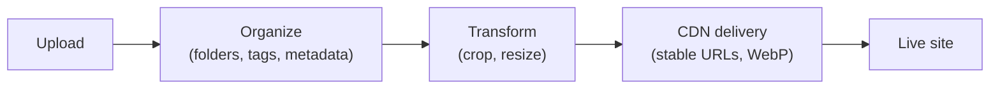

# Media Library & CDN

The **media library** stores your images, video, and files, keeps them organized, and
serves them quickly. Media plugs into components like **Image** and **Video** and into the
theme's favicon.

:::info Plan availability
**Free** with storage quotas. **CDN delivery** with WebP variants is a **paid-tier**
feature; large video uploads and higher storage are gated by plan.
:::

## Organize

- Arrange media in a **folder hierarchy**. Folders appear as **cards in the grid
  (folders first, before files)** as well as in a side rail — open one to browse into it,
  and use the breadcrumb to step back out.
- **Drag and drop to reorganize**: drag a file (or a whole selection) onto a folder to
  move it in, drag a folder onto another to nest it, or drop onto a breadcrumb to move
  items up and out. Nesting depth and name-collision rules are enforced automatically.
- Filter by **type, date, and size**, search, and sort the library.
- Capture and edit **metadata** in a detail drawer — file name, alt text, description,
  tags, and your own **custom key/value metadata** (mirrored onto the delivered object's
  storage metadata). Bulk-edit tags and folders across a selection.
- Each card has an **overflow menu** (Copy URL, Replace file, Details, Delete) so actions
  stay tidy. **Copy URL** gives you a full absolute URL on the site's own domain, ready to
  paste anywhere — including outside Aglyn.
- See **per-asset usage**: delivery counters load automatically, and a **Used on**
  audit runs on demand — click **Find where this is used** to list every screen,
  layout, and content entry that references the asset, each a link that opens it.

## Upload

- Upload **images**, **video**, and **PDFs**, with tiered size caps. Click **Upload**, or
  **drag files straight from your desktop onto the library** — dropped files land in the
  folder you have open.
- Large video (up to 200MB) uses **signed-URL uploads** so big files go straight to
  storage.
- Rename, **replace the file** behind an asset, and apply **image transforms**. Replace is
  available from the asset's details drawer and straight from the card's overflow menu.

## Deliver over CDN

Paid tiers serve media via a **CDN** with automatic **WebP variants**, so images load fast
and cache well.

### URLs are stable

A media URL is keyed to the **asset**, not to its bytes or its location. That means the
link you copied stays correct when you:

- **Replace the file** — every screen, layout, and content entry that embeds it serves
  the new image immediately, with no re-linking.
- **Move it between folders** — organizing your library never breaks a live page.

So replacing a logo across a whole site is one upload, not a hunt for every reference.
Links copied before this behavior shipped keep working too.

### Page elements point at the asset, not at a link

When you place an image with **Browse media**, the element records **which asset** you
chose rather than a link to it. You never have to copy or paste a path, and the element
keeps working through folder moves, file replacements, and any future change to how we
deliver media. **Copy URL** is still there for pasting a link somewhere outside Aglyn.

You can also type any external image URL into the field by hand — useful for hotlinking an
image hosted elsewhere. Images placed before this shipped keep rendering exactly as they
did.

When a visitor saves a delivered file, it keeps the asset's **original filename and
extension**, even though the URL itself doesn't carry one.

## Who an asset is shared with

Workspace media is shared across every site by default. The **Shared with** control
narrows that, with the same three choices as datasets — **All sites**, **This site only**,
or **Selected sites…**. You'll find it in three places:

- on a single asset, in its details drawer;
- on a **selection** — tick several files and use **Shared with…** in the toolbar;
- on a **folder**, from its ⋮ menu, which offers to apply the same sharing to the files
  inside it and its subfolders (it names the count, so you know what you're about to
  change).

A folder applies its sharing **when you save it** — files keep their own setting
afterwards, so moving a file into a "Client A" folder later does not re-share it. Narrowing
a file that sites are already using names those sites first and asks you to confirm.
Only workspace owners and admins can change sharing.

In the media picker's **Organization (shared)** tab, a site sees only the assets it may
use. An agency's internal artwork stays out of the client sites' pickers entirely.

:::warning Sharing controls discovery, not secrecy
Sharing decides which sites may **find and use** an asset, and stops the CDN serving a
restricted asset to a site it isn't shared with. It does **not** make the bytes secret:
anyone holding a delivered media URL can still fetch it, because that URL is public and
cacheable by design — that is what makes the CDN fast.

Treat an ordinary media URL as a shareable link. For files that must never be fetchable by
someone who simply has the URL, mark them **Private** — see below.
:::

## Private files

**Private** is a separate switch from sharing, and it answers a different question:

|  | Question it answers |
| -- | -- |
| **Shared with** | Which of your sites may *use* this file? |
| **Private** | May anyone *fetch* these bytes at all? |

A private file:

- has **no public URL** — the normal media link does not exist for it,
- **cannot be placed on a page**; the picker refuses it and says why,
- is viewable and downloadable in the console by people who can already see it, through a
  **temporary link that stops working after about fifteen minutes**.

That expiry is the point. A normal media URL, once shared, works forever and there's no way
to take it back. A private file's link dies on its own, so a link pasted somewhere it
shouldn't have been is a short problem instead of a permanent one.

Use Private for things that aren't website assets: a signed contract, unreleased artwork,
an embargoed announcement, anything with personal data in it. Don't use it to keep an image
off one particular site — that's what sharing is for, and marking it private will just stop
the image working everywhere.

To publish a private file later, turn Private off. It gets a normal URL from that moment on.

## Components

- **Image** — place and bind images from the library.
- **Video** — embed uploaded video.
- **Favicon picker** — choose the site favicon from your media.

Everywhere you pick media — the Image and Video components, the logo and favicon pickers,
and the organization logo field — the **same media picker** opens, with **This site** and
**Organization (shared)** tabs so you can pull from either library without leaving the
dialog.

## Related

- [Bindings](../../building-sites/bindings/overview.md)
- [SEO toolkit](../../building-sites/seo/overview.md) (Open Graph & Twitter images)
