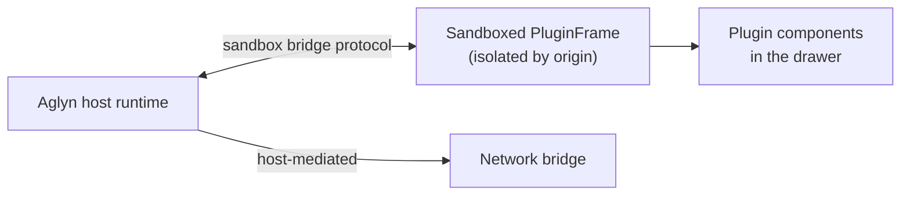

# Plugins & Marketplace

**Plugins** extend Aglyn with new components and capabilities. You install them from the
**organization marketplace** (**Marketplace** in the org navigation), configure them per
site, and they run **sandboxed** so they can't compromise your site.

The marketplace lives at the **organization** level — a single **Marketplace** destination
with **Browse**, **Installed**, and **Publish** tabs — rather than inside each site.

```mermaid
flowchart LR
  Host["Aglyn host runtime"] <-->|sandbox bridge protocol| Frame["Sandboxed PluginFrame<br/>(isolated by origin)"]
  Frame --> Comp["Plugin components<br/>in the drawer"]
  Host -->|host-mediated| Net["Network bridge"]
```

:::info Plan availability
**Free** to install marketplace plugins; some plugins and marketplace monetization features
are paid.
:::

## Install & upgrade

- Open **Marketplace** in the organization navigation and **Browse** the listings. Browse
  is a catalogue: cards link to the **detail page**, which is the only place an install
  happens, and a confirmation dialog names exactly where it will land before anything is
  written.
- When you install a plugin, choose where it applies: **All sites** (organization-wide —
  including sites you add later) or **Selected sites** (a specific subset). Components,
  templates and layouts are site-scoped, so "All sites" installs them onto every current
  site and does **not** cover sites added later.
- Installs are **version-pinned**, and you can **upgrade** deliberately.
- Installed plugins appear as named entries in the Besigner **drawer**, alongside built-in
  components.
- Manage everything from the marketplace's **Installed** tab: first-party plugin toggles
  (with release state), per-plugin configuration, plus every marketplace install with
  upgrade, uninstall, and share-with-organization actions. A listing's own detail page
  also carries **Uninstall** (or **Uninstall org-wide**) once you have it installed.
- Rating a listing needs a **verified email** and an organization that actually installed
  it; commenting is open to any signed-in user.
- Installing enables the plugin for the workspace automatically; uninstalling disables
  it once no site keeps its own pin. **Uninstalling never deletes the data a plugin
  created** — reinstall and it picks up where it left off.

## What the badges on a listing mean

Two badges can appear on a listing, and they say **different** things. Read them as two
separate claims, because that is what they are (AGL-1121).

| Badge | What Aglyn is claiming | What it survives |
| --- | --- | --- |
| **Verified publisher** | A human at Aglyn confirmed **who the publisher is**, and that their listing describes what their code does. | A version bump. It is a claim about the *publisher*, not about any particular release. |
| **Reviewed** | A human at Aglyn read **these exact bytes** — the version currently on offer — against a required checklist. | Nothing. It is re-earned per version, so a new release starts without it. |

So a new release from a verified publisher shows **Verified publisher** but not
**Reviewed**, and that is honest rather than a gap: we vouch for the person, and nobody
has read this particular code yet.

**Neither badge is a security guarantee.** Every plugin runs in the same sandbox with the
same limits whether it is badged or not, and installability is identical — a listed
plugin is installable by every workspace regardless. The badges tell you how much human
attention this listing has had, not whether the code is safe.

A listing with **neither** badge is not necessarily suspect; it may simply be new. It
does mean nobody at Aglyn has looked at it, so read the publisher and the docs before
installing.

## How plugins run

- Each plugin loads into a **sandboxed PluginFrame** host runtime, isolated by origin.
- A **manifest + sandbox bridge protocol** defines what a plugin can do.
- A **host-mediated network bridge** lets plugins make network calls without direct access
  to your environment.
- See [Sandbox security model](reference/sandbox-security.md) for what that isolation
  actually enforces — including the per-plugin network policy — if you're writing one.

## Configure

Plugins expose a **settings** field for per-plugin configuration, so the same plugin can
behave differently on each site.

## Publish your own

The **publish + install pipeline** lets developers ship plugins to the marketplace with
version pinning. The marketplace marketplace also supports **paid listings**, Stripe Connect
payouts, and a publisher **ledger**.

## Related

- [The Besigner](../../building-sites/besigner/overview.md)
- [Site templates & block library](../../building-sites/site-templates/overview.md)
- [Building feature plugins](building-feature-plugins.md) — the developer guide to every
  extension surface
- Repo docs: `docs/PLUGIN_LOADING.md` (loading architecture and trust tiers) and
  `docs/PLUGIN_PLATFORM_GAPS.md` (competitive analysis and the v2 roadmap)
