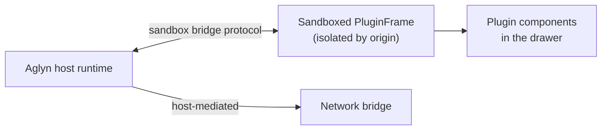

# Plugins & Marketplace

**Plugins** extend Aglyn with new components and capabilities. You install them from the
**organization marketplace** (**Marketplace** in the org navigation), configure them per
site, and they run **sandboxed** so they can't compromise your site.

The marketplace lives at the **organization** level rather than inside each site. Its own
Navigation panel lists **Browse All** and **Installed**; publishers additionally get
**Upload / Publish**, **Publisher Profile**, **Listings**, **Payouts** and **Sales**.

**Marketplace is now purely the market.** Turning plugins on and off for the workspace moved
out to its own **Plugins** section in the org navigation, next to Marketplace. **Installed**
remains as a convenience for uninstalling something you just installed — every row links
through to Plugins.

```mermaid
flowchart LR
  Host["Aglyn host runtime"] <-->|sandbox bridge protocol| Frame["Sandboxed PluginFrame<br/>(isolated by origin)"]
  Frame --> Comp["Plugin components<br/>in the drawer"]
  Host -->|host-mediated| Net["Network bridge"]
```

:::info Plan availability
**Free** to install marketplace plugins; some plugins and marketplace monetization features
are paid.
:::

:::tip New to this?
This page is the reference. If you'd rather be walked through it click by click —
find something, choose which sites get it, install, upgrade, remove — start with
**[Install your first marketplace item](../../guides/install-your-first-plugin.md)**.
:::

## Install & upgrade

- Open **Marketplace** in the organization navigation and **Browse** the listings. Browse
  is a catalog: cards link to the **detail page**, which is the only place an install
  happens, and a confirmation dialog names exactly where it will land before anything is
  written.
- When you install a plugin, choose where it applies: **All sites** (organization-wide —
  including sites you add later) or **Selected sites** (a specific subset). Only plugins
  and dataset schemas install org-wide; components, templates, layouts, themes and email
  templates are site-scoped, so "All sites" installs them onto every current site and
  does **not** cover sites added later. The listing's
  [What's included](#whats-included) box says which of the two you are looking at.
- Installs are **version-pinned**, and you can **upgrade** deliberately.
- Installed plugins appear as named entries in the Besigner **drawer**, alongside built-in
  components.
- Manage what you have from the marketplace's **Installed** section: every marketplace
  install, with upgrade, uninstall, and share-with-organization actions. A listing's own
  detail page also carries **Uninstall** (or **Uninstall org-wide**) once you have it
  installed.
- **Turning a plugin on or off is the Plugins section, not Marketplace.** **Plugins** in
  the organization navigation lists **Installed from the marketplace** and **Built in**,
  each row with its switch, its release state, and a link through to that plugin's own
  settings. If you are hunting for a switch, that is where it is.
- Rating a listing needs a **verified email** and an organization that actually installed
  it; commenting is open to any signed-in user.
- Installing enables the plugin for the workspace automatically; uninstalling disables
  it once no site keeps its own pin. **Uninstalling never deletes the data a plugin
  created** — reinstall and it picks up where it left off.

## What a browse card shows {#browse-card}

Every card in **Browse All** carries the same four claims, so two listings side by side
are comparable:

- **A price chip, always.** A paid listing shows the price — `$29` — and a free one
  shows the word **Free**. There is no such thing as a card without a price chip: a
  missing chip would read as an oversight next to the $29 beside it, which is the one
  thing "free" must not look like. The card's button repeats the price for a paid
  listing you don't own yet: **View details · $29**.
- **A star rating, with its count.** Stars plus the average and the number of ratings
  in brackets — `4.8 (12)`. The count is never dropped, because "5.0" from one rating
  and "5.0" from forty are not the same claim.
- **Not yet rated**, in words, when nobody has rated it. An unrated listing draws no
  stars at all, and silence reads as "zero stars" rather than "no ratings yet".
- **Version, publisher and installs** — `v3 · by @handle · 41 installs` — plus the
  **Reviewed** badge when the version on offer has passed review.

The listing's own page repeats the price chip and the rating in its header, where the
install decision is actually made. On that page an unrated listing shows nothing rather
than the "Not yet rated" wording.

## What's included {#whats-included}

A listing page carries a **What's included** box. Aglyn generates it from the listing —
it is not publisher copy, so it cannot promise something the install does not do, and
it says nothing about how much content is in there.

The first row is what the install physically produces, which depends on the type:

| Type | The row reads |
| --- | --- |
| Plugin | A plugin, sandboxed on its own origin with a per-plugin CSP |
| Component | An editable component you can place on any screen |
| Template | Editable screens you can rework in Besigner |
| Layout | An editable layout you can apply to any screen |
| Dataset schema | A new empty dataset with its fields already defined |
| Email template | An editable email design you can send campaigns from |
| Theme | A theme applied to the site you choose |

Then, in order, up to four more rows:

- **Where it lands.** Plugins and dataset schemas install org-wide — *Installs org-wide,
  covering sites you add later*. Everything else is site-scoped and says so: *Installs
  per site — new sites are not covered automatically*. That row is marked as a **note**,
  not a tick, because it is a limit you are being told about rather than something you
  are getting.
- **Review** — *This version passed marketplace review* — only when the version on offer
  is approved. A new release from the same publisher starts without it.
- **The license**, when the publisher set one: *Licensed MIT*.
- **Price and updates.** A paid listing reads *A one-time purchase — updates to this
  listing are included*; a free one reads *Free, including every future update*. Either
  way, updates are not a second charge — but they are still
  [deliberate](../../guides/install-your-first-plugin.md#step-7-off), not automatic.

What the box will never tell you is how many screens or blocks a template contains.
Aglyn collects no manifest of that, and counting it would mean inventing a number, so
the box stays to facts the listing actually carries.

## What the badges on a listing mean

Two badges can appear on a listing, and they say **different** things. Read them as two
separate claims, because that is what they are (AGL-1121).

| Badge | What Aglyn is claiming | What it survives |
| --- | --- | --- |
| **Verified publisher** | A human at Aglyn confirmed **who the publisher is**, and that their listing describes what their code does. | A version bump. It is a claim about the *publisher*, not about any particular release. |
| **Reviewed** | A human at Aglyn read **these exact bytes** — the version currently on offer — against a required checklist. | Nothing. It is re-earned per version, so a new release starts without it. |

So a new release from a verified publisher shows **Verified publisher** but not
**Reviewed**, and that is honest rather than a gap: we vouch for the person, and nobody
has read this particular code yet.

**Neither badge is a security guarantee.** Every plugin runs in the same sandbox with the
same limits whether it is badged or not, and installability is identical — a listed
plugin is installable by every workspace regardless. The badges tell you how much human
attention this listing has had, not whether the code is safe.

A listing with **neither** badge is not necessarily suspect; it may simply be new. It
does mean nobody at Aglyn has looked at it, so read the publisher and the docs before
installing.

## How plugins run

- Each plugin loads into a **sandboxed PluginFrame** host runtime, isolated by origin.
- A **manifest + sandbox bridge protocol** defines what a plugin can do.
- A **host-mediated network bridge** lets plugins make network calls without direct access
  to your environment.
- See [Sandbox security model](reference/sandbox-security.md) for what that isolation
  actually enforces — including the per-plugin network policy — if you're writing one.
- Your workspace decides which plugins are enabled at all, and a **site admin can narrow
  that further per site** from the site's **Admin → Plugins** page. A plugin disabled for
  a site disappears from that site's navigation, editor, published pages, and API — other
  sites in the workspace are unaffected, and a site can never enable a plugin the
  workspace has switched off.
- The site's **Admin → Plugins** page lists **both kinds** in two groups — what ships
  with the platform, and what the workspace installed from the marketplace — because
  which one a row is is the first thing you need to know before switching it. A
  marketplace plugin gets the same per-site switch as a built-in one.
- Most plugins are **on** for a site unless it turns them off. **User Accounts** is the
  exception: it is **off until a site turns it on**, because it is the one that decides
  whether the site serves `/signin`, `/signup` and `/recover` — and a sign-in page on a
  marketing site is worse than a missing one. See
  [Member accounts](../../guides/member-accounts.md) for what the switch does.

## When one plugin depends on another

Some plugins cannot run without another one. **User Accounts** is the case that exists
today: its Members blocks and its `membership/*` API handlers ship inside the **Commerce**
bundle, so User Accounts with Commerce switched off is a site that still routes `/signin`
while nothing can answer the sign-in request.

Switching off a plugin something else depends on therefore asks first. The dialog names
every dependent, says what disabling each one does to a site that is already published,
and offers **Cancel** or **Continue and disable those too**:

- **Cancel** writes nothing and the switch stays where it was.
- **Continue** disables the plugin and every dependent in a **single** save, so a
  half-applied cascade cannot happen.
- Dependents are followed **transitively** — if C needs B and B needs A, switching off A
  names both.
- **Re-enabling does not undo a cascade.** Turning the plugin back on later does not
  switch its dependents back on; re-enable each one yourself.

Two consequences are possible and the dialog distinguishes them, because they are very
different decisions:

| The dependent | What disabling it does |
| --- | --- |
| Registers site components (Commerce, Bookings, Email, Events Calendar, Marketing) | Elements **already placed on published pages stop rendering**. For a single site the dialog counts them. |
| Serves routes (User Accounts, Redirects, Automation) | Published pages keep rendering, but the routes or rules it serves stop. |
| Console-only (Contacts, Data, Inbox, Logic, Marketplace) | It leaves navigation and the editor. Published pages are unaffected. |

Counts come from scanning the **published** version of each screen, layout and component,
and are capped — where the scan hits its cap the dialog says "at least". Drafts are not
scanned.

:::caution The warning covers built-in plugins only
First-party plugins declare what they require. **Marketplace plugins are not covered at
all**: a plugin manifest has no way to declare a dependency yet, so no third-party plugin
is ever listed — whether or not it actually depends on the one you are switching off. The
dialog says this rather than implying the list is exhaustive. If you rely on a marketplace
plugin, check it yourself before switching off something it might be built on.
:::

Every plugin's page — at the workspace and at a site — carries a **Dependencies** card
showing both directions: what the plugin needs, and what needs it. Each related plugin
links to its own page at the same scope, so a site page links to site pages.

### A dependency that is off for one site {#a-dependency-that-is-off-for-one-site}

A site can switch off a plugin that another plugin on that same site depends on — by
disabling it directly, or simply by never opting in. When that happens the dependent
**stays switched on**. Nothing about it looks wrong: its workspace page is healthy, its
own switch is on, and the site keeps serving whatever routes it registers.

What is actually missing is the code. A site loads only its own enabled bundles, so a
missing requirement's elements **stop rendering on published pages**, and the plugin API
dispatcher answers **404** for any path belonging to a plugin that site has off. User
Accounts with Commerce off is the shape: `/signin` is still served, and the `membership/*`
request the form posts to has nothing behind it.

The site's plugin page is the only surface that can see this, so it says so there — the
Dependencies card marks the requirement as off for this site and warns rather than
showing a neutral label. The fix is either to turn the requirement back on for the site
or to turn the dependent off.

## Configure

A plugin declares the settings it takes, and the console renders the form. A workspace
sets a value once and every site follows it. See
[Plugin configuration](./reference/plugin-config.md).

This is the same for a marketplace plugin. A published manifest may carry a `config`
block declaring the plugin's fields and their defaults, and the console renders it from
the pinned manifest — the same form, the same workspace-default and per-site-override
behavior, with nothing for the publisher to build. See
[Plugin manifest](./reference/manifest-and-envs.md).

### Settings for one site {#configure-site}

A site that needs a different answer overrides **that one field** and keeps inheriting
the rest — including later changes the workspace makes to the fields it did not
override. So the same plugin behaves differently on each site without the author
writing any inheritance of their own.

Each field on a site's plugin page says which state it is in, shows the workspace's own
value beside it, and offers a one-click way back to inheriting. Editing a field is what
overrides it; reverting deletes the site's value rather than storing a copy of the
workspace's, so the site resumes following.

## Publish your own

The **publish + install pipeline** lets developers ship plugins to the marketplace with
version pinning. The marketplace also supports **paid listings**, Stripe Connect
payouts, and a publisher **ledger**.

## Related

- [Install your first marketplace item](../../guides/install-your-first-plugin.md) —
  the click-by-click walkthrough of everything on this page
- [The Besigner](../../building-sites/besigner/overview.md)
- [Site templates & block library](../../building-sites/site-templates/overview.md)
- [Building feature plugins](building-feature-plugins.md) — the developer guide to every
  extension surface
- Repo docs: `docs/PLUGIN_LOADING.md` (loading architecture and trust tiers) and
  `docs/PLUGIN_PLATFORM_GAPS.md` (competitive analysis and the v2 roadmap)
