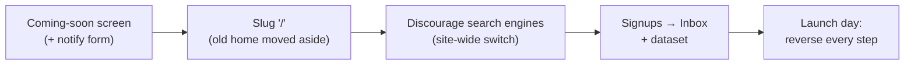

# Launch a coming-soon page while the rest of your site stays private

You have a domain, a half-built site, and a launch date. You want visitors to land on
something deliberate — "here's what's coming, tell me when it's ready" — while the
forty pages behind it stay out of Google until you're happy with them.

This walkthrough is the whole loop: **build the page → make it home → hide the rest →
collect signups → flip everything back on launch day**. It's the same pattern Aglyn
uses on its own site.



:::info Plan availability
Everything here works on **Free**: screens, forms, the inbox, per-screen visibility,
and the site-wide search switch. Writing signups into a **dataset** (step 4) needs the
data store, which unlocks on **Starter** and above — the inbox copy is always kept
either way.
:::

## 1. Build the coming-soon page

Create the screen first; you'll point your domain at it in step 2.

1. Go to **Screens** → **New screen**. Title it `Coming soon`. Give it any slug for
   now — `coming-soon` is fine — you'll change it to `/` in the next step.
2. Open it in the **Besigner** and put the essentials on it. A coming-soon page that
   only says "coming soon" wastes the visit. Aim for:
   - **What's coming, and roughly when.** One sentence and a month beats a countdown
     timer you'll have to move.
   - **A notify-me form** — see below.
   - **How to reach a human.** An email address or a contact link; people who arrive
     early are often the ones who most want to talk to you.
   - **Links out** — your documentation, your changelog, your social accounts,
     wherever you already post. These give an early visitor somewhere to go instead
     of bouncing.
3. **Publish** the screen.

### The notify-me form

Add a **Form** from the element picker with a single **Form Field** of type **Email**,
and set the Form's **Success message** to something that confirms the signup
("Thanks — we'll email you when we open"). The
[Forms & lead capture](../content-and-data/forms/overview.md) page covers the form
elements and every field property in full; the only thing that matters here is that
you give the field a **Field name** you'll recognise later, such as `email`.

## 2. Make it the home page

A screen's **Slug** decides the path it's served at, and the slug `/` means the home
page. So swapping your home page is two slug edits.

:::caution Change the slug, don't delete the screen
Move your existing home page aside rather than deleting it. Its design, its content,
and its version history are all worth keeping, and you'll want it back in step 5.
:::

1. Open your **current** home screen (**Sites** → your site → **Screens** → click the
   row). In the **Publishing** card, change **Slug** from `/` to something you'll
   recognise — `home` works — and choose **Update route**. The screen stays published,
   just at `/home` now.
2. Open the **Coming soon** screen. Change its **Slug** to `/` and choose
   **Update route** (or **Publish**, if you haven't published it yet).
3. Load your site. The coming-soon page is now what visitors get.

A screen can be the home page or have a parent, but not both — if the slug won't take,
check that the screen sits at the top level of your screens list.

:::caution Changing a slug does not create a redirect
Aglyn rewrites its own routing map when you change a slug, so links *within* your site
keep working. It does **not** leave a redirect behind at the old path — that URL simply
stops resolving. If the old path was public and people have linked to it, create the
rule yourself with the redirect manager (a paid feature) — see
[Create a redirect](../building-sites/redirects/create-a-redirect.md).
:::

## 3. Keep everything else out of search

Your unfinished pages are still published and still reachable. Two controls decide
whether search engines index them, and which one you want depends on how far along you
are.

### While nothing is ready: the site-wide switch

Go to **Setup → SEO** and turn on **Discourage search engines from indexing this site**.
One switch, whole site:

- `robots.txt` refuses every crawler (`Disallow: /`) and stops naming your sitemap
- `sitemap.xml` is served empty
- every page — including your coming-soon page — carries
  `<meta name="robots" content="noindex">`

This is the right choice while the site is a building site. It also covers pages you
haven't created yet, which per-screen visibility can't: a screen you publish next
Tuesday is indexable by default, so a site hidden page-by-page slowly un-hides itself
as it grows.

While the switch is on, a warning banner follows you through the console on every page
of that site. That's deliberate, and it's the answer to the most common support
question this feature creates — see step 5.

### Once you're launching page by page: per-screen visibility

When the site is mostly ready and you're releasing sections, turn the site-wide switch
**off** and hide the stragglers individually. Open a screen (**Screens** → pick it) and
use the **Visibility** dropdown in its **Page Access** card:

| Visibility | Reachable by | In search |
| --- | --- | --- |
| **Public** | anyone | yes |
| **Unlisted** | anyone with the link | no |
| **Password protected** | anyone with the password | no |
| **Members only** | signed-in members | no |

**Unlisted** is the one you want for a finished-but-not-announced page: it stays live
so you can share the link with a reviewer, and it's kept out of both search results and
your sitemap.

:::caution `noindex` is a request, not a lock
Unlisted and the site-wide switch ask search engines not to list a page. Well-behaved
crawlers honour that; nothing stops a person with the URL from opening it, and nothing
stops a badly-behaved crawler either. If a page must be genuinely inaccessible, protect
it properly — see [Site protection](../building-sites/site-protection/overview.md) and
[Password-protect a screen](../building-sites/site-protection/password-a-screen.md).
:::

## 4. Collect the signups

Every form submission is filed in your **Inbox** under the form's name, on every plan.
That alone is enough to email people on launch day.

To get a list you can actually query, point the form at a dataset:

1. Create a dataset on the organization **Data** page → **Add dataset**, called
   `Launch signups`, with a field for the address — `email`.
2. Back in the Besigner, select the **Form** container and set **Write to dataset** to
   `Launch signups` in the **Attributes** panel.
3. Select the email **Form Field** and set **Maps to schema field** to `email`.

That mapping is what makes the record land, and it's worth doing explicitly. The picker
stores the dataset field's stable **Reference ID**, so renaming the field later never
breaks it.

Left on **None (match by field name)**, the value falls back to matching a dataset field
whose **Reference ID** — the snake_case key beside each field in the Schema dialog, not
its Display name — is identical to the form field's **Field name**. So a form field
named `email` lands in a dataset field whose Reference ID is `email` with no mapping at
all, while one named `Your email` silently doesn't.

Values that match nothing are dropped from the record without failing the submission,
and the same is true of a deleted dataset or an exceeded record quota — the append is
best-effort by design, so a data-store problem never costs you a signup. **The inbox
copy always keeps everything**, which is why it's the thing to check if a record looks
wrong.

The [survey walkthrough](build-and-publish-a-survey.md) covers datasets, schema types
and the form pickers in much more depth.

## 5. Launch day: reverse every step

Turning a site dark is easy to do and easy to forget. Here is the whole reversal —
work down it, then verify with step 6.

1. **Allow search engines again.** **Setup → SEO** → turn **Discourage search engines
   from indexing this site** off. The console banner disappears, and `robots.txt`, the
   sitemap and the page meta all return within about a minute.
2. **Set the hidden screens back to Public.** The site-wide switch and per-screen
   visibility are independent — turning the switch off does **not** promote an
   Unlisted screen. Go through **Screens** and set each one's **Visibility** back to
   **Public** in its **Page Access** card. Anything you leave Unlisted stays out of
   search, silently and indefinitely.
3. **Swap the home page back.** Open **Coming soon**, change its **Slug** to something
   else (`coming-soon`) and **Update route** — or **Unpublish** it if you're done with
   it. Then open your real home screen and set its **Slug** back to `/`.
4. **Verify** — step 6. Don't skip it. Every step above is a setting that can be half
   applied, and the failure is silent.

:::caution "Why is my site not on Google?"
Nine times out of ten it's this feature, left on. Check, in order: the **Setup → SEO**
switch, then each screen's **Visibility**. Then remember that re-indexing is the search
engine's schedule, not yours — a site that was `noindex` for a month does not come back
the afternoon you fix it. Allow days, and use Google Search Console to request
indexing if you're in a hurry.
:::

## 6. Verify it actually worked

Three things a crawler reads, and how to read them yourself. Run these against your
real domain.

**`robots.txt`** — visit `https://your-site/robots.txt`, or:

```bash
curl -s https://your-site/robots.txt
```

Hidden looks like this — note that no sitemap is named:

```text
User-agent: *
Disallow: /
```

Visible looks like this:

```text
User-agent: *
Allow: /
Sitemap: https://your-site/sitemap.xml
```

**The page's robots meta** — open the page, **View source**, and search for `robots`.
Or:

```bash
curl -s https://your-site/ | grep -i 'name="robots"'
```

A hidden page returns `<meta name="robots" content="noindex, follow"/>`. A visible page
returns nothing at all — no robots meta means "index me", which is the default.

**The sitemap** — visit `https://your-site/sitemap.xml`, or:

```bash
curl -s https://your-site/sitemap.xml | grep -c '<loc>'
```

That counts the URLs you're submitting to search engines. It should be `0` while the
site-wide switch is on, and after launch it should match your public pages. Any page
you expect to see and don't is a screen still set to Unlisted.

:::tip Give it a minute
These three files are cached for about 60 seconds. If a change hasn't shown up, wait a
beat and re-run rather than changing another setting.
:::

## Related

- [SEO Toolkit](../building-sites/seo/overview.md) — search engine visibility in full
- [Forms & lead capture](../content-and-data/forms/overview.md)
- [Build & publish a survey](build-and-publish-a-survey.md) — datasets and form mapping
- [Site protection](../building-sites/site-protection/overview.md) — when `noindex` isn't enough
- [Create a redirect](../building-sites/redirects/create-a-redirect.md)
