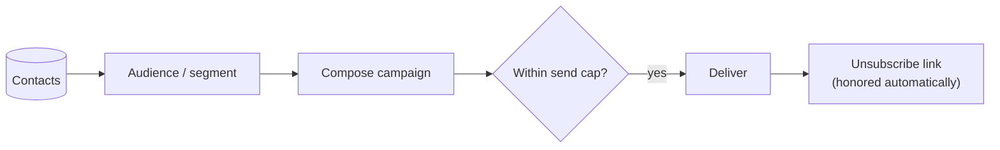

# Email Campaigns

**Email campaigns** let you reach the people in your [contacts CRM](../../content-and-data/contacts/overview.md).
Build an audience, compose a send, and Aglyn handles delivery, caps, and unsubscribes.



:::info Plan availability
**Paid**, with **tiered send caps** — how many emails you can send per period depends on
your plan.
:::


## Send a campaign

1. Build an **audience** — leads, site members, [segments](../../content-and-data/contacts/overview.md#segments),
   or an **email list**.
2. Compose the campaign from the **Marketing** page.
3. Send — subject to your plan's **send cap**.

### Your monthly send cap {#monthly-send-cap}

Every plan includes a number of **campaign** emails per calendar month. The count resets
on the 1st; it does not roll over.

**Only campaigns count against it.** Transactional mail — order confirmations, booking
reminders, password resets, teammate invites, workflow notifications — is never refused
by this cap on any plan. A busy month of orders cannot use up your campaign allowance,
and reaching the cap never stops a receipt from reaching a buyer.

You can see where you stand in two places, without having to be refused first:

- **In the composer**, under the recipient count: `340/500 campaign emails this month`.
- **On the Billing page**, as the **Campaign emails (this month)** meter, per site.

The cap is counted **per site**, so each site in your organization has its own allowance.
One recipient is one email: a campaign to 200 people spends 200.

When a send would take you past the cap, the composer says so while you are still writing
rather than after you press Send. [Upgrade your plan](../../workspace-and-billing/billing-and-plans/overview.md)
or shrink the audience.

### Personalize with merge tags

Use `{{name}}`, `{{firstName}}`, or `{{email}}` anywhere in the subject or body — they
resolve per recipient at send time from the audience's stored details. Add a fallback
with a pipe for recipients without a stored name: `Hi {{firstName|there}}!`.

### See who it will reach, before you send {#recipient-count}

As soon as you pick an audience the composer counts it, and shows the count under the
audience picker:

> Recipients 1,240 · 12 unsubscribed or suppressed

The number is not an estimate. It is produced by running the real send path with nothing
written — the same audience resolution, the same de-duplication, the same suppression
lists, and the same monthly cap — and stopping immediately before the first write. Nothing
is created, no counter moves, and no campaign appears in your history.

That means the count already reflects things you would otherwise only discover afterwards:

- **Duplicates are removed.** One person on two lists is one recipient.
- **People with no marketing consent on record are removed**, before anything else — see
  [Who a campaign is allowed to reach](#who-a-campaign-is-allowed-to-reach). The second
  caption line breaks the audience down by basis.
- **Unsubscribed and undeliverable addresses are removed**, and reported separately as
  `· 12 unsubscribed or suppressed`, so a smaller-than-expected number has a visible
  reason.
- **A single send is capped at 500 recipients**, and when your audience is larger the
  readout says so: `Recipients 500 of 3,200 in this audience`. The send takes the first
  500, in a fixed order, so sending the same campaign again reaches the same people.
- **A very large audience is reported as a floor**, with a `+`: `500 of 5,000+ in this
  audience` means there are at least 5,000 and the count stopped there.
- **A refusal appears here rather than at send time.** An empty audience, an audience
  nobody in which has a consent record, an audience where everyone is unsubscribed or
  suppressed, or a month already at your plan's send cap all say so while you are still
  writing.

While it works it reads `Counting recipients…`. It re-counts whenever you change the
audience.

Counting an audience needs the same permission as sending to it — the size of someone
else's site's audience is not public information.

### Who a campaign is allowed to reach

A marketing campaign goes only to people whose consent you have a record of, or who were
already in your audience before consent was required. The composer's second caption line
tells you which is which:

```
1,240 with a recorded consent basis · 310 grandfathered (captured before consent was
required) · 44 withheld — no consent on record
```

- **Recorded consent basis** — this person ticked an opt-in box on a form, a sign-up, or a
  newsletter subscription, and the date they did it is stored on their record.
- **Grandfathered** — this person was captured before the opt-in checkbox existed, so
  there is no record either way. They still receive campaigns. Nothing you already had was
  taken away.
- **Withheld** — this person is not mailed. Either they explicitly declined, or they were
  captured after consent became required and no opt-in was recorded for them.

Consent is never assumed from an action. Submitting a form, placing an order, booking, or
creating an account are not opt-ins on their own — a person is only counted as consenting
when they ticked a box that says so. To grow the consented number, add a marketing opt-in
checkbox to your forms and sign-up: a form field named `marketingConsent`, `emailOptIn`,
`newsletterOptIn` or `subscribe` is recorded as consent when it is ticked.

Withheld recipients cost you nothing — they are removed before your monthly send
allowance is claimed.

### Schedule a send

Pick a **Send at** time in the composer and the button becomes **Schedule campaign**.
Scheduled campaigns appear in history with a Scheduled chip and a **Cancel** action
until the send time; they deliver through the same caps, suppression list, and merge
tags as an immediate send.

Three things about the timing are worth knowing:

- **Due campaigns are picked up every 15 minutes**, so a send scheduled for 09:00 goes out
  between 09:00 and about 09:15. Schedule to the quarter hour if the exact minute matters.
- **The time is your browser's local time** at the moment you set it, stored as an absolute
  instant. Someone in another timezone reading the history sees the same instant in theirs.
- **A scheduled campaign is checked against your caps when it actually sends, not when you
  schedule it.** A month that has since reached its send cap makes the campaign fail rather
  than send, and it appears in history with a **Failed** chip carrying the reason.

The statuses a scheduled campaign moves through are **Scheduled** → sending → sent, or
**Canceled** if you cancel it in time, or **Failed** with the reason.

## Email lists

**Lists** are audiences shared across your organization's sites. Create them on the
Marketing page and target any of them from the campaign composer. A list is one of two
kinds, chosen when you create it.

### Manual lists

A manual list holds the people you put in it. Grow it with the **"Enroll in a list"**
automation step (e.g. on form completion) or popup email capture. Members stay until
they are removed.

### Lists built from a rule

A **dynamic** list holds everyone matching a rule, re-checked about every fifteen
minutes. Pick **From a rule** when you create the list, then say who it draws from:

- **People from** — contacts, leads, site members, form submissions, or any combination.
- **Tagged** — one or more contact tags, comma separated. Contacts only.
- **Submitted form** — one or more form names, comma separated. Form submissions only.
- **Created after** — only people whose record was created on or after that date.

So "everyone who submitted our Contact us form", "contacts tagged `vip`", and "site
members who joined since March" are each one rule.

The list row shows when the rule last ran. If it says **not yet evaluated**, the next
sweep has not reached it — a list created a moment ago is normal; hours is not.

Three things worth knowing:

- **People leave when they stop matching**, but only the ones the rule enrolled. Anyone
  you added by hand stays until you remove them.
- **A rule is never trimmed to fit a limit.** If it matches more people than a single
  send allows, every one of them is still on the list and it is the *send* that is
  refused, telling you the number it found.
- **Matching a rule is not consent.** A dynamic list decides who is in the audience;
  [the consent rules](#who-a-campaign-is-allowed-to-reach) still decide who is mailed.

## Experiments

Business plans can A/B test screens, sections, and emails from the **Experiments** card
on the Marketing page: weighted variants, deterministic visitor assignment, a conversion
goal, and per-variant exposure/conversion rates with a pick-the-winner flow.

Two ways to finish a test without watching it:

- **End date** — past it, visitors get the default and stats stop accruing until you
  pick a winner.
- **Auto-declare winner** — opt in with a minimum exposure count per variant and a
  confidence level (90/95/99%); once a challenger clears the bar (or every challenger
  confidently loses to the control), the experiment completes itself and serves the
  winner. Auto-completed tests carry a chip in the results dialog.

- **Screens & sections** — variants pin a screen *version*; visitors are split
  deterministically and the winning version serves to everyone once you pick it.
  Start a section test straight from the Besigner's Interactions panel.
- **Emails** — variants override the campaign's subject and/or body. Attach a running
  email experiment in the campaign composer; each recipient deterministically receives
  one variant (re-sends reach the same variant), sends count as exposures, and once a
  winner is picked every later send uses the winning copy.

## Opens & clicks

With the Resend webhook configured, campaign history shows **opens and clicks** per
campaign, and clicks on A/B sends count as that variant's **conversions** — so the
experiment results table fills in by itself.

### The campaign report

**Report**, beside any campaign that has been sent, opens the full picture for
that one send: delivery, engagement, rates, the audience it was taken from,
and which links were clicked.

Every rate names the population it is taken over, right next to the number,
because the same label means different things in different tools:

| Rate | Taken over |
| --- | --- |
| **Delivery rate** | Sent — what the provider accepted |
| **Open rate** | Delivered, and counting *readers*, not opens |
| **Click rate** | Delivered |
| **Click-to-open rate** | The readers who opened — a different question from the click rate, and usually three or four times larger |
| **Bounce rate** | Sent |
| **Complaint rate** | Delivered |
| **Unsubscribe rate** | Delivered |

Two things the report will refuse to show you, and says so on screen:

- **A rate with no denominator.** Delivery events are recorded by the webhook,
  so a campaign sent before it was connected has no delivered count. The
  report leaves those rates blank rather than dividing by *sent*, which would
  read higher than the same campaign measured anywhere else.
- **A click rate for a send whose links were not trackable.** Click tracking
  rewrites links in the HTML part of a message, so a send that carried none
  reports zero clicks whatever recipients did. The click count is still shown;
  no rate is computed from it.

**Opens** and **readers who opened** are both shown and are different numbers:
one person opening an email four times is four opens and one reader. Rates use
the reader count.

### Which links were clicked

The report breaks clicks down by destination. Links are counted by address and
path — the query string is dropped — so two links to the same page that differ
only in their tracking parameters count as one row.

## Compliance

- Every send includes an **unsubscribe** link, and the header mailbox
  providers look for — Gmail and Yahoo's one-click `List-Unsubscribe`.
- Clicking it opens a confirmation page; only confirming actually
  unsubscribes. That matters because corporate mail scanners open every link
  in a message before the recipient sees it, and a link that unsubscribed on
  open would quietly shrink your list.
- Unsubscribes are honored automatically so you stay compliant.

### Suppressions

**Emails ▸ Suppressions** lists every address your campaigns skip, with the
reason and the date:

| Reason | What happened |
| --- | --- |
| **Unsubscribed** | They clicked the unsubscribe link. |
| **Bounced** | The mailbox does not exist. Recorded only for a *permanent* bounce — a full mailbox or a temporary server problem never suppresses anybody. |
| **Marked as spam** | They reported a message. |

This is where the gap between a campaign's recipient count and what it
actually sent comes from, and a rising **Bounced** count is the earliest sign
a list is going stale.

An unsubscribe now records **which campaign** the link was in, so the campaign
report can show an unsubscribe rate for that send. Links in mail sent before
this keep working exactly as they did; they simply carry no campaign.

**Remove** puts an address back on your list — use it when somebody asks to
be re-added, or when a suppression was recorded by mistake. Removing a
*bounced* address means your next campaign will try a mailbox that has
already said it does not exist, which mailbox providers hold against your
sending reputation, so the confirmation names the reason before you do it.

## Related

- [Contacts CRM](../../content-and-data/contacts/overview.md)
- [Forms & lead capture](../../content-and-data/forms/overview.md)
- [Marketing overlays](../marketing-overlays/overview.md) (email capture popups)
