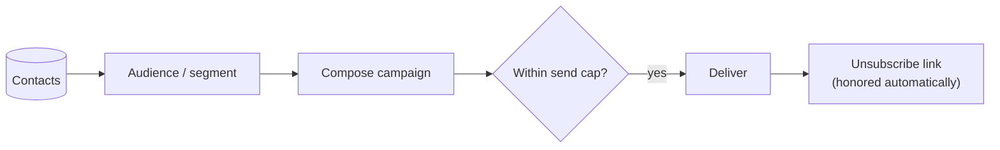

# Email Campaigns

**Email campaigns** let you reach the people in your [contacts CRM](../../content-and-data/contacts/overview.md).
Build an audience, compose a send, and Aglyn handles delivery, caps, and unsubscribes.



:::info Plan availability
**Paid**, with **tiered send caps** — how many emails you can send per period depends on
your plan.
:::


## Send a campaign

1. **Create a campaign** on the Emails page — a name, the dates it runs between, and the
   lists it is aimed at.
2. Open it and **write an email** inside it. Pick the audience for that email — leads,
   site members, [segments](../../content-and-data/contacts/overview.md#segments), or an
   email list.
3. Send — subject to your plan's **send cap**.

### A campaign holds many emails {#campaigns-group-emails}

A campaign is a **container**, not a single message. It carries a name, a start and end
date, and the lists it is aimed at; the emails you send inside it are its contents, and
the campaign's page adds their figures up.

- **The campaigns list** shows one row per campaign: its window, its lists, how many
  emails it has sent, and the totals across them.
- **Opening a campaign** shows the lists it is aimed at, every email inside it, the
  delivery and engagement figures summed across those emails, and a composer for writing
  the next one.
- **Each email keeps its own report**, reached from the campaign page. Nothing about an
  individual send's report or its link changed.

**Campaigns you sent before this existed are still there**, each listed as a campaign of
one and marked **Single send**. Their reports open at the same address they always did,
and the unsubscribe links in mail already delivered are untouched.

### Who the email comes from {#who-the-email-comes-from}

Three fields sit under the audience picker, and they are per email rather than per site:

- **From name** — the display name in front of your sending address. The address itself
  is always your site's verified sending identity; a from name changes what a recipient
  reads, never which domain the mail leaves on.
- **Reply-to** — where replies land, when that is not the sending address.
- **Preheader** — the preview line an inbox shows after the subject.

Left empty, the from name falls back to your workspace's branding and no reply-to or
preheader is set.

### Preview the email {#preview-the-email}

**Preview email** renders the message as it will be mailed — the same renderer, the same
merge-tag resolution, and the same HTML part that reaches the inbox — personalized for
your own account so you can see what a merge tag actually resolves to. It re-renders as
you type and it resolves no audience, so previewing costs nothing against your caps and
sends nothing to anybody.

**Send test to me** is the other half: it delivers one real message to your own account
address, which is the way to check how a mail client renders it.

### Your monthly send cap {#monthly-send-cap}

Every plan includes a number of **campaign** emails per calendar month. The count resets
on the 1st; it does not roll over.

**Only campaigns count against it.** Transactional mail — order confirmations, booking
reminders, password resets, teammate invites, workflow notifications — is never refused
by this cap on any plan. A busy month of orders cannot use up your campaign allowance,
and reaching the cap never stops a receipt from reaching a buyer.

You can see where you stand in two places, without having to be refused first:

- **In the composer**, under the recipient count: `340/500 campaign emails this month`.
- **On the Billing page**, as the **Campaign emails (this month)** meter.

The cap is counted **per workspace**, not per site — every site in your organization draws
on one shared monthly allowance. One recipient is one email: a campaign to 200 people
spends 200, whichever site sent it.

Campaigns are also **paced**: a workspace can send a set number per hour, so a very large
send is spread out rather than refused. The Billing page shows that hourly ceiling beside
the monthly one. Transactional mail — receipts, invites, password resets — is not paced by
it and is not counted against the monthly cap.

When a send would take you past the cap, the composer says so while you are still writing
rather than after you press Send. [Upgrade your plan](../../workspace-and-billing/billing-and-plans/overview.md)
or shrink the audience.

### Personalize with merge tags

Use `{{name}}`, `{{firstName}}`, or `{{email}}` anywhere in the subject or body — they
resolve per recipient at send time from the audience's stored details. Add a fallback
with a pipe for recipients without a stored name: `Hi {{firstName|there}}!`.

### See who it will reach, before you send {#recipient-count}

As soon as you pick an audience the composer counts it, and shows the count under the
audience picker:

> Recipients 1,240 · 12 unsubscribed or suppressed

The number is not an estimate. It is produced by running the real send path with nothing
written — the same audience resolution, the same de-duplication, the same suppression
lists, and the same monthly cap — and stopping immediately before the first write. Nothing
is created, no counter moves, and no campaign appears in your history.

That means the count already reflects things you would otherwise only discover afterwards:

- **Duplicates are removed.** One person on two lists is one recipient.
- **People with no marketing consent on record are removed**, before anything else — see
  [Who a campaign is allowed to reach](#who-a-campaign-is-allowed-to-reach). The second
  caption line breaks the audience down by basis.
- **Unsubscribed and undeliverable addresses are removed**, and reported separately as
  `· 12 unsubscribed or suppressed`, so a smaller-than-expected number has a visible
  reason.
- **A single send is capped at 500 recipients**, and when your audience is larger the
  readout says so: `Recipients 500 of 3,200 in this audience`. The send takes the first
  500, in a fixed order, so sending the same campaign again reaches the same people.
- **A very large audience is reported as a floor**, with a `+`: `500 of 5,000+ in this
  audience` means there are at least 5,000 and the count stopped there.
- **A refusal appears here rather than at send time.** An empty audience, an audience
  nobody in which has a consent record, an audience where everyone is unsubscribed or
  suppressed, or a month already at your plan's send cap all say so while you are still
  writing.

While it works it reads `Counting recipients…`. It re-counts whenever you change the
audience. It does **not** re-count while you write: counting resolves your whole audience,
and nothing about the subject or the body can change how many people are in it.

**The confirmation dialog states the number.** Pressing Send asks you to confirm a send to
`342 list subscribers`, or `500 of 3,200 in this audience` when the audience is larger
than one send carries, and names what is not counted — the people withheld for having no
consent on record, and the ones already unsubscribed or suppressed. If the count could not
be read, the dialog says so rather than implying the send reaches everyone.

Counting an audience needs the same permission as sending to it — the size of someone
else's site's audience is not public information.

### Who a campaign is allowed to reach

A marketing campaign goes only to people whose consent you have a record of, or who were
already in your audience before consent was required. The composer's second caption line
tells you which is which:

```
1,240 with a recorded consent basis · 310 grandfathered (captured before consent was
required) · 44 withheld — no consent on record
```

- **Recorded consent basis** — this person ticked an opt-in box on a form, a sign-up, or a
  newsletter subscription, and the date they did it is stored on their record.
- **Grandfathered** — this person was captured before the opt-in checkbox existed, so
  there is no record either way. They still receive campaigns. Nothing you already had was
  taken away.
- **Withheld** — this person is not mailed. Either they explicitly declined, or they were
  captured after consent became required and no opt-in was recorded for them.

Consent is never assumed from an action. Submitting a form, placing an order, booking, or
creating an account are not opt-ins on their own — a person is only counted as consenting
when they ticked a box that says so. To grow the consented number, add a marketing opt-in
checkbox to your forms and sign-up: a form field named `marketingConsent`, `emailOptIn`,
`newsletterOptIn` or `subscribe` is recorded as consent when it is ticked.

Withheld recipients cost you nothing — they are removed before your monthly send
allowance is claimed.

### Schedule a send

Pick a **Send at** time in the composer and the button becomes **Schedule campaign**.
Scheduled campaigns appear in history with a Scheduled chip and a **Cancel** action
until the send time; they deliver through the same caps, suppression list, and merge
tags as an immediate send.

Three things about the timing are worth knowing:

- **Due campaigns are picked up every 15 minutes**, so a send scheduled for 09:00 goes out
  between 09:00 and about 09:15. Schedule to the quarter hour if the exact minute matters.
- **The time is your browser's local time** at the moment you set it, stored as an absolute
  instant. Someone in another timezone reading the history sees the same instant in theirs.
- **A scheduled campaign is checked against your caps when it actually sends, not when you
  schedule it.** A month that has since reached its send cap makes the campaign fail rather
  than send, and it appears in history with a **Failed** chip carrying the reason.

The statuses a scheduled campaign moves through are **Scheduled** → sending → sent, or
**Canceled** if you cancel it in time, or **Failed** with the reason.

## Email lists

**Lists** are audiences shared across your organization's sites. Create them on the
Marketing page and target any of them from the campaign composer. A list is one of two
kinds, chosen when you create it.

### Manual lists

A manual list holds the people you put in it. Grow it with the **"Enroll in a list"**
automation step (e.g. on form completion), popup email capture, the **Add to a list**
card in the Inbox, or by hand from the list itself. Members stay until they are
removed.

### See and manage who is on a list {#list-members}

Press **Members** on any list row to open it. You get the membership a page at a time —
address, name, when they joined, how they got there, and what their consent record
says — plus the controls to change it. Press **Close** to collapse it again; nothing is
read until you open a list.

**How** tells a rule match apart from somebody who was added. A person a rule enrolled
leaves when they stop matching; a person who was added stays.

**Consent** is the basis the membership carries, and the two kinds are not the same
fact:

- **Opted in** — this person ticked a box, on the date shown. Their own decision.
- **Attested by your team** — somebody on your team stated they had this person's
  permission. That statement is the basis, and it is recorded against their account
  with the date.
- **No basis on record** — nothing either way. Not a refusal; see
  [who a campaign is allowed to reach](#who-a-campaign-is-allowed-to-reach).

**Rename** the list from the same panel. The name is what the campaign composer's
audience picker shows, so renaming it is safe at any time — the list, its members and
any campaign already sent are untouched.

### Add someone by hand {#add-to-a-list}

Type an address (or paste a whole column of them) and press **Check**. Every address is
checked against that person's consent record and both suppression lists before anything
is written, and you are told what would happen to each one:

- Somebody with a **stored opt-in** is added carrying that opt-in — including the
  original date they gave it, not today's.
- Somebody with **no opt-in on record** can only be added if you state that you have
  their permission. That statement is recorded against your account, with the date.
  Adding them does not create an opt-in for them, and nothing else here does either.
- Somebody who **declined**, or whose address is **suppressed**, is not added, and
  there is no override. This is deliberate: if asserting permission could reach past a
  recorded refusal, recording one would mean nothing.

Pasting many addresses works the same way. You see the counts — how many already have
an opt-in, how many need your say-so, how many cannot be added at all — before you
confirm, and one statement covers the batch. Addresses that are not valid are listed
back to you rather than quietly dropped. Up to 100 at a time.

### Removing someone is not an unsubscribe {#remove-from-a-list}

**Remove** takes a person off that one list. It is not a suppression: it does not stop
any other list reaching them, and it does not record that they asked you to stop. If
somebody has asked to stop hearing from you, [suppress the address](#suppressions)
instead — that is the record that holds across every list and every campaign.

### Lists built from a rule

A **dynamic** list holds everyone matching a rule, re-checked about every fifteen
minutes. Pick **From a rule** when you create the list, then say who it draws from:

- **People from** — contacts, leads, site members, form submissions, or any combination.
- **Tagged** — one or more contact tags, comma separated. Contacts only.
- **Submitted form** — one or more form names, comma separated. Form submissions only.
- **Created after** — only people whose record was created on or after that date.

So "everyone who submitted our Contact us form", "contacts tagged `vip`", and "site
members who joined since March" are each one rule.

The list row shows when the rule last ran. If it says **not yet evaluated**, the next
sweep has not reached it — a list created a moment ago is normal; hours is not.

Three things worth knowing:

- **People leave when they stop matching**, but only the ones the rule enrolled. Anyone
  you added by hand stays until you remove them.
- **A rule is never trimmed to fit a limit.** If it matches more people than a single
  send allows, every one of them is still on the list and it is the *send* that is
  refused, telling you the number it found.
- **Matching a rule is not consent.** A dynamic list decides who is in the audience;
  [the consent rules](#who-a-campaign-is-allowed-to-reach) still decide who is mailed.

## Experiments

Business plans can A/B test screens, sections, and emails from the **Experiments** card
on the Marketing page: weighted variants, deterministic visitor assignment, a conversion
goal, and per-variant exposure/conversion rates with a pick-the-winner flow.

Two ways to finish a test without watching it:

- **End date** — past it, visitors get the default and stats stop accruing until you
  pick a winner.
- **Auto-declare winner** — opt in with a minimum exposure count per variant and a
  confidence level (90/95/99%); once a challenger clears the bar (or every challenger
  confidently loses to the control), the experiment completes itself and serves the
  winner. Auto-completed tests carry a chip in the results dialog.

- **Screens & sections** — variants pin a screen *version*; visitors are split
  deterministically and the winning version serves to everyone once you pick it.
  Start a section test straight from the Besigner's Interactions panel.
- **Emails** — variants override the campaign's subject and/or body. Attach a running
  email experiment in the campaign composer; each recipient deterministically receives
  one variant (re-sends reach the same variant), sends count as exposures, and once a
  winner is picked every later send uses the winning copy.

## Opens & clicks

With the Resend webhook configured, campaign history shows **opens and clicks** per
campaign, and clicks on A/B sends count as that variant's **conversions** — so the
experiment results table fills in by itself.

### The campaign report

**Report**, beside any campaign that has been sent, opens the full picture for
that one send: delivery, engagement, rates, the audience it was taken from,
and which links were clicked.

Every rate names the population it is taken over, right next to the number,
because the same label means different things in different tools:

| Rate | Taken over |
| --- | --- |
| **Delivery rate** | Sent — what the provider accepted |
| **Open rate** | Delivered, and counting *readers*, not opens |
| **Click rate** | Delivered |
| **Click-to-open rate** | The readers who opened — a different question from the click rate, and usually three or four times larger |
| **Bounce rate** | Sent |
| **Complaint rate** | Delivered |
| **Unsubscribe rate** | Delivered |

Two things the report will refuse to show you, and says so on screen:

- **A rate with no denominator.** Delivery events are recorded by the webhook,
  so a campaign sent before it was connected has no delivered count. The
  report leaves those rates blank rather than dividing by *sent*, which would
  read higher than the same campaign measured anywhere else.
- **A click rate for a send whose links were not trackable.** Click tracking
  rewrites links in the HTML part of a message, so a send that carried none
  reports zero clicks whatever recipients did. The click count is still shown;
  no rate is computed from it.

**Opens** and **readers who opened** are both shown and are different numbers:
one person opening an email four times is four opens and one reader. Rates use
the reader count.

### Which links were clicked

The report breaks clicks down by destination. Links are counted by address and
path — the query string is dropped — so two links to the same page that differ
only in their tracking parameters count as one row.

### Revenue from a campaign {#revenue-from-a-campaign}

If your site sells something, the report also shows what the campaign earned.

Because your store and your email live in the same product, this is a lookup
rather than an estimate — there is no tracking script to install, no store to
connect, and nothing is guessed from a cookie.

**The rule, in one sentence:** an order is credited to the last campaign whose
link the buyer clicked, if they clicked it within **7 days** before ordering.

Four things follow from that rule, and the report says all four on screen:

- **Clicks only.** An open is not treated as evidence that anybody read the
  email — Apple's Mail Privacy Protection opens mail on the recipient's behalf,
  so a large share of recorded opens have no person behind them.
- **One campaign gets the whole order.** If two campaigns reached the buyer, the
  more recent click takes the credit. Nothing is split between them.
- **Refunds come back off.** The report shows gross, refunded and net, and leads
  with net. A chargeback is treated the same way as a refund.
- **It is a floor, not a total.** An order from somebody who never clicked, or
  who checked out without giving an email address, is credited to no campaign at
  all. Campaigns sent before your store existed will show nothing here.

**Net revenue per delivered message** is the figure to compare between
campaigns, and like every rate above it names what it is divided by. A campaign
with no recorded delivery count shows amounts but no per-message figure.

If a campaign earned in more than one currency, each is reported on its own.
Nothing converts between currencies, so there is deliberately no combined total.

## Compliance

- Every send includes an **unsubscribe** link, and the header mailbox
  providers look for — Gmail and Yahoo's one-click `List-Unsubscribe`.
- Clicking it opens a page; only submitting that page actually changes
  anything. That matters because corporate mail scanners open every link in a
  message before the recipient sees it, and a link that unsubscribed on open
  would quietly shrink your list.
- Unsubscribes are honored automatically so you stay compliant.

### Topics {#topics}

A **topic** is a stream of email somebody can leave on its own. Every campaign
belongs to one, picked in the composer, and the link in that email offers to
stop *that* stream rather than all of them.

Four topics come with every organization — Promotions and offers, Newsletter,
Product updates, and Sales outreach. Rename them, change what recipients are
told they get, or add your own under **Emails ▸ Topics**. Topics are shared
across every site in your organization, the same way your lists are.

You cannot delete a topic, only **retire** it. A retired topic disappears from
the composer and from the preference page, and campaigns already sent under it
keep working — their unsubscribe links still name it. Restore it at any time.

### The preference page {#preference-page}

The link at the bottom of every campaign opens a page where the recipient sees
your topics, ticks the ones they want to keep, and saves. Whatever they untick
stops; everything else carries on. "Unsubscribe from everything" is on the same
page, one button away, for anyone who wants it.

This is why an unsubscribe is no longer all-or-nothing: somebody who only
wanted the sales mail to stop can stop it and keep your newsletter, instead of
leaving your list entirely — or reaching for "report spam", which costs you
far more.

One exception, and it is deliberate: **the one-click unsubscribe in the mail
client's own header still unsubscribes from everything.** That button is
pressed with no page in front of it, and a mailbox provider expects it to mean
"stop". Narrowing it would be a promise the recipient did not make.

Somebody who unsubscribed can also **resubscribe** from the same link — except
when the address was suppressed by a bounce or a spam complaint. Those protect
your sending reputation rather than expressing a preference, so no link can
clear them.

### Which mail this applies to {#marketing-mail}

The unsubscribe link, the suppression list and the daily limit below apply to
every message your site sends its own audience, not only to campaigns:

| Message | Sent when |
| --- | --- |
| A campaign | You press Send, or a scheduled send comes due |
| A **members post** | You publish one with "Email subscribers" ticked |
| An **abandoned-cart reminder** | A shopper leaves a cart behind |
| A **back-in-stock alert** | A product a shopper asked about returns |
| A **workflow email** | An automation's *Send email* step runs |

Transactional mail is deliberately **not** in this list and never carries an
unsubscribe link: order confirmations, booking reminders, password resets and
teammate invites answer something the person just did, and somebody who
unsubscribed from your newsletter still gets their receipt.

Somebody who unsubscribes, hard-bounces or reports a message as spam is
skipped by **all five** of the message types above, from that point on.

### The daily limit {#frequency-cap}

One person receives at most **five marketing messages from one site per
24 hours**. It is the same number on every plan, because it protects the
sending domain your mail shares with every other Aglyn site rather than
anything you buy.

In practice it cannot reach a normal week: a campaign plus a cart reminder
plus a restock alert plus a members post is four. What it stops is a loop — a
workflow that fires on every form submission, or a members post published
repeatedly.

When the limit is reached, the **message is skipped and the person is left
exactly where they were**. Nobody is unsubscribed, nothing is removed from an
audience, and no contact is deleted. A reminder or alert that was skipped is
retried on the next sweep once the window rolls; a campaign is never refused
by this limit, though it does count toward it.

### Suppressions

**Emails ▸ Suppressions** lists every address your campaigns skip, with the
reason and the date:

| Reason | What happened |
| --- | --- |
| **Unsubscribed** | They clicked the unsubscribe link. |
| **Bounced** | The mailbox does not exist. Recorded only for a *permanent* bounce — a full mailbox or a temporary server problem never suppresses anybody. |
| **Marked as spam** | They reported a message. |
| **Added by hand** | You added the address yourself — see below. |

This is where the gap between a campaign's recipient count and what it
actually sent comes from, and a rising **Bounced** count is the earliest sign
a list is going stale.

An unsubscribe now records **which campaign** the link was in, so the campaign
report can show an unsubscribe rate for that send. Links in mail sent before
this keep working exactly as they did; they simply carry no campaign.

#### Add an address yourself {#add-a-suppression}

**Add**, at the top of the card, opens a drawer where you can type or paste
addresses — one per line or separated by commas, up to 50 at a time — with an
optional note recording how the request reached you.

Use it when somebody asks you to stop emailing them by reply, by phone, or in
person. US law requires an opt-out received *by any means* to be honored, and
the person who asks in words rather than by clicking has asked just as clearly.

Two things it does not do, both on purpose:

- **It does not remove anybody.** The person stays on every audience and keeps
  every record you hold about them. Only this site's marketing email stops.
- **It does not stop transactional mail.** Order confirmations, booking
  reminders and password resets still reach them, because those answer
  something the person just did.

An address that is already on the list is left exactly as it is, with the
reason and date it already had — so adding one by hand can never overwrite the
record of a bounce or a spam report.

#### An address Aglyn is blocking too {#platform-suppressions}

Some addresses are suppressed **platform-wide** as well as on your list —
because they bounced permanently, or reported a message as spam, on a send
from anywhere in Aglyn including mail we send you ourselves.

When you remove such an address, the confirmation says so: removing your entry
will not start mail reaching them, because the platform entry is still there
and only Aglyn can lift it. Contact support and we will look at it. This is
the usual explanation for an address that keeps being skipped after you have
already taken it off your own list.

**Remove** puts an address back on your list — use it when somebody asks to
be re-added, or when a suppression was recorded by mistake. Removing a
*bounced* address means your next campaign will try a mailbox that has
already said it does not exist, which mailbox providers hold against your
sending reputation, so the confirmation names the reason before you do it.

## Related

- [Contacts CRM](../../content-and-data/contacts/overview.md)
- [Forms & lead capture](../../content-and-data/forms/overview.md)
- [Marketing overlays](../marketing-overlays/overview.md) (email capture popups)
