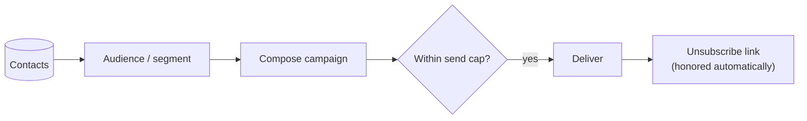

# Email Campaigns

**Email campaigns** let you reach the people in your [contacts CRM](../../content-and-data/contacts/overview.md).
Build an audience, compose a send, and Aglyn handles delivery, caps, and unsubscribes.

:::info Plan availability
**Paid**, with **tiered send caps** — how many emails you can send per period depends on
your plan.
:::

## Send a campaign

1. Build an **audience** — leads, site members, [segments](../../content-and-data/contacts/overview.md#segments),
   or an **email list**.
2. Compose the campaign from the **Marketing** page.
3. Send — subject to your plan's **send cap**.

### Personalize with merge tags

Use `{{name}}`, `{{firstName}}`, or `{{email}}` anywhere in the subject or body — they
resolve per recipient at send time from the audience's stored details. Add a fallback
with a pipe for recipients without a stored name: `Hi {{firstName|there}}!`.

### See who it will reach, before you send {#recipient-count}

As soon as you pick an audience the composer counts it, and shows the count under the
audience picker:

> Recipients 1,240 · 12 unsubscribed

The number is not an estimate. It is produced by running the real send path with nothing
written — the same audience resolution, the same de-duplication, the same suppression list,
and the same monthly cap — and stopping immediately before the first write. Nothing is
created, no counter moves, and no campaign appears in your history.

That means the count already reflects things you would otherwise only discover afterwards:

- **Duplicates are removed.** One person on two lists is one recipient.
- **Unsubscribes are removed**, and reported separately as `· 12 unsubscribed`, so a
  smaller-than-expected number has a visible reason.
- **A single send is capped at 500 recipients.** A larger audience is counted at the cap.
- **A refusal appears here rather than at send time.** An empty audience, an audience where
  everyone has unsubscribed, or a month already at your plan's send cap all say so while
  you are still writing.

While it works it reads `Counting recipients…`. It re-counts whenever you change the
audience.

Counting an audience needs the same permission as sending to it — the size of someone
else's site's audience is not public information.

### Schedule a send

Pick a **Send at** time in the composer and the button becomes **Schedule campaign**.
Scheduled campaigns appear in history with a Scheduled chip and a **Cancel** action
until the send time; they deliver through the same caps, suppression list, and merge
tags as an immediate send.

Three things about the timing are worth knowing:

- **Due campaigns are picked up every 15 minutes**, so a send scheduled for 09:00 goes out
  between 09:00 and about 09:15. Schedule to the quarter hour if the exact minute matters.
- **The time is your browser's local time** at the moment you set it, stored as an absolute
  instant. Someone in another timezone reading the history sees the same instant in theirs.
- **A scheduled campaign is checked against your caps when it actually sends, not when you
  schedule it.** A month that has since reached its send cap makes the campaign fail rather
  than send, and it appears in history with a **Failed** chip carrying the reason.

The statuses a scheduled campaign moves through are **Scheduled** → sending → sent, or
**Canceled** if you cancel it in time, or **Failed** with the reason.

## Email lists

**Lists** are static audiences shared across your organization's sites. Create them on
the Marketing page, then grow them with the **"Enroll in a list"** automation step (e.g.
on form completion) or popup email capture. Target any list from the campaign composer.

## Experiments

Business plans can A/B test screens, sections, and emails from the **Experiments** card
on the Marketing page: weighted variants, deterministic visitor assignment, a conversion
goal, and per-variant exposure/conversion rates with a pick-the-winner flow.

Two ways to finish a test without watching it:

- **End date** — past it, visitors get the default and stats stop accruing until you
  pick a winner.
- **Auto-declare winner** — opt in with a minimum exposure count per variant and a
  confidence level (90/95/99%); once a challenger clears the bar (or every challenger
  confidently loses to the control), the experiment completes itself and serves the
  winner. Auto-completed tests carry a chip in the results dialog.

- **Screens & sections** — variants pin a screen *version*; visitors are split
  deterministically and the winning version serves to everyone once you pick it.
  Start a section test straight from the Besigner's Interactions panel.
- **Emails** — variants override the campaign's subject and/or body. Attach a running
  email experiment in the campaign composer; each recipient deterministically receives
  one variant (re-sends reach the same variant), sends count as exposures, and once a
  winner is picked every later send uses the winning copy.

## Opens & clicks

With the Resend webhook configured, campaign history shows **opens and clicks** per
campaign, and clicks on A/B sends count as that variant's **conversions** — so the
experiment results table fills in by itself.

## Compliance

- Every send includes an **unsubscribe** link.
- Unsubscribes are honored automatically so you stay compliant.

## Related

- [Contacts CRM](../../content-and-data/contacts/overview.md)
- [Forms & lead capture](../../content-and-data/forms/overview.md)
- [Marketing overlays](../marketing-overlays/overview.md) (email capture popups)
