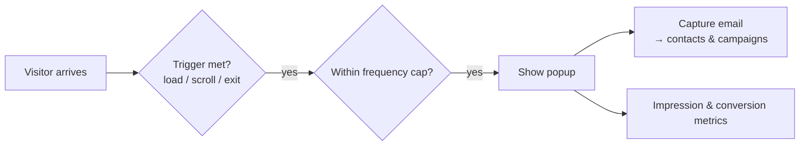

# Marketing Overlays

**Marketing overlays** are the announcement bars and popups that sit on top of your site to
promote offers and capture emails — without touching your page designs. Manage them from
your site's **Marketing** page.

:::info Plan availability
**Paid**, gated by the `marketingOverlays` entitlement.
:::

## Announcement bar

A **site-wide announcement bar** shows a message across every page — ideal for sales,
notices, or launches. It's controlled centrally and gated by the marketing-overlays
entitlement.

## Promotional popups

Popups give you more control:

- **Triggers** — **After a delay** (a number of seconds), **On scroll** (a percentage of
  the page), or **On exit intent**.
- **Frequency capping** — don't nag returning visitors. See below.
- **Scheduling** — run a popup only during a campaign window.

### Frequency: how often a popup comes back {#frequency}

In the popup editor, **Frequency** offers two mutually exclusive choices.

**Once per session** shows the popup at most once for as long as the visitor keeps the tab
open. Close the tab, come back tomorrow — or open your site in a second tab — and they see
it again. This is the right choice for a popup tied to the visit rather than to the person:
a first-order discount, a cookie or age notice, a "we're closed today" message.

**Re-show after a while** takes a number of days — **Re-show after (days)**, 7 by default —
and hides the popup for that long after it is dismissed, across sessions and browser
restarts. This is the right choice for a newsletter capture you do not want to ask twice
for in a week.

Only one applies. Choosing **Once per session** hides the days field entirely, because a
popup cannot be capped both ways.

:::note Where the choice is remembered
The cap is remembered **in the visitor's browser**, not on your site — per-session in
session storage, per-days in local storage. A visitor who clears their browser data, or
arrives in a private window, is a new visitor as far as the cap is concerned. If storage
is unavailable altogether the popup falls back to showing at most once per page view.

The cap is also per popup, keyed to its content. Editing a popup's content resets its cap,
so an edited popup is shown again to visitors who had already dismissed the old one.
:::

:::caution The site-wide default popup has only the day cap
The **Once per session** choice is on the multi-overlay editor, where you manage any number
of popups. The single always-on default popup card still offers only **Re-show after
(days)**.
:::

### Popup v2

The latest popup adds:

- **Email capture** — collect emails straight into your [contacts](../../content-and-data/contacts/overview.md)
  and [campaigns](../email-campaigns/overview.md).
- **Overlay metrics** — impressions and conversions for each overlay.
- A **media picker** so popups can use images from your [media library](../../content-and-data/media/overview.md).

## Multiple overlays, scheduling & page targeting

The **Marketing** page manages any number of bars and popups, each with:

- A **schedule window** (show from / show until) — run a bar only during a sale.
- **Page targeting** — comma-separated paths, with `/blog/*` matching a whole section,
  plus a "never show on" exclude list.
- An **enable switch** and a status chip (Live / Scheduled / Off).

When several overlays match a page, the first bar and the first popup (by order) show.
The single announcement bar and popup on the same page remain as your always-on default
surfaces; configured overlays take priority over them.

## Engagement stats

Each overlay tracks its own lifetime **views, clicks, and dismissals**, shown in the
Engagement column of the overlays table — so you can tell whether a bar earns its
screen space. Dismissals persist per visitor: a closed bar stays closed until you edit
its text.

With [Google Analytics](../analytics/overview.md) connected, the same events also land
in your own GA property as `aglyn_overlay` events (with the overlay id and action), so
you can segment sessions by overlay engagement.

## Related

- [Email campaigns](../email-campaigns/overview.md)
- [Contacts CRM](../../content-and-data/contacts/overview.md)
- [Billing & plans](../../workspace-and-billing/billing-and-plans/overview.md)
