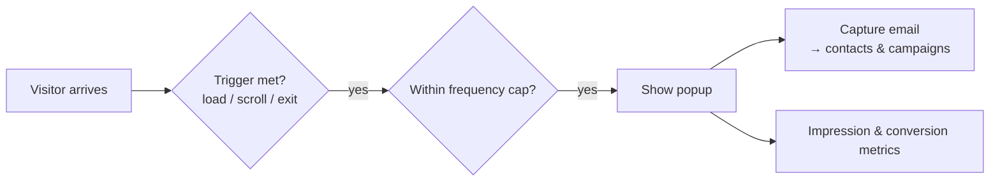

# Marketing Overlays

**Marketing overlays** are the announcement bars and popups that sit on top of your site to
promote offers and capture emails — without touching your page designs. Manage them from
your site's **Marketing** page, and see every site's at once from your
[organization's](#across-your-sites).

:::info Plan availability
**Paid**, gated by the `marketingOverlays` entitlement.
:::

## Announcement bar

A **site-wide announcement bar** shows a message across every page — ideal for sales,
notices, or launches. It's controlled centrally and gated by the marketing-overlays
entitlement. Its text can show [variables and site details](#variables-in-copy).

## Promotional popups

Popups give you more control:

- **Triggers** — **After a delay** (a number of seconds), **On scroll** (a percentage of
  the page), or **On exit intent**.
- **Frequency capping** — don't nag returning visitors. See below.
- **Scheduling** — run a popup only during a campaign window.

### Frequency: how often a popup comes back {#frequency}

In the popup editor, **Frequency** offers two mutually exclusive choices.

**Once per session** shows the popup at most once for as long as the visitor keeps the tab
open. Close the tab, come back tomorrow — or open your site in a second tab — and they see
it again. This is the right choice for a popup tied to the visit rather than to the person:
a first-order discount, a cookie or age notice, a "we're closed today" message.

**Re-show after a while** takes a number of days — **Re-show after (days)**, 7 by default —
and hides the popup for that long after it is dismissed, across sessions and browser
restarts. This is the right choice for a newsletter capture you do not want to ask twice
for in a week.

Only one applies. Choosing **Once per session** hides the days field entirely, because a
popup cannot be capped both ways.

:::note Where the choice is remembered
The cap is remembered **in the visitor's browser**, not on your site — per-session in
session storage, per-days in local storage. A visitor who clears their browser data, or
arrives in a private window, is a new visitor as far as the cap is concerned. If storage
is unavailable altogether the popup falls back to showing at most once per page view.

The cap is also per popup, keyed to its content. Editing a popup's content resets its cap,
so an edited popup is shown again to visitors who had already dismissed the old one.
:::

:::caution The site-wide default popup has only the day cap
The **Once per session** choice is on the multi-overlay editor, where you manage any number
of popups. The single always-on default popup card still offers only **Re-show after
(days)**.
:::

### Popup v2

The latest popup adds:

- **Email capture** — collect emails straight into your [contacts](../../content-and-data/crm/overview.md)
  and [campaigns](../email-campaigns/overview.md).
- **Overlay metrics** — impressions and conversions for each overlay.
- A **media picker** so popups can use images from your [media library](../../content-and-data/media/overview.md).

## Multiple overlays, scheduling & page targeting

The **Marketing** page manages any number of bars and popups, each with:

- A **schedule window** (show from / show until) — run a bar only during a sale.
- **Page targeting** — comma-separated paths, with `/blog/*` matching a whole section,
  plus a "never show on" exclude list.
- An **enable switch** and a status chip (Live / Scheduled / Off).

When several overlays match a page, the first bar and the first popup (by order) show.
The single announcement bar and popup on the same page remain as your always-on default
surfaces; configured overlays take priority over them.

## Variables and site details in copy {#variables-in-copy}

A bar's text and a popup's headline and body are filled in when the page renders:

- **A variable** — type its name in double braces, such as `{{saleEndsAt}}` for a variable
  named `saleEndsAt` on the **Logic** page. Saving stores the variable's id, so renaming
  the variable later does not break the copy.
- **A site detail** — `{{host.businessName}}` and the other
  [site details](../../building-sites/bindings/overview.md#site-details). A detail the
  site hasn't set renders as nothing.

A token nothing fills in, such as a name no variable carries or a function call, would
reach visitors exactly as typed, so the field turns red and names it. A date variable
shows as a date, not as a live countdown.

## Engagement stats

Each overlay tracks its own lifetime **views, clicks, and dismissals**, shown in the
Engagement column of the overlays table — so you can tell whether a bar earns its
screen space. Dismissals persist per visitor: a closed bar stays closed until you edit
its text.

With [Google Analytics](../analytics/overview.md) connected, the same events also land
in your own GA property as `aglyn_overlay` events (with the overlay id and action), so
you can segment sessions by overlay engagement.

## Across your organization's sites {#across-your-sites}

Your organization has its own **Marketing** page beside CRM, with the same sections as a
site's — Overview, Campaigns, Conversions, Overlays and A/B testing — each answering for
every site at once. It opens on **Overview**.

- **Overview** leads with the email figures for every site's sends, then lists your sites
  one per row with their overlay views and clicks and their running and decided A/B tests,
  totaled underneath. A site's name opens its own Overview, which also counts the overlays
  live right now. The table covers your first 25 sites; a site past that has its figures on
  its own page.
- **Overlays** lists every site's bars and popups, grouped by site in the order each site
  shows them, with whether that site's default bar and popup are on. Switch an overlay on
  or off right from the list. Creating and editing happen on the site — **New overlay**
  asks which site, and **Edit** opens that site's Overlays section — because an overlay is
  written against one site's pages, variables and order. Ten sites show at a time, with up
  to ten overlays each; a site with more says so and links to its own list.

These figures and lists are read when you open the section rather than kept live, so open
it again to see a change made somewhere else. Without the `marketingOverlays` entitlement
the organization's **Overlays** section is locked, and the Overview leaves the overlay
columns out.

## Related

- [Email campaigns](../email-campaigns/overview.md)
- [CRM](../../content-and-data/crm/overview.md)
- [Billing & plans](../../workspace-and-billing/billing-and-plans/overview.md)
