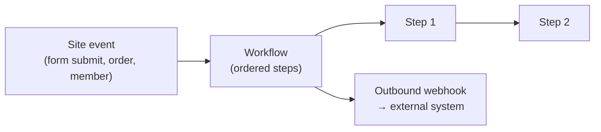

# Automation

Automate what happens on your site. The section holds three tabs — **Workflows**,
**Actions** and **Webhooks**. **Workflows** run multi-step logic when something
happens; the **actions builder** maps an event to an action; **webhooks** connect Aglyn to
outside systems.

:::info Plan availability
**Basic in-page interactions** (menu/drawer open-close, show/hide, class toggles, sticky
nav, navigation, site alerts) are on **every plan** and never metered. The **automations
engine** — server-side steps, analytics, overlays, and custom JS — is **Pro+** with
metered runs per tier. **Webhooks** are **Business**.
:::

## Workflows

- Build workflows on the **workflows page** with a pure step runner.
- Trigger them from **site events**, and compose [functions and variables](../../building-sites/bindings/overview.md)
  inside them.
- Runs are **metered** per tier.

## Actions builder

The **actions builder** turns an event into an action — event → action automation without
code. Basic in-page effects (menus, drawers, show/hide, navigation) run on every plan; the
server-side and advanced steps are **Pro+** with metered runs.

## Webhooks

**Outbound** and **inbound** webhooks let Aglyn notify other systems and receive events from
them. Webhooks are a **Business**-tier feature.

## Run history and the run allowance {#run-history}

The **Workflows** and **Actions** tabs each open with a line reading
`1,284 action runs this month · 50,000 included` — the metered run allowance this site is
spending. When a site reaches the month's limit, triggered automations stop running
rather than queueing or billing on.

Each row has a **Runs** button opening a four-column table — **Time**, **Trigger**,
**Result**, **What happened** — with **Succeeded**, **Failed** and **Skipped** chips. The
table is runs only: publishes, media saves and member changes stay in the site's general
activity feed, where there is nothing to say **Succeeded** about.

**Skipped** is the row that earns the table: an automation stopped by an unmet trigger
condition is now recorded, naming the condition field, so "why didn't my automation
fire?" is answered where the runs are. A skip is not a metered run. See
[Run history](actions-builder.md#run-history) for what is and isn't recorded — page-view
skips deliberately aren't — and [Build a workflow](build-a-workflow.md#4-save-and-test)
for where workflow executions currently show up.

:::note More detailed how-tos coming
Recipes for common automations (notify on form submit, sync orders, etc.) are on the way.
:::

## Related

- [Build a workflow](build-a-workflow.md)
- [Actions builder](actions-builder.md)
- [Bindings, variables & functions](../../building-sites/bindings/overview.md)
- [Billing & plans](../../workspace-and-billing/billing-and-plans/overview.md)
