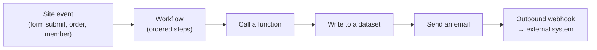

# Automation

Automate what happens on your site. The section holds three tabs — **Workflows**,
**Actions** and **Webhooks** — over **one engine**. A workflow step is either a call to
one of your [functions](../../building-sites/bindings/overview.md) or any of the steps
the actions builder offers, so "write to a dataset, send an email, update the contact"
is a sequence of one workflow rather than two automations that have to find each other.
**Webhooks** connect Aglyn to outside systems.

The two tabs are two ways into the same steps, kept apart by what they run on:

| | What starts it | What it can do |
| --- | --- | --- |
| **Workflows** | a server event — a form submission, an order, a new member, a CRM event | function calls and every server-side step |
| **Actions** | the same server events, **and** what a visitor does on the page — a click, a hover, exit intent, a scroll depth | everything a workflow can do, plus the in-page effects |

So an automation that touches the page is an **action**; one triggered by something that
happened on the server is a **workflow**; and the steps in between are the same steps.
Nothing you have already built moves or changes.

:::info Plan availability
**Basic in-page interactions** (menu/drawer open-close, show/hide, class toggles, sticky
nav, navigation, site alerts) are on **every plan** and never metered. The **automations
engine** — server-side steps, analytics, overlays, and custom JS — is **Pro+** with
metered runs per tier. **Webhooks** are **Business**.
:::

## Workflows

- Build workflows on the **workflows page**: a trigger and an ordered list of steps.
- Each step is a **call to a function** — composing your
  [functions and variables](../../building-sites/bindings/overview.md) — or any of the
  **server-side steps** the actions builder offers: write to a dataset, send an email,
  enroll in a list, assign a campaign, post a webhook, the CRM steps, and **Wait**.
- The in-page effects are not offered here. A workflow runs on a server event, where
  there is no page to toggle a class on or redirect.
- A run is **metered once**, however many steps it has and whatever they are.

## Actions builder

The **actions builder** turns an event into an action — event → action automation without
code, and the place to build anything that touches the page a visitor is looking at.
Basic in-page effects (menus, drawers, show/hide, navigation) run on every plan; the
server-side and advanced steps are **Pro+** with metered runs.

## Webhooks

**Outbound** and **inbound** webhooks let Aglyn notify other systems and receive events from
them. Webhooks are a **Business**-tier feature.

## Org automations

An organization with several sites can write an automation **once** and run it on every
site, or on the sites it chooses, from **Automation → Org automations** at the
organization level. Each run belongs to the site it runs on — that site's sender, its
action runs, its run history — and each site can pause it for itself. The organization's
Automation page also lists every site's own workflows, actions and webhooks side by side.
See [Org automations](org-automations.md).

## Run history and the run allowance {#run-history}

The **Workflows** and **Actions** tabs each open with a line reading
`1,284 action runs this month · 50,000 included` — the metered run allowance this site is
spending. When a site reaches the month's limit, triggered automations stop running
rather than queueing or billing on.

Each row has a **Runs** button opening a four-column table — **Time**, **Trigger**,
**Result**, **What happened** — with **Succeeded**, **Failed** and **Skipped** chips. The
table is runs only: publishes, media saves and member changes stay in the site's general
activity feed, where there is nothing to say **Succeeded** about.

**Skipped** is the row that earns the table: an automation stopped by an unmet trigger
condition is now recorded, naming the condition field, so "why didn't my automation
fire?" is answered where the runs are. A skip is not a metered run. See
[Run history](actions-builder.md#run-history) for what is and isn't recorded — page-view
skips deliberately aren't — and [Build a workflow](build-a-workflow.md#4-save-and-test)
for where workflow executions currently show up.

:::note More detailed how-tos coming
Recipes for common automations (notify on form submit, sync orders, etc.) are on the way.
:::

## Related

- [Build a workflow](build-a-workflow.md)
- [Actions builder](actions-builder.md)
- [Org automations](org-automations.md)
- [Bindings, variables & functions](../../building-sites/bindings/overview.md)
- [Billing & plans](../../workspace-and-billing/billing-and-plans/overview.md)
