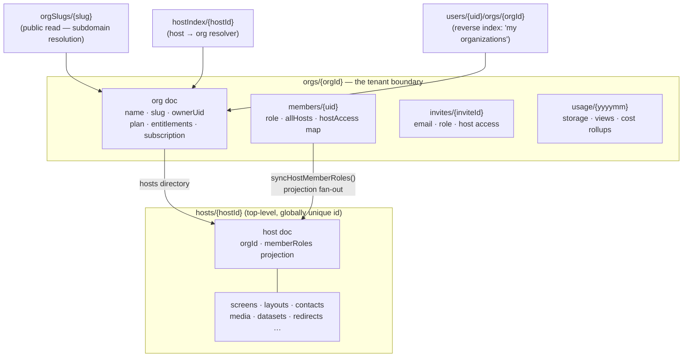
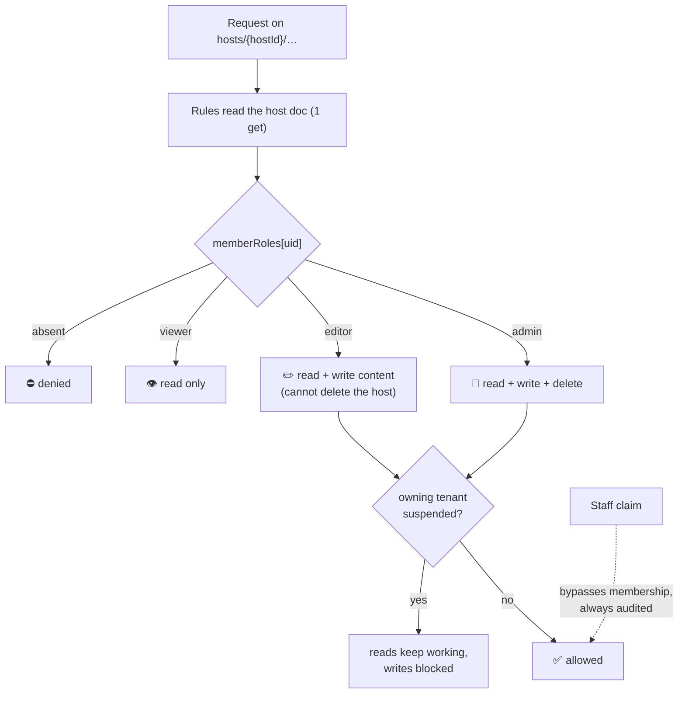
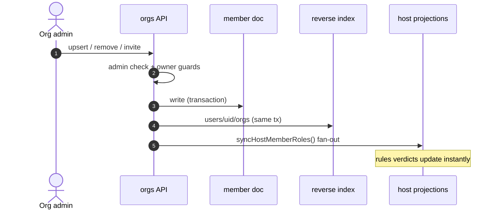
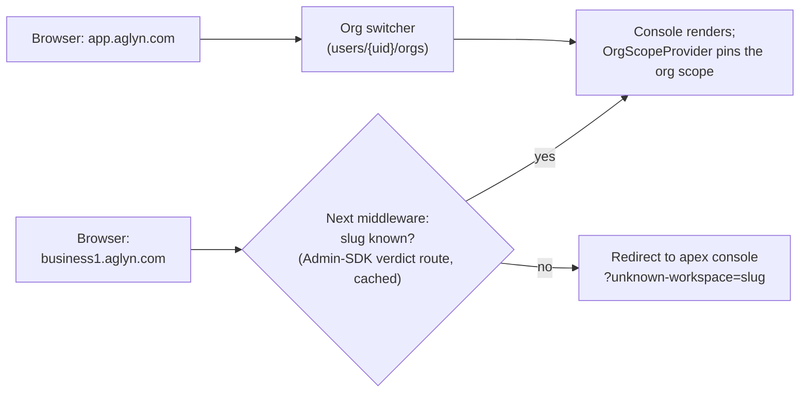
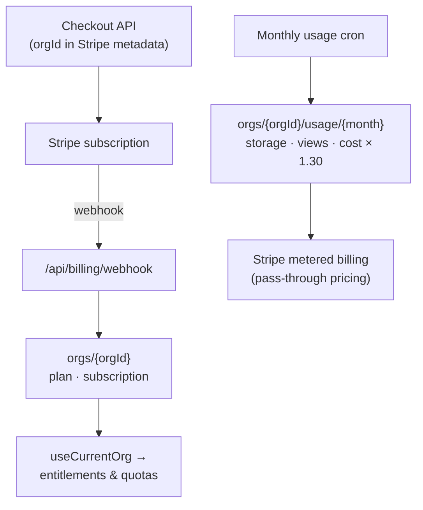

# Architecture: Multi-Tenant Organizations

:::warning Aglyn staff only
Internal architecture reference for the organization tenancy model (Linear project
*Multi-Tenant Organizations & Firestore v2*; the full design doc lives in the repo at
`docs/MULTI_TENANT_FIRESTORE.md`).
:::

## The model in one sentence

**An organization is the tenant**: one subscription, one workspace subdomain, one
isolation boundary — owning any number of hosts (websites), with people belonging to
many organizations under different roles.

## Data model

Everything lives in one Firestore database. Isolation comes from membership documents
and server-maintained projections, never from client-side query discipline:

Two deliberate choices:

- **Hosts stay top-level.** Host ids are the console's route params and the tenant
  renderer's lookup keys; `hostIndex` resolves a host's org without knowing it. The
  isolation the design wanted from ancestry nesting comes from the projection below.
- **Reverse index over collection-group queries.** "List my orgs" is one cheap
  collection read under the user's own doc — no composite indexes, no cross-org scans.

## Authorization: one read per request

Security rules never do more than one extra document read. For host content that read is
the host doc itself, which carries a **`memberRoles` projection** — a map of
`uid → admin | editor | viewer` recomputed by the org APIs whenever membership changes:

Org-level roles feed that projection:

| Org role | Org settings | Members & invites | Create hosts | Host access |
|----------|--------------|-------------------|--------------|-------------|
| owner    | ✓ (incl. delete) | ✓ | ✓ | admin on all hosts |
| admin    | ✓ | ✓ | ✓ | admin on all hosts |
| editor   | — | — | — | per `hostAccess` / `allHosts` |
| viewer   | read-only | — | — | read per `hostAccess` / `allHosts` |

Billing, suspension, slugs, membership and the projections are **Admin-SDK-only** —
security rules deny every client write, so the invariants can't drift from the browser.
A 13-case emulator matrix (`npm run test:rules`) locks this behavior in; it caught a
rules-v2 wildcard subtlety (zero-segment `{document=**}` matching the host doc itself)
before it shipped.

## Membership lifecycle

All mutations flow through API routes so three places stay consistent — the member doc,
the reverse index, and every affected host's projection:

Invites follow the same path: an org admin records the invite, the invited person signs
in with a **verified matching email** and accepts, which materializes the membership
through the identical transaction + fan-out.

The reverse index also carries an `orgWide` mirror of the member doc's scoping, because
a **site collaborator is an org member doc** with `role: 'viewer'` — indistinguishable
from a genuine org-wide viewer by role alone. The console routes from the index, so it
uses the mirror to send a scoped collaborator into their site and drop the org tab strip
for them. An absent flag reads as org-wide (rows predating the mirror have none;
`tools/scripts/backfill-org-reach.mjs` stamps them). Navigation only — the rules remain
the access boundary.

## Workspace subdomains

Each org gets a Slack-style workspace address. Host sites keep their own domains — the
workspace subdomain scopes the **console**, not published sites:

Organizations are the permanent tenancy model (not release-flagged): every
account operates inside an org, and the switcher appears as soon as a user
belongs to one.

### Which hostnames may serve the console

**The Vercel domain allowlist is the boundary, not the middleware.** Only
`app.aglyn.com`, `auth.aglyn.com`, and *explicitly registered* workspace
subdomains are attached to the `aglyn-console` project. `*.aglyn.com` used to
be, which meant every hostname under the domain served a real console: measured
before the change, `https://billing-security-update.aglyn.com/signin` returned
**200** with a genuine Aglyn sign-in page under a valid Aglyn certificate.
It now returns **404**.

This has to be the boundary rather than the middleware because `/api/*` is
outside the middleware matcher — a host that middleware would redirect could
still call an API route, and the session cookie is issued with
`Domain=.aglyn.com`, so the browser attaches it.

`console.aglyn.com` is registered as a **308 redirect** to `app.aglyn.com`
rather than dropped, so existing links keep working without a second hostname
serving a full console.

### Attaching a workspace's subdomain

Removing the wildcard means `{slug}.aglyn.com` resolves only if that exact
domain is attached to the console project, so org lifecycle now manages it
(AGL-1136):

| Event | Domain action |
| --- | --- |
| org created | attach `{slug}` |
| org renamed | attach the new slug, **keep the old one** |
| org erased | detach `{slug}` |

A rename deliberately does **not** detach. The previous slug keeps a tombstone
that 308s to the new one, and a redirect can only run on a hostname that still
resolves — detaching would break the very redirect the tombstone exists to
serve.

**The attach can never fail an org.** It runs after the transaction, unawaited,
and swallows its own errors: the console is path-routed and
`app.aglyn.com/{slug}` is the canonical form, so a workspace with no subdomain
is fully usable, while an org creation rolled back because a DNS API was slow
would not be. With no `VERCEL_TOKEN` it is a silent no-op — self-hosted
deployments have no Vercel project and must not log an error per signup.

Drift is therefore expected rather than exceptional, and
`tools/scripts/reconcile-workspace-domains.mjs` is both the drift check and the
backfill. Dry-run by default; it also reports **orphaned** workspace domains —
attached names with no `orgSlugs` doc, which keep resolving to a console for a
deleted org and block the slug from being reclaimed — but never removes them,
because deleting a domain is not a reconcile job's decision.

:::note Env
`VERCEL_TOKEN`, `VERCEL_CONSOLE_PROJECT_ID`, and `VERCEL_TEAM_ID` for a
team-scoped project. The token needs project-domain scope. Note the existing
`VERCEL_TOKEN` in `apps/console/.env.production.local` is a *local* file — this
needs a real deployment secret.
:::

The middleware gate is defence in depth behind that. Two corrections worth
recording, because the earlier version of this page asserted the opposite:

- It was **not** "inert until ops sets `NEXT_PUBLIC_WORKSPACE_DOMAIN`". That
  constant is declared in eight places; seven default to `aglyn.com` and only
  the gate did not, so the gate alone disabled itself while the session route
  kept minting domain-wide cookies. All of them now derive from
  `apps/console/constants/workspace-domain.ts`.
- The slug check is **not** a public `orgSlugs` read. App Check is enforced on
  this project, so an unauthenticated Firestore REST read from the edge returns
  `403 PERMISSION_DENIED` for every slug, including ones that exist. The gate
  treated any non-200/404 as *known*, so setting the env var alone would have
  judged every rogue subdomain a real workspace. It now asks
  `/api/orgs/slug-verdict`, which reads through the Admin SDK.

Both layers fail **open** on a Firestore outage: a workspace going dark because
a lookup timed out is worse than the residual exposure, given the allowlist
above is what actually stops an unregistered host.

## Billing & cost attribution

Plans and entitlements live on the **org doc** — the uid-keyed `tenants`
collection retired with the AGL-238 cutover. The Stripe webhook writes org docs
only, and every entitlement, quota, and suspension check resolves host → org:

Per-org usage rollups are what keep the freemium model affordable: every org's floor
cost is a handful of Firestore reads per session (one membership/host-doc read per
request, reverse index instead of scans), and anything metered is attributed to the org
that caused it.

## Related

- [Feature flags](feature-flags.md) — the release-gating system the workspace UX
  ships behind.
- [Teams, Roles & Membership](../workspace-and-billing/teams-and-roles/overview.md) — the customer-facing
  view of the same membership model.
- `docs/MULTI_TENANT_FIRESTORE.md` (repo) — full design doc with the migration plan
  and open questions.
