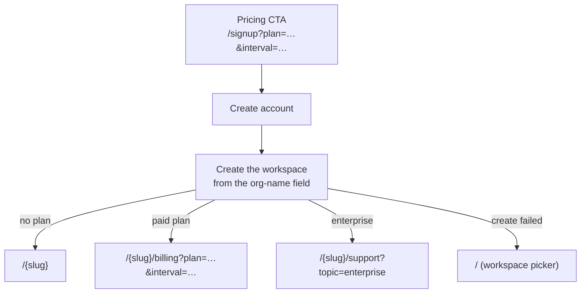

# Onboarding deep links

:::warning Aglyn staff only
Internal contract reference. The marketing site is built and deployed separately
from the console (AGL-1117), so this page is the agreement between them.
:::

## The contract

The marketing pricing page links into console signup, carrying the plan the
visitor chose:

```
https://app.aglyn.com/signup?plan=pro&interval=year
```

| Param | Values | Missing / unrecognized |
| --- | --- | --- |
| `plan` | `starter` `pro` `business` `scale` `advanced` `agency` `enterprise` | Ordinary signup |
| `interval` | `month`, `year` (`annual` accepted as a synonym) | `month` |

`free` is accepted as a value but produces **no** intent — it is a real plan
but not a purchase, and a new workspace already starts there. Sending someone
to a billing page to buy what they have would be worse than ignoring it.

## What the console does with it



Signup collects an **organization name** and provisions the workspace as part
of account creation (AGL-1115), so a new user lands in a ready workspace rather
than an empty chooser.

**Enterprise never routes to checkout.** It is quoted, not bought, so the CTA
lands on contact-sales and the staff enterprise-billing flow (AGL-1110) takes
it from there. A checkout that cannot price the plan is a dead end.

## Rules this parser follows, and why

Parsing lives in one place — `parseOnboardingPlanIntent` in `@aglyn/aglyn` —
and is deliberately forgiving, because **the pricing page will be edited by
people who have never read our enum**, and we cannot deploy the two in
lockstep:

- **A bad param degrades to ordinary signup.** It must never break signup, and
  — far worse — must never silently start someone on a plan they did not pick.
- **An unrecognized interval falls to `month`, never `year`.** Guessing the
  longer commitment from a malformed link is the expensive direction to be
  wrong in.
- **Casing and stray whitespace are the same intent**; `?plan=PRO%20` is `pro`.
- **A repeated param takes the first value.** Next hands back a `string[]`, and
  joining would produce `"pro,free"` and lose a valid intent.

## Known gap

The **Google sign-up buttons submit no form**, so there is no organization name
to provision from — those accounts still land on the workspace picker. Closing
that needs the two-step flow (account → org details) that AGL-1115 also
suggests, which is a larger change than the field.

Org creation is best-effort: the account exists and the user is signed in
before it runs, so a failure falls through to the workspace picker rather than
surfacing as a failed sign-up. A `409` (slug taken) also falls through — the
org was not created, and inventing a suffix would hand someone a workspace URL
they never chose.
